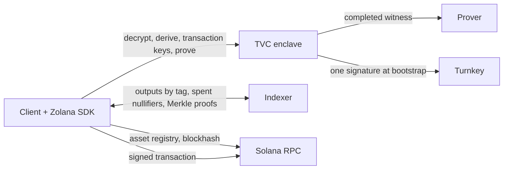

# Zolana TVC privacy wallet

A Zolana shielded wallet whose privacy keys live in a Turnkey Verifiable
Compute enclave. The enclave holds the nullifier and viewing keys and answers
the Zolana SDK's `WalletKeys` interface with them: it opens ciphertexts, derives
nullifiers, mints per-transaction keys, and completes proof witnesses. The
client runs every wallet flow with the Zolana TypeScript SDK, `TvcKeys` in
place of `LocalKeys`: sync, selection, transfers, withdrawals, splits, merges,
rings, deposits, registration, signing, and submission.

Pre-production, for disposable devnet funds. The pinned external prover receives
a plaintext witness containing the long-lived nullifier secret; see
[Network boundary](#network-boundary).

| Path | Purpose |
| --- | --- |
| [`apps/privacy-wallet`](apps/privacy-wallet) | The TVC application and an unattested local testkit. |
| [`packages/tvc-wallet`](packages/tvc-wallet) | TypeScript client: connection verification, the five operations, `TvcKeys` for the Zolana SDK, browser persistence, React bindings. |
| [`crates/protocol`](crates/protocol) | Wire types, JCS, digests, P-256 client auth, QOS envelope, release policies, conformance fixtures. |
| [`crates/boot-proof`](crates/boot-proof) | Fetches a replica's public Boot Proof from Turnkey for a relying party that cannot. |
| [`examples/headless-wallet`](examples/headless-wallet) | Node end-to-end against the testkit and a local Zolana network. |
| [`examples/typescript-client`](examples/typescript-client) | Deposit, private transfer and withdraw against a deployed enclave or the local testkit (`just client-example-local`), in the zolana-examples layout. |

## Responsibility split



| Step | Where | How |
| --- | --- | --- |
| Keys | TVC | Turnkey signs a fixed message; the deterministic signature is the seed; roles are expanded inside the enclave and returned sealed. |
| Register, deposit | Client | Zolana SDK with the ordinary Turnkey wallet; no privacy secret involved. |
| Sync | Client + TVC | The SDK's `syncWallet` over `TvcKeys`: the client fetches outputs under the wallet's tags, the enclave opens the ciphertexts and derives the nullifiers in one batch per dependency round, the client decodes, matches commitments, and keeps the Zolana `Wallet`. |
| Select inputs, encrypt outputs | Client | The SDK's builders, with the per-transaction viewing key the enclave mints for the transaction's first nullifier. |
| Prove | Client + TVC | The SDK assembles the witness with the nullifier secret slots open; the enclave fills them and forwards it to the pinned prover. |
| Sign, submit, confirm | Client | The application's Solana signer, the Turnkey session for a Turnkey wallet, and any Solana RPC. |

## Connecting

Trust material arrives out of band: a threshold-signed release policy, the
authority public keys, and PCR pins. `connectAndVerify()` verifies the policy,
binds every security field of `GET /v1/info` to it, completes the Quorum-encrypted
`POST /v1/ping`, and verifies the Nitro Boot Proof against the PCRs and
accepted manifest digests. Wallet calls take the resulting `VerifiedConnection`
only; HTTPS alone establishes nothing.

## Operations

`POST /v1/operations` accepts an `EncryptedRequest`: an `OperationRequest`
encrypted to the Quorum key, carrying the wallet descriptor, the release pins,
a fresh request id and expiry, the sealed seed (absent on bootstrap), a
one-time response key, the operation, and a P-256 signature by the client's
non-exportable key. The `EncryptedResponse` carries the result encrypted to the
response key and an App Proof by the replica's Ephemeral key binding request
digest, encrypted-result digest, operation kind, and the digest of the sealed
seed used. Verify the proof before reading the plaintext.

| Operation | Sealed seed | Returns |
| --- | --- | --- |
| `Bootstrap` | forbidden | Public identity (Solana address, owner hash, nullifier and viewing public keys) and the sealed seed. Also recovery: the client passes the identity it knows and refuses another. |
| `Decrypt { items }` | required | The transfer cipher's output for each `{ ciphertext, viewing_public_key, transaction_viewing_public_key, salt, slot_index, label }`, label `Transfer` or `RingDeposit`. The enclave interprets nothing; the SDK decodes and matches commitments. |
| `Derive { items }` | required | One 32-byte value per item: `Nullifier { utxo_hash, blinding }`, `MergeDummyNullifier { first_nullifier, slot_index }`, or `MergeOutputBlinding { first_nullifier }`. |
| `TransactionKeys { items }` | required | The per-transaction viewing secret for each `{ viewing_public_key, first_nullifier }`. The derivation is one way, so a secret opens that transaction and nothing else. |
| `Prove { request }` | required | The prover's answer to the Zolana SDK's prover request, after the enclave has written its nullifier secret into every `null` slot. Circuits `transfer-confidential`, `transfer-ring`, and `merge`. |

Each batch takes up to 256 items. The pool cipher is unauthenticated, so
`Decrypt` cannot tell whose ciphertext it opened; the SDK adopts a UTXO only
when its commitment equals the indexed one. `Prove` does not check who owns the
inputs: a slot filled for another wallet's UTXO gives a witness the circuit
rejects, and a proof reveals nothing about the secret either way. Failures
surface only inside the encrypted result as a closed stage marker (`Prover`,
`TurnkeySigning`); public HTTP errors are generic.

These five operations are exactly the Zolana SDK's `ShieldedKeys` and
`ProofAuthority` methods, so `TvcKeys` implements the SDK's `WalletKeys` and
every SDK flow runs unchanged over the enclave.

Both the descriptor and the running environment must be `development`; a
production descriptor is rejected.

## Network boundary

Callers never name an origin. Every destination is compiled into the measured
executable, so changing one is a new release.

| Destination | Used for |
| --- | --- |
| `api.turnkey.com` | Bootstrap signing |
| `zolnet-devnet-*.elb.amazonaws.com` (plain HTTP) | Proving |

Turnkey can reproduce the bootstrap seed, and the prover receives the whole
witness: amounts, blindings, Merkle paths, and the nullifier secret. Nothing
makes the witness confidential. Production needs proving inside the enclave or
an attested prover over a bound channel, an authenticated prover origin, an
external egress boundary enforcing this table, and release governance with
rotation and revocation.

## Development

Rust from `rust-toolchain.toml`, Node 24, pnpm 9, `just`, Docker with
`linux/amd64`:

```sh
just setup
just ci
```

`just ci` runs fmt, clippy, the Rust tests, the committed-fixture check, and
the TypeScript lint/typecheck/test/build. `just regenerate-protocol-fixtures`
rewrites `crates/protocol/fixtures`; review fixture and manifest diffs together,
the TypeScript conformance suite reads the committed files. `just headless-e2e`
runs the lifecycle against a local Zolana network from a sibling `../zolana`
checkout.

`boot-proof` keeps its own lockfile so the Turnkey client graph stays out of
the enclave build. Never commit Turnkey operator files, API keys, or
`.env.local`.

## Deployment

Each deployment has its own Turnkey TVC app (`apps/privacy-wallet/deploy`),
Quorum key, `linux/amd64` image pinned by `@sha256:`, signed release policy, and
wallet descriptor. The constants of the current app are in
`apps/privacy-wallet/deploy/release.json`; a release is one command:

```sh
just release keyholder-v35            # build, deploy, policy, pins
node scripts/release.mjs policy keyholder-v35   # or one phase at a time
```

`build` builds the image, pushes it, and records
`privacy-wallet-<release>.deployment.json` with the OCI digest and the
`/tvc_app` SHA-256 (`expectedPivotDigest`; debug mode stays off and
`qosVersion` equals the pinned `qos_core`). `deploy` drives the Turnkey `tvc`
CLI, logged in for the operators: create, one approval per operator (each shows
the QOS manifest for the operator to confirm; `--unattended` skips that
review), provision, set live, then waits until `/v1/info` serves the release.
A re-run continues the same deployment from the last completed step. Turnkey
keeps three deployable deployments per app; `--prune-deployments` deletes the
oldest that are neither live nor the release's own until the new one fits,
through the Turnkey API with the operator API key `tvc login` stored (or
`TVC_API_KEY_PUBLIC` / `TVC_API_KEY_PRIVATE`; `--api-key <name>` picks one of
several). `policy` assembles
the release policy from `/v1/info` and `release.json`, signs it with a one-time
authority key (`cargo run -p zolana-tvc-protocol --example sign-release-policy`;
the private half exists only inside that call), and writes
`privacy-wallet.trust.json`, the three objects a client pins. `pins` writes
them into the wallet-kit demo's `tvc-policy.ts` and enables its signature test.
The signature is 64-byte raw low-S P-256 over
`H(ZOLANA_TVC_RELEASE_POLICY_V1, JCS(policy))`; re-signing means a new
authority set every client must accept. `TVC_PROVISIONING_KEY_JSON` signs
wallet descriptors and its public half is compiled into the image; treat it as
release material.

## Wire format

Normative for v1. JSON inputs reject unknown and duplicate fields; digested
objects use RFC 8785 (JCS); binary fields are lowercase hex without `0x`; `u64`
values are canonical decimal strings; P-256 public keys are 65-byte uncompressed
SEC1; P-256 signatures are 64-byte raw low-S `r || s`; Solana addresses and
transaction signatures are base58.

`H(domain, payload) = SHA256(domain || 0x00 || payload)` with domains
`ZOLANA_TVC_REQUEST_V1`, `ZOLANA_TVC_CLIENT_AUTH_V1`, `ZOLANA_TVC_RESULT_V1`,
`ZOLANA_TVC_SEALED_SEED_DIGEST_V1`, `ZOLANA_TVC_RELEASE_POLICY_V1`,
`ZOLANA_TVC_PROVISIONING_AUTH_V1`.
`request_digest = H(request, JCS(request without authorization.signature))`;
the client signs `H(client-auth, request_digest)` through a prehash API.
`result_digest = H(result, encrypted_result_bytes)`.

Envelopes use the QOS P-256 scheme: `P256Public` is
`encryption_sec1[65] || signing_sec1[65]`; the key is
`HMAC-SHA512(key = ephemeral_pub || receiver_pub || ECDH_x, msg =
"qos_encryption_hmac_message")[0..32]`, AES-256-GCM with AAD
`ephemeral_pub || 0x41 || receiver_pub || 0x41`, Borsh-framed as
`nonce[12] || ephemeral_pub[65] || ciphertext || tag[16]`. App Proof signatures
are P-256/SHA-256 over the exact UTF-8 payload. Request and response bodies are
at most 262,144 bytes; a request expires within 300 s with 60 s of clock skew.

The wallet descriptor binds one wallet to a security domain, the development
environment, a Turnkey organization and wallet id, the Solana address, one P-256
client grant with its allowed operations, and a provisioning signature verified
against the public key compiled into the application. The sealed seed is the
seed encrypted to the Quorum key and bound to wallet, descriptor, derivation suite,
security domain, Quorum key id, and epoch; it never contains anything the
Turnkey wallet cannot reproduce.

Rust and TypeScript must agree on the content-addressed fixtures under
`crates/protocol/fixtures`. Turnkey App Proofs are verified cryptographically
but stay `CryptographicallyValidButUnbound`: no decision-context binding exists
yet, and nothing here labels them `Verified`.

## License

Protocol, client, and verifier code is Apache-2.0. The TVC application links
AGPL QOS crates and is AGPL-3.0-only; see the individual manifests.
