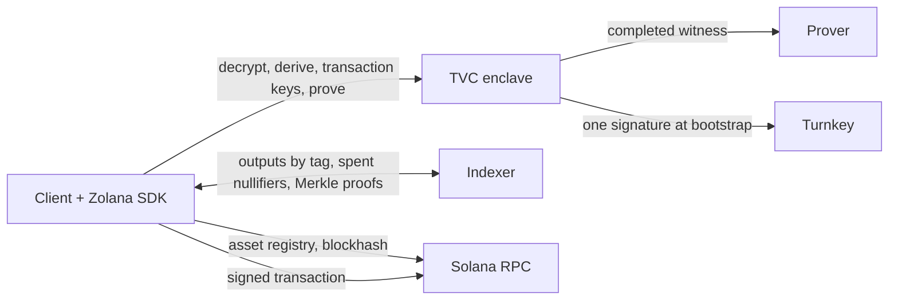

# Zolana TVC privacy wallet

A Zolana shielded wallet whose privacy keys live in a Turnkey Verifiable
Compute enclave. The enclave holds the nullifier and viewing keys and answers
the Zolana SDK's `WalletKeys` interface with them: it opens ciphertexts, derives
nullifiers, mints per-transaction keys, and completes proof witnesses. The
client runs every wallet flow with the Zolana TypeScript SDK, `TvcKeys` in
place of `LocalKeys`: sync, selection, transfers, withdrawals, splits, merges,
rings, deposits, registration, signing, and submission.

Pre-production, for disposable devnet funds. The pinned external prover receives
a plaintext witness containing the long-lived nullifier secret; see
[Network boundary](#network-boundary).

| Path | Purpose |
| --- | --- |
| [`apps/privacy-wallet`](apps/privacy-wallet) | The TVC application and an unattested local testkit. |
| [`packages/tvc-wallet`](packages/tvc-wallet) | TypeScript client: connection verification, the five operations, `TvcKeys` for the Zolana SDK, browser persistence, React bindings. |
| [`crates/protocol`](crates/protocol) | The protocol specification and its Rust implementation: wire types, JCS, digests, client authorization, QOS envelope, release policies, conformance fixtures. |
| [`crates/boot-proof`](crates/boot-proof) | Fetches a replica's public Boot Proof from Turnkey for a relying party that cannot. |
| [`examples/typescript-client`](examples/typescript-client) | Enrollment, then SOL, SPL, and custom-ring lifecycles against a deployed enclave or the local testkit. |
| [`scripts`](scripts) | Operator tooling: releases, wallet descriptors, the localnet for `just headless-e2e`. |

## Responsibility split



| Step | Where | How |
| --- | --- | --- |
| Keys | TVC | Turnkey signs a fixed message; the deterministic signature is the seed; roles are expanded inside the enclave and returned sealed. |
| Register, deposit | Client | Zolana SDK with the ordinary Turnkey wallet; no privacy secret involved. |
| Sync | Client + TVC | The SDK's `syncWallet` over `TvcKeys`: the client fetches outputs under the wallet's tags, the enclave opens the ciphertexts and derives the nullifiers in one batch per dependency round, the client decodes, matches commitments, and keeps the Zolana `Wallet`. |
| Select inputs, encrypt outputs | Client | The SDK's builders, with the per-transaction viewing key the enclave mints for the transaction's first nullifier. |
| Prove | Client + TVC | The SDK assembles the witness with the nullifier secret slots open; the enclave fills them and forwards it to the pinned prover. |
| Sign, submit, confirm | Client | The application's Solana signer, the Turnkey session for a Turnkey wallet, and any Solana RPC. |

## Operations

The enclave serves five operations at `POST /v1/operations`. They are exactly
the Zolana SDK's `ShieldedKeys` and `ProofAuthority` methods, so `TvcKeys`
implements the SDK's `WalletKeys` and every SDK flow runs unchanged over the
enclave.

| Operation | Answers |
| --- | --- |
| `Bootstrap` | The wallet's public identity and its seed, sealed to the enclave's Quorum key. Once per wallet; also recovery. |
| `Decrypt` | The plaintext of encrypted outputs from the index. |
| `Derive` | Nullifiers and merge blindings for a spend. |
| `TransactionKeys` | The per-transaction viewing key of a spend. |
| `Prove` | The prover's proof for a witness the enclave completed with the nullifier secret. |

The enclave never sees a balance, never selects an input, and never signs a
Solana transaction. Request and response semantics, the envelope, digests,
descriptors, sealed seeds, and release policies are specified in
[`crates/protocol`](crates/protocol/README.md).

## Trust

Trust material arrives out of band: a threshold-signed release policy, the
authority public keys, and PCR pins. `connectAndVerify()` verifies the policy,
binds `GET /v1/info` to it, completes the Quorum-encrypted `POST /v1/ping`,
and verifies the Nitro Boot Proof against the PCRs and accepted manifest
digests. Wallet calls take the resulting `VerifiedConnection` only; HTTPS
alone establishes nothing. A wallet descriptor, signed by the operator with the
provisioning key whose public half is compiled into the image, grants a client
key the operations of one Turnkey wallet.

## Network boundary

Callers never name an origin. Every destination is compiled into the measured
executable, so changing one is a new release.

| Destination | Used for |
| --- | --- |
| `api.turnkey.com` | Bootstrap signing |
| `zolnet-devnet-*.elb.amazonaws.com` (plain HTTP) | Proving |

Turnkey can reproduce the bootstrap seed, and the prover receives the whole
witness: amounts, blindings, Merkle paths, and the nullifier secret. Nothing
makes the witness confidential. Production needs proving inside the enclave or
an attested prover over a bound channel, an authenticated prover origin, an
external egress boundary enforcing this table, and release governance with
rotation and revocation.

## Development

Rust from `rust-toolchain.toml`, Node 24, pnpm 9, `just`, Docker with
`linux/amd64`:

```sh
just setup
just ci
```

`just ci` runs fmt, clippy, the Rust tests, the committed-fixture check, and
the TypeScript lint, typecheck, tests, and build. `just headless-e2e` runs the
client example's SOL, SPL, and custom-ring lifecycles against the testkit and
a local Zolana network built from a sibling `../zolana` checkout, which must be
at the commit
[`headless-local-e2e.yml`](.github/workflows/headless-local-e2e.yml) pins.

`boot-proof` keeps its own lockfile so the Turnkey client graph stays out of
the enclave build. Never commit Turnkey operator files, API keys, or
`.env.local`.

## Deployment

Each deployment has its own Turnkey TVC app, Quorum key, `linux/amd64` image
pinned by `@sha256:`, signed release policy, and wallet descriptors. The
constants of the current app are in
[`apps/privacy-wallet/deploy/release.json`](apps/privacy-wallet/deploy/release.json);
a release is one command, and a descriptor one more:

```sh
just release keyholder-v35
just provision-descriptor --organization-id <org> --wallet-id <id> \
  --address <address> --client-public-key <hex> --out descriptor.json
```

[`scripts/README.md`](scripts/README.md) describes the release phases, the
provisioning key, and the localnet.

## License

Protocol, client, and verifier code is Apache-2.0. The TVC application links
AGPL QOS crates and is AGPL-3.0-only; see the individual manifests.
