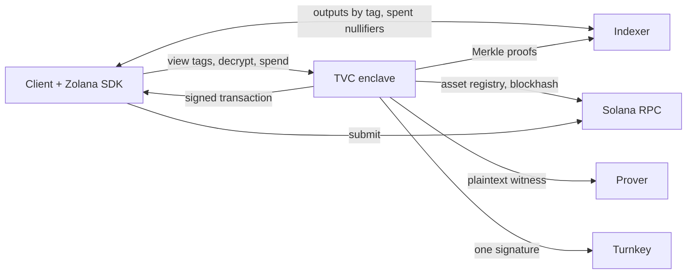

# Zolana TVC privacy wallet

A Zolana shielded wallet whose privacy keys live in a Turnkey Verifiable
Compute enclave. The enclave holds the nullifier and viewing keys and does the
four things that need them; the client does everything else with the Zolana
TypeScript SDK: indexer reads, wallet bookkeeping, UTXO selection, deposits,
registration, and submission.

Pre-production, for disposable devnet funds. The pinned external prover receives
a plaintext witness containing the long-lived nullifier secret; see
[Network boundary](#network-boundary).

| Path | Purpose |
| --- | --- |
| [`apps/privacy-wallet`](apps/privacy-wallet) | The TVC application and an unattested local testkit. |
| [`packages/tvc-wallet`](packages/tvc-wallet) | TypeScript client: connection verification, the four operations, `syncWallet`, `spend`, browser persistence, React bindings. |
| [`crates/protocol`](crates/protocol) | Wire types, JCS, digests, P-256 client auth, QOS envelope, release policies, conformance fixtures. |
| [`crates/proof-verifier`](crates/proof-verifier) | Operator-side Turnkey and Nitro evidence inspection. |
| [`examples/headless-wallet`](examples/headless-wallet) | Node end-to-end against the testkit and a local Zolana network. |

## Responsibility split



| Step | Where | How |
| --- | --- | --- |
| Keys | TVC | Turnkey signs a fixed message; the deterministic signature is the seed; roles are expanded inside the enclave and returned sealed. |
| Register, deposit | Client | Zolana SDK with the ordinary Turnkey wallet; no privacy secret involved. |
| Sync | Client + TVC | Client fetches outputs under the wallet's tags, TVC opens them and returns each UTXO with its nullifier, client checks the indexer for spent nullifiers and keeps a Zolana `Wallet`. |
| Select inputs | Client | `spend` picks largest-first from the synced wallet, or takes explicit commitments. |
| Nullify, encrypt, prove, build, sign | TVC | One `Spend` call: proof witness with the nullifier secret, output encryption under the transaction viewing key, pinned prover, local proof verification, fresh blockhash, one Turnkey signature as owner and fee payer. |
| Submit, confirm | Client | Any Solana RPC. |

## Connecting

Trust material arrives out of band: a threshold-signed release policy, the
authority public keys, and PCR pins. `connectAndVerify()` verifies the policy,
binds every security field of `GET /v1/info` to it, completes the Quorum-encrypted
`POST /v1/ping`, and verifies the Nitro Boot Proof against the PCRs and
accepted manifest digests. Wallet calls take the resulting `VerifiedConnection`
only; HTTPS alone establishes nothing.

## Operations

`POST /v1/operations` accepts an `EncryptedRequest`: an `OperationRequest`
encrypted to the Quorum key, carrying the wallet descriptor, the release pins,
a fresh request id and expiry, the sealed checkpoint (absent on bootstrap), a
one-time response key, the operation, and a P-256 signature by the client's
non-exportable key. The `EncryptedResponse` carries the result encrypted to the
response key and an App Proof by the replica's Ephemeral key binding request
digest, encrypted-result digest, operation kind, and the digest of the sealed
state used. Verify the proof before reading the plaintext.

| Operation | Checkpoint | Returns |
| --- | --- | --- |
| `Bootstrap` | forbidden | Public identity (Solana address, owner hash, nullifier and viewing public keys) and the sealed seed. Also recovery: the client passes the identity it knows and refuses another. |
| `ViewTags` | required | The stable recipient tags the wallet's outputs are published under. The identity tag derives from the public signing key, so the client computes that one. |
| `Decrypt { payloads, assets }` | required | For each `Encrypted` ciphertext or `Plain` deposit opening, either `Utxo { asset, amount, blinding, commitment, nullifier, .. }` or `Unreadable`. Up to 256 per call. |
| `Spend { tree, inputs, action, assets }` | required | For 1–5 plain default-pool inputs and a `Transfer` to a shielded address or `Withdrawal` to a Solana address, the signed transaction and its signature. |

The pool cipher is unauthenticated, so `Decrypt` cannot tell whose ciphertext it
opened; `syncWallet` adopts a UTXO only when its commitment equals the indexed
one. `Spend` checks the client's compact asset ids against the pool's on-chain
registry, verifies the returned proof locally, inserts the blockhash after
proving, and checks Turnkey's signature over the exact bytes it sent. Failures
surface only inside the encrypted result as a closed stage marker
(`AssetRegistry`, `IndexerProofs`, `Prover`, `ProofVerification`, `Blockhash`,
`TransactionAssembly`, `TurnkeySigning`, `SignedTransactionMismatch`); public
HTTP errors are generic.

Both the descriptor and the running environment must be `development`; a
production descriptor is rejected.

## Network boundary

Callers never name an origin. Every destination is compiled into the measured
executable, so changing one is a new release.

| Destination | Used for |
| --- | --- |
| `api.turnkey.com` | Bootstrap and spend signing |
| `api.devnet.solana.com` | Asset registry accounts and the blockhash |
| `zolnet-devnet-*.elb.amazonaws.com` (plain HTTP) | Merkle proofs and proving |

Turnkey can reproduce the bootstrap seed, the indexer sees which commitments a
spend proves against, and the prover receives amounts, blindings, and the
nullifier secret. Local Groth16 verification stops an invalid proof from
authorizing a different transition; nothing makes the witness confidential.
Production needs proving inside the enclave or an attested prover over a bound
channel, an authenticated indexer/prover origin, an external egress boundary
enforcing this table, and release governance with rotation and revocation.

## Development

Rust from `rust-toolchain.toml`, Node 24, pnpm 9, `just`, Docker with
`linux/amd64`:

```sh
just setup
just ci
```

`just ci` runs fmt, clippy, the Rust tests, the committed-fixture check, and
the TypeScript lint/typecheck/test/build. `just regenerate-protocol-fixtures`
rewrites `crates/protocol/fixtures`; review fixture and manifest diffs together,
the TypeScript conformance suite reads the committed files. `just headless-e2e`
runs the lifecycle against a local Zolana network from a sibling `../zolana`
checkout.

`proof-verifier` keeps its own lockfile so the operator-side verification graph
stays out of the enclave build. Never commit Turnkey operator files, API keys,
`.env.local`, or sealed wallet state.

## Deployment

Each deployment has its own Turnkey TVC app, Quorum key, `linux/amd64` image
pinned by `@sha256:`, signed release policy, and wallet descriptor. Build with
`just image-privacy-wallet`; the printed `/tvc_app` SHA-256 becomes
`expectedPivotDigest`. Check a descriptor with
`just deploy-preflight <descriptor.json>`. Sign the policy after the deployment
answers `/v1/info`, since the accepted manifest digest is only readable live:

```sh
cargo run -p zolana-tvc-protocol --example sign-release-policy -- policy.json <release-id>
```

The authority key is used once and discarded; re-signing means a new authority
set every client must accept. `TVC_PROVISIONING_KEY_JSON` signs wallet
descriptors and its public half is compiled into the image; treat it as release
material.

## Wire format

Normative for v1. JSON inputs reject unknown and duplicate fields; digested
objects use RFC 8785 (JCS); binary fields are lowercase hex without `0x`; `u64`
values are canonical decimal strings; P-256 public keys are 65-byte uncompressed
SEC1; P-256 signatures are 64-byte raw low-S `r || s`; Solana addresses and
transaction signatures are base58.

`H(domain, payload) = SHA256(domain || 0x00 || payload)` with domains
`ZOLANA_TVC_REQUEST_V1`, `ZOLANA_TVC_CLIENT_AUTH_V1`, `ZOLANA_TVC_RESULT_V1`,
`ZOLANA_TVC_STATE_DIGEST_V1`, `ZOLANA_TVC_RELEASE_POLICY_V1`,
`ZOLANA_TVC_PROVISIONING_AUTH_V1`.
`request_digest = H(request, JCS(request without authorization.signature))`;
the client signs `H(client-auth, request_digest)` through a prehash API.
`result_digest = H(result, encrypted_result_bytes)`.

Envelopes use the QOS P-256 scheme: `P256Public` is
`encryption_sec1[65] || signing_sec1[65]`; the key is
`HMAC-SHA512(key = ephemeral_pub || receiver_pub || ECDH_x, msg =
"qos_encryption_hmac_message")[0..32]`, AES-256-GCM with AAD
`ephemeral_pub || 0x41 || receiver_pub || 0x41`, Borsh-framed as
`nonce[12] || ephemeral_pub[65] || ciphertext || tag[16]`. App Proof signatures
are P-256/SHA-256 over the exact UTF-8 payload. Request and response bodies are
at most 262,144 bytes; a request expires within 300 s with 60 s of clock skew.

The wallet descriptor binds one wallet to a security domain, the development
environment, a Turnkey organization and wallet id, the Solana address, one P-256
client grant with its allowed operations, and a provisioning signature verified
against the public key compiled into the application. Sealed state is the seed
encrypted to the Quorum key and bound to wallet, descriptor, derivation suite,
security domain, Quorum key id, and epoch; it never contains anything the
Turnkey wallet cannot reproduce.

Rust and TypeScript must agree on the content-addressed fixtures under
`crates/protocol/fixtures`. Turnkey App Proofs are verified cryptographically
but stay `CryptographicallyValidButUnbound`: no decision-context binding exists
yet, and nothing here labels them `Verified`.

## License

Protocol, client, and verifier code is Apache-2.0. The TVC application links
AGPL QOS crates and is AGPL-3.0-only; see the individual manifests.
