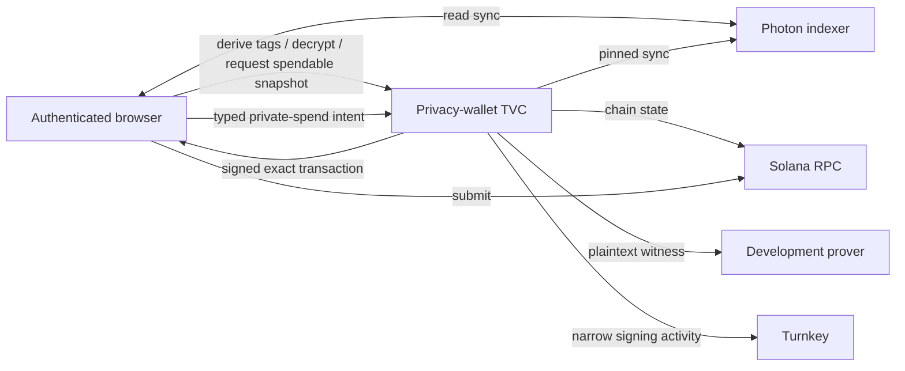

# Zolana TVC privacy wallet

An attested privacy-wallet backend for Zolana, built on Turnkey Verifiable
Compute. The TVC application holds the shielded seed, viewing key, and
nullifier key. The browser holds only the public identity, an opaque sealed
checkpoint, and transaction bookkeeping.

This repository is a pre-production implementation for disposable devnet
funds. Its external prover currently receives a plaintext witness containing
the long-lived nullifier secret. Read [Network boundary](#network-boundary)
before using the code.

## Components

| Path | Purpose |
| --- | --- |
| [`apps/privacy-wallet`](apps/privacy-wallet) | The HTTP/1 TVC application and an explicitly unattested local harness. |
| [`packages/tvc-wallet`](packages/tvc-wallet) | Typed TypeScript client, release/Boot Proof verification, browser persistence, and React bindings. |
| [`crates/protocol`](crates/protocol) | Strict wire types, RFC 8785/JCS, digests, P-256 client auth, QOS envelopes, and release policies. |
| [`crates/keypair-turnkey`](crates/keypair-turnkey) | Narrow Turnkey-backed `ShieldedKeypairTrait` implementation. |
| [`crates/proof-verifier`](crates/proof-verifier) | Operator-side Turnkey and Nitro evidence inspection tools. |
| [`examples/private-swap`](examples/private-swap) | TVC integration for the canonical Zolana confidential swap SDK and prover. |
| [`examples/headless-wallet`](examples/headless-wallet) | Minimal Node client exercising the full verified flow. |

The normative wire contract is the
[protocol specification](#protocol-specification-v1) below.

## Talking to TVC, the short version

Everything is HTTP/1 with four routes. Two are plain GETs, two carry
encrypted bodies, and nothing sensitive ever travels outside a QOS envelope.

- `GET /health` tells a load balancer the replica is up, nothing more.
- `GET /v1/info` returns discovery data you must not trust yet.
- `POST /v1/ping` answers a Quorum-encrypted challenge with an App Proof.
- `POST /v1/operations` is the only wallet endpoint.

**Connecting.** You start with trust material you got out of band, the signed
release policy, its authority public keys, and the PCR pins. Verify the policy,
fetch `/v1/info` and check every security field against it, run the ping, then
fetch and verify the Nitro Boot Proof. Now you know which measured binary you
are talking to. The TypeScript client does all of it in one
`connectAndVerify()`.

**Calling an operation.** Encrypt an `OperationRequestV1` to the enclave's
Quorum encryption key and post it inside an `EncryptedRequestV1` wrapper. The
request carries your wallet descriptor, the release/manifest/executable/Quorum
pins you verified, a fresh 32-byte request id and expiry, your sealed
checkpoint blob (except on bootstrap), a one-time 65-byte P-256 response key,
the operation itself, and a signature by the browser's non-exportable P-256
key over the canonical request digest.

Back comes an `EncryptedResponseV1`: the result encrypted to your one-time
key plus a `tvc_app_proof` signed by the replica's Ephemeral key. The proof
binds the request digest, the encrypted result digest, the operation kind, and
the digest of the exact sealed state the answer used. Verify it before
touching the plaintext, decryption alone proves nothing.

**The four operations, informally.**

1. `BootstrapKeyholder`, no checkpoint allowed. Turnkey signs a fixed message,
   TVC derives the shielded identity and hands back the public identity plus a
   sealed blob. That blob is your checkpoint from now on.
2. `DeriveViewTags`, checkpoint required, no egress. Returns the stable tags
   you use to query the indexer yourself.
3. `DecryptUtxos`, checkpoint plus up to 256 ciphertexts you fetched from the
   indexer. Returns plaintexts in order and, when asked, the spendable-output
   snapshot the enclave reconciled with its nullifier key. That snapshot is
   your balance authority.
4. `AuthorizeSpend`, always two calls. `Prepare { plan }` proves the transition
   and returns an exact unsigned transaction (direct plan) or a serialized SPP
   transact with its `private_tx_hash` (program plan), plus a short-lived
   sealed capsule. `Finalize { sealed_authorization_capsule,
   unsigned_transaction }` revalidates everything against the capsule and
   returns the once-signed transaction. You submit it, TVC never does.

A typical session is connect, bootstrap once, then per sync derive tags, query
the indexer, decrypt in batches asking the last one for the snapshot, and per
spend prepare, finalize, journal the signed bytes, submit with preflight.
Public HTTP errors stay deliberately generic, real failure detail arrives only
inside the encrypted result as a closed stage marker.

Exact shapes, digests, and MUSTs live in the
[protocol specification](#protocol-specification-v1) below.

## Trust model



HTTPS does not establish enclave identity. The client connects in four steps
and refuses wallet calls until all of them pass.

1. Verify an independently distributed, threshold-signed `ReleasePolicyV1`
   against pinned release authorities. The verifier also compares the policy's
   Turnkey trust-root id with a client constant and its revocation epoch with
   an independently pinned minimum, so authorities can revoke a signed,
   unexpired policy.
2. Fetch `GET /v1/info` as untrusted discovery and bind every security-relevant
   field to that policy.
3. Complete the QOS ping: a Quorum-encrypted challenge answered with an App
   Proof signed by the replica's Ephemeral key.
4. Fetch and verify the matching AWS Nitro Boot Proof against pinned PCRs and
   the accepted manifest digests.

The result is an opaque `VerifiedConnection`. No wallet operation accepts a raw
URL or an unverified discovery object.

## Operations

The service exposes four closed operations over one encrypted endpoint. It
does not expose a generic message signer, wallet export, or raw privacy key.

- `BootstrapKeyholder` derives the stable shielded identity from a fixed,
  deterministic Turnkey signature and returns the public identity plus a seed
  sealed to the QOS Quorum key.
- `DeriveViewTags` returns the wallet's stable recipient tags, one per viewing
  key held.
- `DecryptUtxos` decrypts browser-relayed ciphertexts in bounded batches and
  optionally returns the spendable-output snapshot the enclave reconciled
  against pinned services.
- `AuthorizeSpend` is a two-phase protocol. Prepare proves and seals an exact
  transition. Finalize revalidates the sealed capsule against one complete
  transaction and asks Turnkey for a single signature.

The application is replica-stateless. The browser persists the sealed blob as
its checkpoint and presents it on key-dependent calls. Every result is
encrypted to a one-time client response key, and its App Proof binds the
request digest, encrypted-result digest, operation, and the digest of the
exact sealed state answered against.

The existing Turnkey Ed25519 wallet is both shielded owner and fee payer, so
one Turnkey signature authorizes both roles without exporting the derivation
seed.

## Spend rails

### Direct transitions

A direct plan names source and destination domains, either `Default` or
`Ring { program_id, lookup_table }`. The route is derived from the pair.

| Source | Destination | Meaning |
| --- | --- | --- |
| Default | Default | Default-pool private transfer |
| Ring(A) | Ring(A) | Private transfer remaining in A |
| Ring(A) | Default | Move privately from A to the default pool |
| Default | Ring(A) | Move into A using exact named bridge UTXOs |
| Ring(A) or Default | Public | Withdraw to SOL or a derived classic SPL token account |

Prepare returns one complete unsigned transaction and a short-lived sealed
capsule committing to its exact bytes. Finalize accepts only those bytes. The
ring named in a spend is caller input on every request, so a new ring needs no
re-provisioning. The rail's gates are the deployed ring circuit and the ring
program's own on-chain policy.

### Consolidation

Ordinary transact circuits accept at most five inputs. When a default-domain
balance is too fragmented, the wallet runs `Consolidate { asset }` through the
same prepare/finalize protocol. Zolana's fixed `merge_8_1` rail replaces up to
eight plain same-asset UTXOs with one same-owner UTXO. Consolidation is
balance-neutral and valid only in the default domain.

### Ring-to-ring movement

Direct Ring(A) to Ring(B) is deliberately invalid, a wallet composes it. Leg
one moves the exact amount from the source ring to a self-owned default UTXO.
After the indexer exposes that commitment, leg two spends exactly that bridge
UTXO into the destination ring. The exact-sum rule keeps any other default
balance from becoming ring-bound as change. The browser persists each phase,
so a reload resumes the pending leg instead of losing it.

### Ecosystem programs

A `Program` plan declares a program-neutral SPP transition: target program,
input tree, circuit shape, wallet and program-PDA-owned inputs, declared
program-authority seeds, shielded outputs, messages, and a short expiry. TVC
rediscovers the inputs, verifies openings and exact per-asset conservation,
proves the common transition, locally verifies the proof, and seals the exact
serialized transact behind `private_tx_hash`.

The ecosystem SDK then builds its own program proof and a complete Solana
transaction in which exactly one target instruction carries that hash.
Finalize checks the capsule, target, hash binding, sole wallet signer, lookup
tables, tree, pool interface, and declared program authorities, refreshes the
blockhash, and signs once through Turnkey.

TVC fixes the private economic effects. The selected program and any
additional user-approved instructions receive the same trust as in a
conventional Solana wallet transaction. An integrating program needs the
Zolana SPP `transact` interface, an authorization rule bound to
`private_tx_hash`, and an SDK that declares the transition and assembles the
final transaction. It does not need a new TVC operation, an adapter registry,
a caller-selected prover, or an enclave release. The canonical Zolana swap
`make`, order discovery, `take`, and `cancel` flows exercise this path on
devnet through [`examples/private-swap`](examples/private-swap).

## Wallet lifecycle

**Bootstrap and recovery.** The sealed blob is a cache, the Turnkey wallet is
the recovery root. The bootstrap input is a fixed message and Ed25519
signatures are deterministic, so the same Turnkey wallet always reproduces the
same seed. After blob loss or Quorum rotation the client verifies the
replacement release, bootstraps without old state, and accepts the new blob
only when every public identity field matches the identity it already knows.
Losing the underlying Turnkey wallet requires Turnkey custody recovery.

**Synchronization.** Reads are split. TVC derives tags, the browser queries
the indexer, and TVC decrypts the returned ciphertexts. The spendable-output
snapshot is enclave-owned because it needs the nullifier role: TVC validates
the pool's classic SPL registry, reconstructs owned UTXOs, and reconciles
nullifiers against the pinned index. The client keeps a decrypted opening only
when its owner matches the wallet identity and its commitment appears in the
snapshot, because the transport cipher is unauthenticated.

**Submission.** Registration and deposits need no privacy secret, so the
browser builds and submits them with the ordinary Turnkey wallet session.
Signed private transactions are journaled before submission. A timeout is an
unknown outcome, not a failure. The journal entry is cleared only on a
definitive chain failure or proven blockhash expiry, and a confirmed spend
cannot land twice because its nullifier is unique. Token-2022 is unsupported.

## Network boundary

Callers cannot select a network origin. Every destination is compiled into the
measured executable, so changing one changes the executable digest and needs a
new reviewed release. QOS currently provides a transparent outbound bridge,
not a per-host allowlist, so the application binary is the only destination
boundary today.

| Destination | Transport | Used by |
| --- | --- | --- |
| `api.turnkey.com` | HTTPS | Bootstrap signing and finalize signing |
| `api.devnet.solana.com` | HTTPS-only client | Chain reads during snapshots, prepare, and generic finalize |
| `zolnet-devnet-*.elb.amazonaws.com` | Plain HTTP | Indexer sync and default/generic prover witnesses |
| `d30sgubc9yxiri.cloudfront.net` | HTTPS | Custom-ring prover witnesses |

A custom-ring spend proves twice through one client, the pooled transfer-ring
proof and then the custom-ring proof over the public-input chain it produced.
Only the CloudFront deployment carries the second circuit, so the ring path is
pinned to it and the default path to the other origin.

Sensitive disclosures inside that boundary: Turnkey can reproduce the
deterministic bootstrap seed, the indexer can link the tags and commitments an
enclave-owned spend queries, and the current prover receives a plaintext
witness containing private inputs, amounts, and the long-lived
`nullifier_secret`. Local Groth16 verification prevents an invalid prover
response from authorizing a different transition, but nothing makes the
witness confidential.

Production therefore requires, before real funds: proving inside the enclave
or an independently attested prover over a channel bound to that attestation,
replacement of the plain-HTTP development origin, an external
VPC/firewall/proxy enforcing the same destination set, and production release
governance with monitoring, rotation, and revocation procedures. Adding TLS
alone is insufficient because the prover process still reads the secret.

## Security properties

- Unknown and duplicate JSON fields are rejected. Wire integers and binary
  encodings are canonical.
- The release policy is verified before discovery, and discovery, App Proof,
  and Boot Proof must describe the same release and boot.
- Requests are signed with a non-exportable browser P-256 key and bound to
  release, descriptor, operation, expiration, response key, and checkpoint.
- The derivation seed never leaves the enclave. State is sealed to the wallet
  descriptor and Quorum epoch.
- Signing is limited to the fixed bootstrap message and the exact
  capsule-validated transaction. Production descriptors and mainnet are
  rejected.
- Turnkey policy evidence stays `CryptographicallyValidButUnbound`: the
  available proof does not bind `decisionContextDigest`, so the code never
  labels it `Verified`.

## Development

Rust (pinned by `rust-toolchain.toml`), Node.js 24+, pnpm 9, Docker with
`linux/amd64`, and `just`:

```sh
just setup
just ci
```

`just ci` runs formatting, clippy, every Rust suite, the committed-fixture
check, the private-swap example, and the TypeScript chain. The swap example
path-depends on a sibling `zolana` checkout next to this repository.
Regenerate protocol fixtures with `just regenerate-protocol-fixtures` and
review fixture and manifest diffs together, the TypeScript conformance suite
reads the committed files.

Rust intentionally uses three lock domains: the root workspace holds the
protocol and TVC application, `keypair-turnkey` isolates the full Zolana RPC
test graph from QOS's pinned runtime, and `proof-verifier` isolates the
operator-side verification graph from enclave code.

Never commit Turnkey operator files, API private keys, `.env.local`, sealed
wallet state, or Docker pull credentials.

## Deployment

Each deployment needs its own Turnkey TVC app, Quorum key, single-platform
`linux/amd64` OCI image pinned by `@sha256:`, signed release policy, and
wallet descriptor. Build with `just image-privacy-wallet` and record both the
OCI manifest digest and the printed `/tvc_app` SHA-256, the latter becomes
`expectedPivotDigest`. Never deploy the local harness image.

Validate a deployment descriptor before submitting it:

```sh
just deploy-preflight apps/privacy-wallet/deploy/<release>.deployment.json
```

The committed descriptors under `apps/privacy-wallet/deploy/` are the release
ledger. The preflight checks release-id and pivot-digest uniqueness against
them, so removing one silently disables that check. A release ID is immutable
signed deployment data, use a new one for every executable or protocol change.

Sign the release policy after the deployment answers `/v1/info`, because the
accepted manifest digest is only readable from a live deployment:

```sh
cargo run -p zolana-tvc-protocol --example sign-release-policy \
    -- policy.json <release-id>-<yyyy-mm>
```

The authority private key is generated, used once, and discarded. A policy
cannot be quietly re-signed later, re-signing requires a new authority set
every client must be updated to accept.

The relying party holds two Turnkey credentials on different rotation clocks.
`TVC_PROVISIONING_KEY_JSON` signs wallet descriptors and its public half is
pinned in the image, treat it as release material. `TVC_TURNKEY_API_KEY_JSON`
only reads Turnkey and can rotate freely. Deployment is complete when a client
verifies the release, ping, Boot Proof, and a descriptor-bound bootstrap
without bypass flags.

## Protocol specification (v1)

This section is normative for the v1 wire contract. “MUST”, “MUST NOT”,
“SHOULD”, and “MAY” use their RFC 2119 meanings. English wins over translated
or explanatory material.

The implementation is development-only. Production descriptors and mainnet
MUST be rejected. The current external prover receives a plaintext witness that
contains `nullifier_secret`; disposable devnet funds only.

### 1. Scope

The protocol defines:

- strict JSON and canonical encodings;
- release discovery and independent release-policy authorization;
- AWS Nitro/QOS connection verification;
- descriptor-bound P-256 client authorization;
- encrypted operation requests and proof-bound results;
- sealed keyholder state; and
- four closed wallet operations.

It does not define a generic signing API, wallet export, arbitrary Turnkey
activity, caller-selected RPC/indexer/prover, or production release governance.

### 2. Encoding

All JSON inputs MUST reject duplicate and unknown fields. Objects used in a
digest MUST use RFC 8785/JCS. Text is UTF-8.

- Binary fields are lowercase hexadecimal without `0x`.
- `u64` wire values are canonical decimal strings: `0` or a non-zero digit
  followed by digits. Signs, whitespace, fractions, exponent form, and leading
  zeroes are invalid.
- P-256 public keys are 65-byte uncompressed SEC1 points.
- P-256 signatures are 64-byte raw low-S `r || s`. DER, compressed keys, high-S
  signatures, and signatures over a second hash are invalid.
- Ed25519 Solana addresses and transaction signatures use base58 where the
  corresponding type says so.

The maximum encrypted request and response size in the current release is
262,144 bytes. A `DecryptUtxos` batch is at most 256 payloads and a
spendable-output snapshot is at most 512 outputs. `DeriveViewTags` takes no
window and returns one stable tag per viewing key held.

### 3. Hashes and signatures

`H(domain, payload) = SHA256(domain || 0x00 || payload)`.

Important domains:

| Purpose | Domain |
| --- | --- |
| Request | `ZOLANA_TVC_REQUEST_V1` |
| Client authorization | `ZOLANA_TVC_CLIENT_AUTH_V1` |
| Encrypted result | `ZOLANA_TVC_RESULT_V1` |
| Sealed-state digest | `ZOLANA_TVC_STATE_DIGEST_V1` |
| Release policy | `ZOLANA_TVC_RELEASE_POLICY_V1` |
| Descriptor provisioning | `ZOLANA_TVC_PROVISIONING_AUTH_V1` |

`request_digest` is `H(request-domain, JCS(request-without-only-
authorization.signature))`. `authorization.client_key_id` and
`authorization.scheme` remain included.

`client_auth_digest = H(client-auth-domain, request_digest)`. The client signs
this 32-byte digest through a prehash P-256 API. Implementations MUST NOT hash
it again.

`result_digest = H(result-domain, encrypted_result_bytes)`.

Release authorities sign
`H(release-policy-domain, JCS(ReleasePolicyV1))`. Empty, duplicate, and unknown
key IDs do not count toward the independently pinned threshold.

### 4. QOS P-256 envelope

The protocol uses the QOS algorithm, not HPKE or generic ECIES.

`P256Public` is exactly 130 bytes:

```text
encryption_public_sec1[65] || signing_public_sec1[65]
```

For encryption:

```text
shared_secret = ECDH_x(ephemeral_secret, receiver_encryption_public) // 32 bytes
pre_image = ephemeral_public || receiver_public || shared_secret
key_material = HMAC-SHA512(
  key = pre_image,
  msg = "qos_encryption_hmac_message"
)
cipher_key = key_material[0..32]
aad = ephemeral_public || 0x41 || receiver_public || 0x41
```

Encrypt with AES-256-GCM. The Borsh envelope is:

```text
nonce[12]
ephemeral_sender_public[65]
encrypted_message = ciphertext || gcm_tag[16]
```

Never swap the QOS encryption and signing subkeys. QOS App Proof P-256
signatures use SHA-256 and are verified over the exact UTF-8 proof payload.

### 5. HTTP surface

The deployed application uses HTTP/1 and exposes exactly these public routes:

#### `GET /health`

Returns `200 {"status":"Healthy"}` only after runtime keys are ready. Otherwise
it returns a generic `503`. Health contains no key or deployment identifiers
and is not enclave evidence.

#### `GET /v1/info`

Returns untrusted `ServiceInfoV1`: version, environment, security domain,
release ID, manifest and executable digests, QOS Quorum and Ephemeral public
keys, Quorum ID/epoch, operation list, envelope limits, proof type, and Boot
Proof lookup key.

The client MUST verify an independent signed `ReleasePolicyV1` before accepting
these values and MUST compare every security-relevant discovery field with that
policy.

#### `POST /v1/ping`

Accepts a QOS-encrypted canonical `QosPingChallengeV1` under the Quorum
encryption key. The response contains an App Proof signed by the running
replica's Ephemeral signing key over the exact challenge bytes. The client MUST
also fetch and verify the matching AWS Nitro Boot Proof and PCR/manifest chain.
Ping grants no wallet authority.

#### `POST /v1/operations`

Accepts a public `EncryptedRequestV1` wrapper containing a QOS-encrypted
`OperationRequestV1`. Public parse/decrypt/validation failures are generic.
Detailed operation failures appear only inside authenticated encrypted results.

### 6. Wallet descriptor

`WalletDescriptorV1` binds one logical wallet to:

- security domain and development environment;
- owning Turnkey organization, HD wallet ID, and Solana account address;
- exactly one P-256 client grant with its allowed operations; and
- the provisioning signature over the descriptor digest.

Signing uses the account address. The wallet ID is derived as
`wallet-<turnkey_wallet_id>`, the expected Ed25519 public key is the decoded
address, and the client key ID is derived from the grant public key. The
derivation suite is fixed by the application. The provisioning signature is
verified against the public key compiled into the application; neither value
is supplied by the wallet descriptor.

The descriptor is provisioned out of band. The wallet package does not mint or
silently rotate descriptor authority.

### 7. Operation request

An `OperationRequestV1` contains:

- version `1`, 32-byte request ID, issue and expiry times;
- target release, manifest, executable, Quorum key ID and epoch;
- complete wallet descriptor;
- either the sealed key state or no state;
- one-time 65-byte client response public key;
- one operation; and
- client key ID, `p256-sha256`, and raw signature.

The request MUST expire within the release bounds. The current maximum request
age is 300,000 ms with at most 60,000 ms clock skew.

The application MUST check release, descriptor, environment, client grant,
operation grant, timestamp, sealed state, and client signature before invoking a
key-dependent action.

### 8. Sealed state and recovery

`BootstrapKeyholder` obtains a deterministic Ed25519 signature over the fixed
derivation message from the descriptor-bound Turnkey wallet. The 64-byte
signature is the derivation seed. TVC derives the public shielded identity and
returns the seed only inside `SealedWalletStateV1`, encrypted to the QOS Quorum
key and bound internally and externally to wallet, descriptor, derivation
suite, security domain, Quorum key ID, and epoch.

The result contains the registered Ed25519 public identity and the sealed
bytes. The state digest is the digest of those exact bytes and the App Proof
commits to it. The result MUST NOT contain the derivation seed, viewing
secret, nullifier secret, or a second ring-signing identity.

Custom-ring UTXOs keep the registered Ed25519 identity. A later spend restores
that same Turnkey-backed owner from the sealed seed and uses one transaction
signature for the owner and fee-payer roles. A descriptor or checkpoint that
introduces a second ring-signing identity is invalid.

The ring a spend names is caller input, not granted input. The circuit binds
every input and output to it, and the ring program's own policy authorizes the
transact, so an enumerated list would add re-provisioning without adding a
check the proof does not already make.

The service is replica-stateless. A sealed blob is a cache; the Turnkey wallet
is the recovery root. After blob loss or Quorum rotation, the client verifies
the replacement release, calls `BootstrapKeyholder` without old state, and
accepts the new blob only if every public identity field equals the previously
recorded identity.

### 9. Operations

| Operation | State | Meaning |
| --- | --- | --- |
| `BootstrapKeyholder` | Forbidden | Derive public shielded identity and return Quorum-sealed key state. |
| `DeriveViewTags` | Required | Return the wallet's stable recipient bootstrap tags, one per viewing key held. |
| `DecryptUtxos { payloads, include_spendable_outputs }` | Required | Decrypt bounded public ciphertext material and optionally reconcile a bounded list of currently spendable output commitments and public metadata against pinned RPC/indexer state. |
| `AuthorizeSpend { spend: Prepare { plan } }` | Required | Prepare either a direct default/custom-ring transaction or a program-neutral SPP transition, plus a short-lived sealed authorization capsule. Does not call Turnkey transaction signing. |
| `AuthorizeSpend { spend: Finalize { unsigned_transaction, ... } }` | Required | Let the capsule select the validator, verify the complete unsigned transaction, then owner-and-fee-payer-sign once through Turnkey. |

`SpendIntentV1` contains a source domain, a settlement, and exact input
commitments when required. `PrivateDomainV1` is `Default` or
`Ring { program_id, lookup_table }`. A private transfer also names its
destination domain. Direction is derived: Ring(A) to Ring(A) remains in A,
Ring(A) to Default exits, and Default to Ring(A) enters. The last form consumes
explicitly named default-pool commitments whose sum MUST equal the settlement
amount. A direct Ring(A) to Ring(B) transition is invalid. The application
builds a custom-ring transaction as a v0 message and checks the table against
the instruction's accounts.

A custom-ring A to custom-ring B move is two independent `AuthorizeSpend`
transactions: Ring(A) to an exact self-owned default-pool UTXO, followed by a
Default to Ring(B) transition consuming that UTXO's commitment. There is no direct cross-ring
transition and no public unshield between the two legs.

`SpendSettlementV1` is one of
`Transfer { asset, recipient, amount, destination }` to a registered shielded
recipient, `Withdrawal { asset, recipient, amount }` to a public wallet owner,
or `Consolidate { asset }`. Consolidation is valid only in the default domain,
keeps all value private under the same owner, and uses Zolana's fixed
`merge_8_1` circuit to replace two to eight plain UTXOs with one UTXO.
For classic SPL, withdrawal derives that owner's associated token account. They
are separate variants so a public recipient can never be resolved as a
registered one. `AssetV1` is either `Sol` or
`Spl { mint, asset_id }`. SOL is reserved asset ID 1. SPL mint/asset ID MUST
match the on-chain classic SPL asset registry. Token-2022 is unsupported.

`SpendPlanV1::Program` is the ecosystem extension point. Its declarative plan names
the target program, input tree, supported circuit shape, wallet/program inputs,
program-authority PDA seeds, shielded outputs, messages, and a short expiry.
The common transition always conserves assets privately; prover endpoints and
the program's own proof system are not caller-selected TVC fields. TVC independently rediscovers wallet commitments,
recomputes program-PDA-owned commitments, enforces exact per-asset
conservation, constructs and locally verifies the SPP proof, and seals the exact
serialized transact plus its `private_tx_hash` in the capsule.

Finalize always accepts one complete unsigned transaction. For a direct
capsule its bytes MUST equal the prepared transaction. For a program capsule,
exactly one instruction for the prepared target MUST contain the prepared
`private_tx_hash`; this binds the application proof to the sealed SPP
transition. The binding instruction must carry the prepared shielded tree,
shielded-pool program, System Program required by the SPP ABI, wallet signer,
and every declared program authority. The complete transaction may contain
additional user-approved instructions and executable programs. TVC does not
claim to prove their semantics: users trust that public behavior exactly as in
a conventional Solana wallet. The wallet remains the sole signer in this
version, TVC supplies a fresh blockhash, and public withdrawals remain on the
typed direct path.

The same operation covers both rails. `BootstrapKeyholder` never returns the
derivation seed; TVC restores the Ed25519 shielded identity from sealed state.

`DecryptUtxos` does not assert ownership. The pool transport cipher is
unauthenticated; another wallet's ciphertext may decrypt to garbage. The
client MUST deserialize each candidate and compare its recovered owner with the
known wallet identity. When `include_spendable_outputs` is true, TVC also syncs
the wallet using its enclave-held nullifier role. Before reconstruction it MUST
load the classic SPL registry from the pinned shielded-pool program and MUST
reject an oversized response, a wrong account owner, a non-canonical registry
PDA, or an inconsistent asset mapping. The result contains no nullifiers or
UTXO secrets: only commitment, asset, amount, and ring program ID.
The client MUST use this set, rather than decrypted history or a local journal,
as the authority for current balance and spendability.

Public registration and SOL/SPL deposits are not TVC operations because they
do not require privacy secrets. The authenticated browser constructs them with
the Zolana SDK and asks the ordinary Turnkey wallet session to sign.

### 10. Spend construction

For direct `AuthorizeSpend`, the application MUST:

1. reject production, mainnet, zero amount, caller-selected
   origins, and invalid assets;
2. unseal and validate the complete key checkpoint;
3. synchronize from compile-time-pinned indexer and RPC endpoints;
4. for Default to Ring, rediscover every named input as an unspent default-pool UTXO on
   the configured tree, reject duplicates, and require their exact sum;
5. construct the ring witness with the Zolana SDK;
6. send the witness to the pinned development prover;
7. for transfer/withdrawal rails, locally verify the returned Groth16 proof
   against the compiled verifying key and locally constructed public inputs;
8. return the exact unsigned transaction with a short-lived sealed capsule
   bound to the wallet, release, checkpoint, and transaction digest;
9. on a separate finalize request, unseal and revalidate the capsule and exact
   unsigned transaction;
10. ask Turnkey to sign only that exact validated transaction, as owner and fee payer;
11. independently verify Turnkey's returned signature and message; and
12. return exact signed bytes, signature, prior shielded balance, and Turnkey
   evidence. The client retains the same opaque sealed wallet state.

For `Consolidate`, the application MUST additionally require the registered
owner's on-chain merging opt-in, select only unspent plain same-asset UTXOs from
the configured default tree, and bind every inclusion/non-inclusion proof to
that tree. The proof itself establishes shielded ownership, so finalize's one
Turnkey signature is only the Solana fee-payer signature. An invalid external
merge proof can make the exact transaction fail on chain but cannot change its
locally constructed inputs, output, or balance-neutral semantics.

For generic SPP preparation and finalization, the application MUST additionally
enforce the plan ownership/conservation checks and `private_tx_hash` binding,
single-signer, target-program, lookup-table, packet-size, and expiry checks
described above. The authenticated wallet caller supplies the complete
instruction set; TVC refreshes the blockhash before the Turnkey signature.

The witness contains plaintext `nullifier_secret`, and the pinned prover
receives it. This remains the development exception that prevents a production
privacy claim.

### 11. Result verification

`EncryptedResponseV1` contains version, request ID, encrypted result, and one
Ephemeral App Proof. The proof payload type is
`zolana.tvc.wallet_operation.v1` and binds:

- request ID and request digest;
- digest of the encrypted result;
- exact operation kind; and
- exact state digest used for the answer.

The client MUST verify the proof and bindings before accepting plaintext.
Bootstrap and spend results also include Turnkey App Proofs. They are verified
cryptographically but their policy classification is exactly
`CryptographicallyValidButUnbound`; no implementation may upgrade them to
`Verified` without a signed decision-context binding.

The client MUST independently verify the Ed25519 signature over the exact
returned Solana transaction. Transaction submission is caller-owned and MUST
use preflight. Exact signed bytes MUST be journaled before waiting for
confirmation. Timeout is an unknown outcome, not failure.

An operation failure exposes only its operation kind and a closed, non-secret
stage marker inside the encrypted result. Spendable snapshot implementations
MUST distinguish `AssetRegistry`, `WalletIndexRead`, `WalletReconstruction`,
`WalletNullifierRead`, `WalletSnapshotTooLarge`, and the overall `WalletSync`
deadline. Public HTTP failures MUST remain generic and MUST NOT reveal these
stages.

### 12. Release and deployment

A release policy pins release/security-domain identity, accepted manifest and
executable digests, Quorum key and epoch, allowed operations, envelope limits,
and validity interval. The verifier compares the Turnkey trust-root id with
its client constant and the revocation epoch with the independently pinned
minimum. The application id and proof schema versions are reserved, signed but
not yet compared with an independent source.

The application image MUST be a single-platform `linux/amd64` OCI manifest
pinned by digest. The pivot binary SHA-256 is independently pinned as the
expected executable digest. Each deployment uses a dedicated TVC app and
dedicated Quorum key. A debug-mode enclave with zero PCRs is not a verifier.

The local harness and its development bootstrap route are not part of this
protocol and MUST NOT be deployed or accepted as attested evidence.

### 13. Conformance

The Rust and TypeScript implementations MUST pass the committed
content-addressed fixtures under `crates/protocol/fixtures`. The manifest hashes
every fixture by SHA-256. Interoperability is tested against the pinned official
QOS P-256 crate; the official crate is test-only for the reusable protocol
crate.

## License

Reusable protocol, client, and keypair code is Apache-2.0. The TVC application
links AGPL QOS crates and is AGPL-3.0-only, see the individual manifests.
