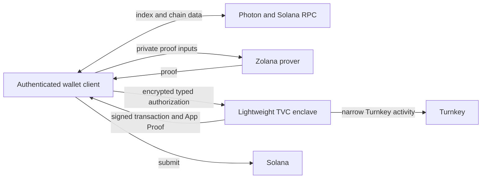

# Lightweight TVC Wallet Architecture

This profile is an alternative to the full enclave-wallet design preserved in
[`../enclave-wallet`](../enclave-wallet). It deliberately makes the
authenticated user client the privacy boundary. It is a development design,
not a production-funds profile.

The normative full-enclave design remains in
[`TVC_SPEC.md`](../../spec/TVC_SPEC.md). A release must pick
one trust model explicitly; clients must not silently treat this lightweight
profile as providing the full design's confidentiality guarantees.

## Decision

The client runs the ordinary Zolana wallet stack:

- Photon/indexer and Solana RPC calls;
- wallet synchronization and local checkpoints;
- private balance and UTXO selection;
- default-ring transaction construction;
- external prover calls and transaction/prover-input validation;
- transaction submission.

TVC performs only:

- independently verifiable release and Boot Proof handling;
- deterministic Turnkey-backed Ed25519 bootstrap;
- delivery of the derivation seed encrypted to one authenticated client key;
- validation and Turnkey signing of one fixed default-ring Solana transaction
  shape.

TVC has no Zolana indexer, prover, RPC, wallet-sync, or wallet-state dependency.
It has no persistent sealed wallet checkpoint.

## Why `ShieldedKeypairTrait` is not the network API

`ShieldedKeypairTrait` is a process-local SDK abstraction. Its current custody
contract intentionally returns a raw `NullifierKey`, and the related
`ViewingKeyTrait`/`WalletAuthority` paths provide locally usable viewing
material. The prover also consumes the nullifier key as private proof input.

A remote implementation can therefore work only if the client receives the
derived privacy material. Once it does, fine-grained RPC calls for every trait
method add latency and a generic signing surface without preserving more
secrecy.

The lightweight profile instead sends the deterministic derivation seed once,
inside the QOS-encrypted operation result. The client verifies the seed against
the descriptor's Ed25519 public key, expands the ordinary Zolana viewing and
nullifier roles through `ClientEd25519WalletAuthority`, and then uses the normal
local wallet SDK. That authority intentionally has no Solana signing method;
the completed transaction goes back through the typed TVC authorization
operation. The Turnkey signing key never leaves Turnkey.

The TVC API remains typed. It does not expose `sign_message`, arbitrary
`sign_transaction`, `ShieldedKeypairTrait`, or `WalletAuthority` over HTTP.

## Connection verification

The client still performs the existing fail-closed connection flow:

1. verify an independently signed `ReleasePolicyV1`;
2. treat `/v1/info` as untrusted discovery and bind it to that policy;
3. QOS-encrypt a fresh `/v1/ping` challenge;
4. verify the Ephemeral-key App Proof;
5. retrieve and verify the matching Turnkey Boot Proof;
6. return an opaque connection bound to the verified release.

This remains necessary because bootstrap returns secret material and
authorization can spend funds.

## Operations

### `BootstrapClientEd25519`

The enclave requests the fixed deterministic bootstrap signature from the
descriptor-bound Turnkey HD-wallet account. It verifies the signature, expands
the roles once to confirm the public shielded identity, and returns:

- the Solana address and shielded public identity;
- the 64-byte derivation seed;
- Turnkey activity evidence.

The complete result is encrypted to the request's one-time client response key.
The enclave zeroizes its result copy after serialization and retains no wallet
state. The client must encrypt the seed at rest and must never send it to the
indexer or application backend.

### `AuthorizeDefaultRingTransfer`

The client supplies its authenticated, operation-specific intent digest and one unsigned,
non-versioned Solana transaction. The enclave accepts only a transaction with:

- exactly the descriptor-bound wallet as the sole signer and fee payer;
- one bounded compute-unit-limit instruction;
- at most one bounded compute-unit-price instruction;
- exactly one final Zolana shielded-pool `TRANSACT` instruction;
- no additional program instructions;
- one empty signature slot and a nonzero recent blockhash;
- the Solana packet-size bound.

The accepted `TRANSACT` shape covers a confidential transfer or a public
withdrawal. Transfer and withdrawal clients use separate intent-digest domains;
the current enclave release retains its existing operation name because its
enforced boundary is the shared transaction shape.

The enclave sends those exact canonical transaction bytes to Turnkey, verifies
that the returned message is unchanged and its Ed25519 signature is valid, and
returns the signed bytes plus App Proof evidence. The result and proof bind the
client-authenticated intent digest, but the enclave does not reconstruct the
private recipient or amount from the zero-knowledge transaction.

This is narrower than generic transaction signing, but it is not independent
semantic policy enforcement. A compromised authenticated client can construct
a different valid Zolana transfer and authorize it. Production requires a
separate owner-intent mechanism or enclave-side semantic reconstruction.

## End-to-end transfer

1. The client restores its locally encrypted derivation seed and expands the
   viewing/nullifier roles with `ClientEd25519WalletAuthority`.
2. It queries Photon using its own view tags and synchronizes its local wallet.
3. It selects private inputs and constructs a default-ring transfer.
4. It fetches Merkle/non-inclusion proofs and assembles the prover input.
5. It calls the external prover. The current TypeScript client validates the
   assembled inputs but does not yet run Groth16 verification locally; Solana
   verifies the proof on chain and the client keeps preflight enabled.
6. It constructs the unsigned Zolana Solana transaction.
7. It calls `AuthorizeDefaultRingTransfer` with the exact transaction and its
   client-authorized intent digest.
8. It verifies the TVC App/Boot Proof and Turnkey evidence, then submits the
   returned bytes to Solana.

## Changed trust model

| Property | Full enclave wallet | Lightweight client wallet |
| --- | --- | --- |
| Viewing/nullifier material | TVC enclave | Authenticated user client |
| Private balances and history | TVC enclave | Authenticated user client |
| Wallet checkpoint | QOS-sealed client blob | Client-local wallet state |
| Indexer/RPC transport | TVC | Client |
| Prover transport | TVC | Client |
| Turnkey signing key | Turnkey | Turnkey |
| TVC runtime state | Sealed wallet continuation | Stateless |
| Browser compromise reveals privacy | Intended not to | Yes |

The external development prover sees private proof inputs in both current PoC
profiles. Moving the HTTP caller to the client does not improve that property.

## Operational consequences

The service image becomes smaller and no longer requires egress to Photon,
Solana RPC, or the prover. It still requires Turnkey egress for bootstrap and
transaction authorization.

The client now needs:

- encrypted local seed storage and recovery;
- replay-safe local operation state;
- the Zolana wallet/indexer/prover SDK stack;
- browser-side Groth16 verification before requesting authorization (not yet
  implemented in the TypeScript SDK);
- protection against frontend compromise and malicious dependencies.

This profile is a good fit for a native wallet or a PoC that trusts the user's
device. It is not a fit when the product requirement is to hide private-wallet
metadata from browser/application code.
