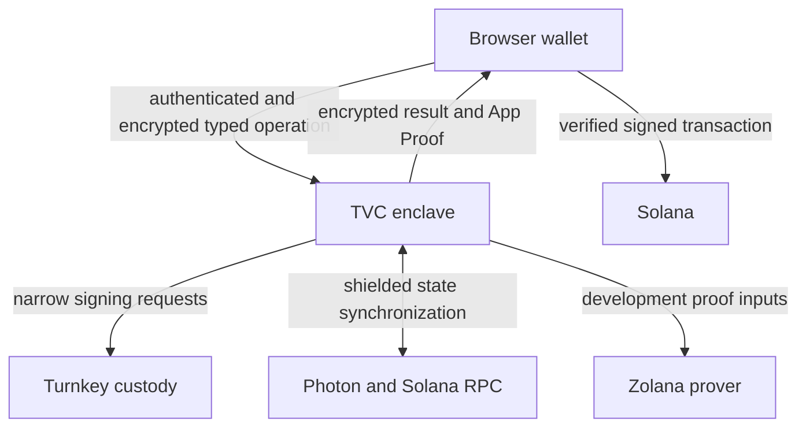

# TVC Private Wallet Architecture

This document explains how the current development implementation fits
together. It is an implementation overview, not a second protocol
specification. [`TVC_SPEC.md`](../../spec/TVC_SPEC.md) defines
the normative security rules, formats, and production acceptance gates.

The Turnkey Verifiable Cloud (TVC) service is an attested, narrowly scoped
private-wallet backend. It does not replace Turnkey custody, the Zolana
shielded protocol, Photon, or the prover. It connects them while keeping
derived shielded-wallet secrets out of the browser and ordinary application
servers.

## Responsibility boundaries

| Component | Responsibility |
| --- | --- |
| Turnkey | Holds the user's Ed25519 wallet key and evaluates the narrow signing policies installed for that wallet. |
| TVC enclave | Restores sealed private-wallet state, constructs an allowed operation, coordinates signatures and proving, verifies their outputs, and emits an attested result. |
| Zolana shielded protocol | Provides the on-chain private balance, nullifiers, default-ring transfer semantics, and proof verification rules. |
| Photon | Supplies indexed shielded-chain state used to synchronize the wallet. |
| External prover | Produces the Groth16 proof for the current development transfer profile. The enclave verifies the proof before using it. |
| Browser client | Verifies the release and Boot Proof, authorizes typed operations, stores opaque checkpoints, and explicitly submits verified transaction bytes. |

Turnkey protects a signing key, but it does not implement a Zolana private
wallet. A browser-only implementation would expose the derived viewing and
nullifier material to the browser environment. TVC provides an attestable
execution boundary for those wallet operations while Turnkey remains the
custodian of the signing key.

TVC is not itself the privacy protocol. Zolana's shielded pool and
zero-knowledge proof provide the on-chain privacy properties. TVC provides
attestable execution, state sealing, and a closed policy surface around that
protocol.

## Connecting an embedded wallet

The integrated demo starts with an ordinary Turnkey embedded HD wallet. It
does not expose that wallet through a generic TVC signing API and does not need
to create a second Turnkey wallet.

Private-wallet enrollment does the following:

1. The active embedded-wallet owner session registers the TVC Quorum signing
   public key in the user's Turnkey child organization.
2. It installs narrow policies for the exact wallet account and supported TVC
   operations.
3. A provisioning authority signs a `WalletDescriptorV1` that binds the
   Turnkey organization, wallet account, Solana address, TVC identities,
   browser authorization key, environment, and allowed operations.
4. The browser creates a separate non-extractable P-256 authorization key in
   WebCrypto and stores it in IndexedDB.

The TVC application and its Quorum private key can remain in their dedicated
Turnkey organization. Only the Quorum public signing credential and its narrow
policies are installed in the end user's child organization.

## Verifying the running service

`connectAndVerify()` does not trust `/v1/info` by itself. It:

1. verifies an independently signed development `ReleasePolicyV1`;
2. checks that `/v1/info` matches the policy's release, executable, manifest,
   Quorum key, environment, limits, and supported operations;
3. QOS-encrypts a fresh challenge to the Quorum encryption key and sends it to
   `/v1/ping`;
4. verifies the response signed by the enclave's Ephemeral key;
5. retrieves the matching Turnkey Boot Proof through the caller's authenticated
   Turnkey session;
6. verifies the AWS Nitro attestation chain, approved PCR values, QOS manifest
   commitment, and exact Ephemeral-key binding.

Only a successful fail-closed check produces the opaque `VerifiedConnection`
accepted by wallet operations. The client repeats the App Proof and matching
Boot Proof verification for each operation result.

The TypeScript verifier is deliberately a development composite verifier. The
Rust operator harness uses the pinned official `turnkey_proofs` crate. Neither
path changes the production blockers described below.

## Operation lifecycle

For each operation, the browser constructs a canonical `OperationRequestV1`
bound to:

- a fresh request ID and bounded validity interval;
- the verified release, manifest, executable, and Quorum epoch;
- the signed wallet descriptor and requested operation;
- the expected sealed-state version and digest;
- a one-time response encryption key;
- the browser's P-256 authorization signature.

The complete request is QOS-encrypted to the Quorum encryption key. The
enclave decrypts it, validates every binding, and runs only the selected typed
operation. It encrypts the result to the one-time browser response key and
signs an App Proof binding the request, result, operation, and resulting state.

The browser verifies that evidence before decrypting and accepting the result.
Transaction submission remains an explicit client/backend action; TVC never
hides broadcast behind a wallet operation.

## Implemented operations

| Operation | Current development behavior |
| --- | --- |
| `CreateWallet` | Operator-only provisioning path that creates one Turnkey HD wallet and its Solana Ed25519 account. The embedded-wallet demo normally skips it. No mnemonic is returned. |
| `BootstrapEd25519` | Requests one fixed Turnkey derivation signature, verifies it, derives the shielded identity, and returns public address material plus an opaque sealed checkpoint. |
| `PrepareWallet` | Restores the checkpoint and constructs exactly one shielded-identity registration transaction. |
| `ShieldSol` | Constructs a bounded public-to-private SOL deposit into the same user's shielded balance. |
| `BuildTransfer` | Synchronizes the private wallet, builds a default-ring SOL or registered SPL transfer, obtains the required narrow Turnkey signatures, calls the pinned prover, verifies its proof, and returns the signed Solana transaction. |

There is no public `signMessage`, arbitrary `signTransaction`, wallet export,
or generic Turnkey activity endpoint. Internally, a private transfer can use a
Turnkey signature for shielded spend authorization and another for the outer
Solana transaction, but both are requested only for enclave-constructed,
validated operation shapes.

The fixed bootstrap signature is sensitive derivation material. After
enrollment, production lifecycle automation must revoke the Turnkey policy that
permits it to be produced again.

## Key and state ownership

| Material | Location |
| --- | --- |
| Turnkey Ed25519 wallet private key | User's Turnkey child organization |
| QOS Quorum private subkeys | Reconstructed and supplied by the QOS runtime |
| QOS Ephemeral private key | Current enclave replica |
| Derived viewing/nullifier material | Plaintext only during enclave execution; otherwise inside sealed state |
| Opaque sealed checkpoint | Browser IndexedDB |
| Browser request authorization key | Non-extractable WebCrypto key in IndexedDB |
| Release and provisioning private keys | Outside the runtime |
| Development faucet key | Demo backend, outside TVC |

The service is stateless between operations. The client must durably retain the
latest opaque checkpoint and its pending/finalized status. A persistent
Turnkey login session does not replace the private-wallet checkpoint.

## Prover and demo boundaries

The current enclave does not run the prover. `BuildTransfer` calls the pinned
external `../zolnet` development prover and locally verifies the returned
Groth16 proof. This protects correctness, but the current plaintext development
path does not hide proof inputs from the prover.

The following conveniences are also outside TVC:

- devnet SOL airdrops and gas funding;
- the `Claim 1 ZDEV` faucet action;
- transaction broadcast;
- UI polling while Photon indexes a transaction.

ZDEV and other registered SPL assets can use `BuildTransfer` after the wallet
has a private balance. The current API has a dedicated `ShieldSol` operation;
it does not expose a generic public-to-private SPL deposit operation.

## Current production gaps

The deployed implementation is a disposable development PoC and rejects
production descriptors and mainnet use. The principal remaining gaps are:

- confidential or attested proving instead of the external plaintext prover;
- an independently operated production release-distribution and revocation
  process;
- cryptographic binding between Turnkey policy evidence and the exact activity
  (`decisionContextDigest` evidence remains
  `CryptographicallyValidButUnbound`);
- automated bootstrap-policy revocation;
- cross-device checkpoint backup, recovery, and browser-key rotation;
- Quorum-key rotation and sealed-state migration;
- durable replay/idempotency coordination;
- a fee-payer design that does not publicly link every private-wallet action to
  the user's Turnkey Solana address;
- completion and audit of the production acceptance gates in the normative
  specification.

## Implementation map

- [`zolana-tvc-protocol`](../../crates/protocol/README.md) owns the shared
  protocol types, canonicalization, digests, envelopes, and release policy.
- [`enclave-wallet`](README.md) is the full attested development
  enclave application.
- [`proof-verifier`](../../crates/proof-verifier/README.md) contains the
  Rust operator verification and end-to-end harness.
- [`@zolana/tvc-wallet`](../../packages/tvc-wallet/README.md) owns browser
  verification, request orchestration, checkpoint persistence, and the React
  integration.
- `private-wallet-next-app` in the downstream `wallet-kit` repository
  demonstrates the combined embedded public wallet and private-wallet
  experience.
