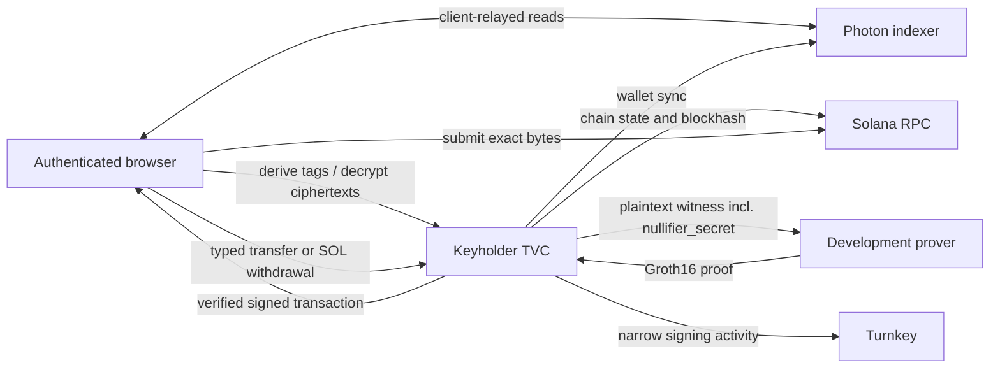

# Keyholder TVC Wallet Architecture

This is the implemented development architecture. The detailed API and risk
record are in [`../../docs/keyholder-profile.md`](../../docs/keyholder-profile.md).

The keyholder is the middle profile between `client-wallet`, which releases the
derivation seed to the authenticated device, and `enclave-wallet`, which owns
the complete wallet runtime. It keeps the derivation seed, viewing key, and
nullifier key behind TVC while retaining client-relayed read synchronization.

One intentional PoC exception closes private spending now: `BuildTransfer` and
`BuildSolWithdrawal` run wallet sync and construction inside TVC and send the
plaintext Groth16 witness to the pinned development prover. That witness
contains the long-lived `nullifier_secret`. The browser never receives it; the
prover does. This profile must not hold production funds.

## Responsibility boundary

| Component | Responsibility |
| --- | --- |
| Browser | Verifies release and Boot Proof, signs typed requests with a device P-256 key, stores the opaque sealed state, performs relayed read sync, constructs public registration/deposit transactions, journals signed spends, and submits them. |
| Keyholder TVC | Unseals privacy keys per request, derives view tags, decrypts payloads, and for typed spend operations syncs, selects inputs, assembles the witness, verifies the proof, and requests the narrow Turnkey signature. |
| Turnkey | Holds the ordinary Ed25519 signing key, produces the fixed deterministic bootstrap signature, evaluates policy, and signs accepted Solana transactions. |
| Photon / Solana RPC | Browser-owned for reads and submission; also compile-time-pinned TVC dependencies during `BuildTransfer` and `BuildSolWithdrawal`. |
| Development prover | Receives the complete plaintext witness, including `nullifier_secret`. It is trusted with wallet unlinkability for this PoC. |

The service is not a remote `ShieldedKeypairTrait` or generic signer. Its public
surface is six closed operation discriminants and never returns a seed,
viewing key, nullifier key, generic Turnkey stamp, or arbitrary signature.

## Verification and state

The browser trusts neither HTTPS nor `/v1/info`. It first verifies an
independently signed release policy, binds discovery to that policy, completes
the QOS-encrypted ping, and verifies the matching AWS Nitro Boot Proof. Only the
resulting opaque `VerifiedConnection` can execute an operation.

Every operation request is QOS-encrypted and descriptor-authorized. Every
result is encrypted to a one-time client key and carries an App Proof binding
the request digest, encrypted result digest, operation, and state digest.

`BootstrapKeyholder` uses the deterministic Turnkey signature as the 64-byte
derivation seed, returns only the public identity, and QOS-seals the seed. TVC
is replica-stateless; the browser carries this opaque checkpoint. A lost or
old-epoch blob is recovered by bootstrapping again after verifying the new
release and comparing the returned public identity with the previously known
identity. The Turnkey wallet, not the blob, is the recovery root.

Stateful key operations require the complete checkpoint tuple: blob, version,
and digest. Partial tuples are rejected. The current spend operations do not
mutate key state, so they return the same checkpoint digest they consumed.

## Operations

| Operation | Checkpoint | Egress | Result |
| --- | --- | --- | --- |
| `BootstrapKeyholder` | Absent | Turnkey | Public identity and sealed key state. |
| `DeriveViewTags` | Required | None | Up to 512 tags. |
| `DecryptUtxos` | Required | None | Up to 256 plaintext candidates. |
| `BuildTransfer` | Required | Photon, Solana RPC, development prover, Turnkey | Signed default-ring transaction, proof-bound prior balance, and unchanged checkpoint. |
| `BuildSolWithdrawal` | Required | Photon, Solana RPC, development prover, Turnkey | Signed public-SOL withdrawal, proof-bound prior balance, and unchanged checkpoint. |
| `AuthorizeDefaultRingTransfer` | Absent | Turnkey | Existing bounded transaction-shape authorization rail. |

`DecryptUtxos` does not assert ownership because the current shielded transport
cipher is unauthenticated. The caller must deserialize candidates and compare
their owner with the recorded identity.

For both spend operations, URLs, tree, environment, and prover profile are not
caller selected. The app rejects zero amounts, unknown assets, unregistered
SPL assets, other prover profile IDs, production descriptors, and mainnet. The
Zolana SDK assembles the witness and locally verifies the returned proof before
Turnkey signing. A failure is returned as a closed stage rather than leaking
transport details.

## What remains unsafe

The external prover can read `nullifier_secret` and compute this wallet's
nullifiers. Plain HTTP is used for the pinned current devnet prover endpoint.
Turnkey can reproduce the deterministic seed. Turnkey App Proof policy evidence
remains `CryptographicallyValidButUnbound`. The browser sees any plaintexts it
asks the oracle to decrypt and the indexer can correlate queried tags.

The production replacement is an attested prover plus a channel bound to its
attestation, or in-enclave proving. Until one is implemented and independently
verified, this spend path is disposable-devnet-only.

## Deployment boundary

Keyholder is a separate TVC application identity, image, Quorum key, manifest,
release policy, descriptor grant, dependency lock, and review line. Its image
uses HTTP/1 ingress. Egress must allow the fixed Turnkey, Photon/Solana, and
development prover targets required by the operation; caller-supplied origins
are never accepted.

The deployed routes are `GET /health`, `GET /v1/info`, `POST /v1/ping`, and
`POST /v1/operations`. The local harness route is feature-gated and absent from
`/tvc_app`.
