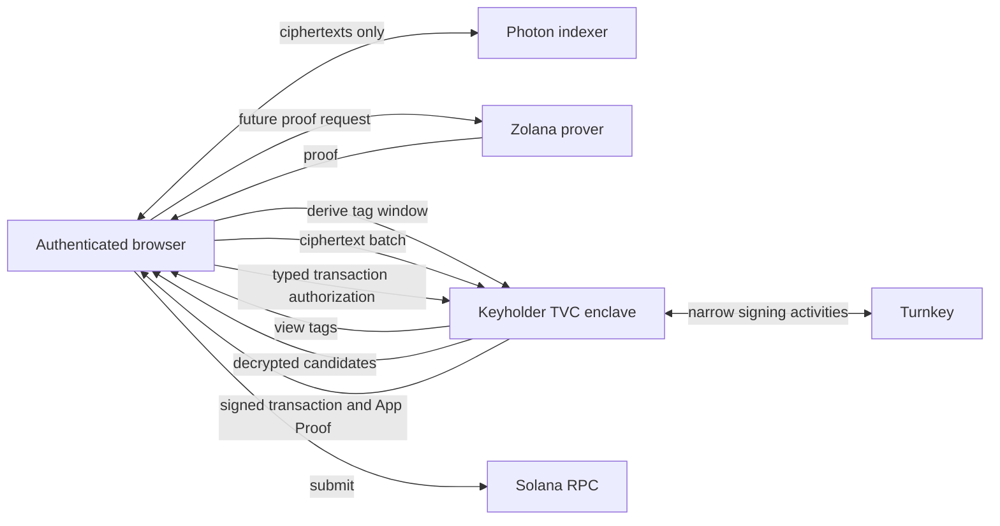

# Keyholder TVC Wallet Architecture

This document describes the current keyholder implementation. It is an
implementation overview, not a second protocol specification. The detailed
trust analysis and open design questions live in
[`../../docs/keyholder-profile.md`](../../docs/keyholder-profile.md).

The keyholder profile is the middle ground between
[`client-wallet`](../client-wallet), which releases the derivation seed to the
authenticated device, and [`enclave-wallet`](../enclave-wallet), which runs
wallet sync and transaction construction inside TVC.

The keyholder keeps the derivation seed, viewing key, and nullifier key behind
the attested TVC boundary. The browser still owns all indexer, prover, Solana
RPC, transaction-construction, and submission transports. It sends encrypted
wallet data to TVC only when an answer requires a private key.

This is a development profile and must not hold production funds.

## Responsibility boundaries

| Component | Responsibility |
| --- | --- |
| Browser | Verifies the TVC release, authorizes typed requests with its device key, stores the opaque sealed key state, queries the indexer, validates decrypted candidates, and owns transaction construction and submission. |
| Keyholder TVC | Unseals privacy-key state for one request, derives view tags, decrypts shielded payloads, validates the narrow transaction shape, and emits encrypted results with App Proofs. |
| Turnkey | Holds the ordinary Ed25519 wallet key, produces the fixed deterministic bootstrap signature, and signs an accepted Solana transaction. |
| Photon | Returns encrypted shielded payloads for browser-supplied view tags. TVC never connects to it. |
| Prover | Not yet wired into the implemented keyholder spend path. The browser will relay the eventual proof request. |
| Solana RPC | Serves chain data and accepts transaction submission from the browser. TVC never connects to it. |

The service is a key oracle, not a remote `ShieldedKeypairTrait` API. Its
network surface is four explicit operations; it does not expose raw viewing or
nullifier keys, arbitrary messages, generic transactions, wallet export, or a
generic Turnkey activity endpoint.

## Connection and request verification

The browser cannot trust HTTPS or `/v1/info` as attestation. Before any wallet
operation it:

1. verifies an independently signed `ReleasePolicyV1`;
2. binds the untrusted `/v1/info` discovery document to that policy;
3. completes a fresh QOS-encrypted `/v1/ping` challenge;
4. verifies the Ephemeral-key App Proof; and
5. resolves and verifies the matching AWS Nitro Boot Proof.

Only that fail-closed sequence produces the opaque `VerifiedConnection` needed
by the operation client.

Every `/v1/operations` request is QOS-encrypted to the release's Quorum
encryption key and signed by the descriptor-authorized browser P-256 key. The
request binds the release, executable, wallet descriptor, validity window,
operation, response key, and—when required—the exact sealed checkpoint.

The response is encrypted to a fresh one-time client key. Its App Proof binds
the request digest, encrypted result digest, operation, and state digest. An
operation result is not accepted merely because it decrypts.

## Sealed key state

`BootstrapKeyholder` obtains the fixed deterministic Ed25519 signature from
the descriptor-bound Turnkey wallet. TVC uses the raw signature as the
derivation seed, expands the Zolana shielded roles inside the enclave, returns
only the public identity, and seals the seed to the QOS Quorum key.

The browser stores the opaque `SealedWalletStateV1`. TVC stores nothing between
requests. The sealed plaintext binds:

- the Quorum key ID and epoch;
- wallet and descriptor identities;
- policy and state versions;
- the expected Ed25519 public key and derivation suite; and
- the 64-byte derivation seed.

Oracle requests must present the complete checkpoint tuple: sealed state,
expected version, and expected digest. Partial state is rejected. Bootstrap and
transaction authorization reject all checkpoint fields so caller-selected
state cannot influence those operations.

The blob is a cache, not the recovery root. The bootstrap signature is
deterministic, so losing the blob or rotating the Quorum key is handled by
verifying the new release and bootstrapping again. The client must compare the
new public shielded identity with the identity it previously recorded before
adopting the replacement blob. Losing or disabling the underlying Turnkey
wallet is not recoverable by this mechanism.

## Implemented operations

| Operation | Checkpoint | Egress | Result |
| --- | --- | --- | --- |
| `BootstrapKeyholder` | Must be absent | Turnkey only | Public Solana/shielded identity and version-1 sealed key state. The seed is never returned. |
| `DeriveViewTags` | Required | None | A requested view-tag window, capped at 512 entries. Overflow is rejected rather than truncated. |
| `DecryptUtxos` | Required | None | One decryption result per supplied ciphertext, capped at 256 entries. |
| `AuthorizeDefaultRingTransfer` | Must be absent | Turnkey only | The exact accepted transaction signed by the descriptor-bound wallet, plus Turnkey evidence. |

`DecryptUtxos` cannot authenticate ownership. Zolana's shielded transport uses
an unauthenticated cipher, so another wallet's payload decrypts to garbage
rather than failing. The browser must deserialize every candidate and compare
the recovered owner with its recorded shielded identity.

`AuthorizeDefaultRingTransfer` accepts only a non-versioned Solana transaction
with the descriptor-bound account as sole signer and fee payer, a bounded
compute-budget prefix, and exactly one final Zolana `TRANSACT` instruction. It
rejects extra program instructions, populated signature slots, zero
blockhashes, and oversized transactions. Transfer and withdrawal use distinct
intent-digest domains even though they share this transaction-shape rail.

This authorization is deliberately narrower than generic signing, but it is
not enclave-side reconstruction of recipient and amount. The authenticated
client still chooses the zero-knowledge transaction it asks TVC to authorize.

## Implemented sync flow

1. The browser sends a tag window and its sealed checkpoint to
   `DeriveViewTags`.
2. It queries Photon with the returned tags.
3. It batches the returned ciphertexts into `DecryptUtxos` requests carrying
   the same checkpoint.
4. It validates the returned plaintext candidates and updates its local public
   display of private balance and history.

This costs two TVC round trips per tag page, with the indexer request between
them. The TypeScript `syncKeyholderWallet` helper owns the paging but accepts
the indexer fetch as a callback so the package never hides that transport
inside TVC.

## Spend path status

The service already exposes the final narrow Turnkey authorization rail, but a
complete keyholder private spend is not implemented. Constructing a spend
requires the nullifier key to assemble nullifiers and the prover witness. That
key cannot be released without collapsing this profile into `client-wallet`.

The proposed `AssembleSpend` operation remains intentionally unimplemented
until the proof-request boundary is settled. Returning a plaintext witness
would expose the long-lived nullifier secret to the browser and external
prover. Encrypting it directly to an attested or otherwise pinned prover would
preserve the keyholder boundary but requires a corresponding prover protocol.

Until that is decided, the keyholder demo covers verified connection, sealed
bootstrap, tag derivation, client-relayed indexer fetch, and enclave
decryption. It must not claim end-to-end private spending.

## Trust consequences

| Property | Client wallet | Keyholder wallet | Full enclave wallet |
| --- | --- | --- | --- |
| Seed and raw privacy keys | Browser | TVC | TVC |
| Indexer/RPC/prover transport | Browser | Browser | TVC |
| Private plaintext history | Browser | Browser after requested decryption | TVC |
| Wallet synchronization | Browser | Browser, with TVC key oracles | TVC |
| Sealed state stored by | N/A; client encrypts local seed | Browser | Browser |
| TVC egress | Turnkey | Turnkey | Turnkey, indexer/RPC, and prover |
| Browser compromise at rest reveals raw keys | Yes | No | No |
| Browser compromise in use can observe private history | Yes | Yes | Intended not to |

The keyholder reduces at-rest key exposure without pulling the evolving Zolana
wallet stack or network transports into the enclave. It does not hide the
plaintexts that the user asks to display from a compromised live browser, stop
the indexer from correlating queried tags, protect against Turnkey recomputing
the deterministic seed, or solve confidential proving.

## Deployment boundary

The keyholder is a separate TVC application identity, not a mode flag. A
release needs its own app ID, Quorum key, manifest, executable digest, signed
release policy, descriptor grants, and review record. The production image has
only HTTP/1 ingress and permits egress to Turnkey; it contains no indexer,
prover, or Solana RPC client.

`GET /health`, `GET /v1/info`, `POST /v1/ping`, and
`POST /v1/operations` are the deployed public routes. The local harness's
`POST /dev/v1/bootstrap-ed25519` route is compile-time gated and is never part
of `/tvc_app`.

The current development deployment metadata is recorded under
[`deploy/`](deploy/). Exact request formats, limits, and recovery requirements
are documented in
[`../../docs/keyholder-profile.md`](../../docs/keyholder-profile.md).
