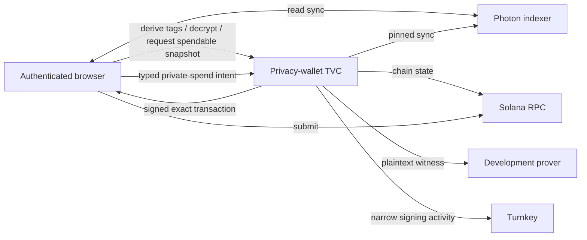

# Privacy-wallet TVC architecture

The product is called the privacy wallet. Its security model is a keyholder:
TVC retains the derivation seed, viewing key, and nullifier key, while the
browser owns connection verification, public chain actions, ciphertext
discovery/relay, submission, and local display state. TVC reconciles current
spendability because that requires the nullifier role.

## Boundary

| Component | Responsibility |
| --- | --- |
| Browser | Verifies release and Boot Proof, authorizes typed requests with a device P-256 key, stores the sealed checkpoint, builds public registration/deposit transactions, relays reads, journals spends, and submits exact signed bytes. |
| TVC | Unseals privacy keys for one request, derives tags, decrypts candidates, reconciles spendable commitments, prepares bounded default/custom-ring spends, and finalizes only an exact capsule-bound transaction. |
| Turnkey | Holds the ordinary Ed25519 signing key, supplies the deterministic bootstrap signature, enforces policy, and signs accepted transactions. |
| Indexer and RPC | Serve browser reads; pinned endpoints also serve TVC spend construction. |
| Development prover | Receives the plaintext witness, including `nullifier_secret`, and is inside the PoC privacy trust boundary. |

The public surface is four closed operation discriminants. It never returns a
seed, privacy key, witness, generic Turnkey stamp, or arbitrary signature.

## Verification and state

`/v1/info` is discovery, not trust. The client first verifies an independently
signed release policy, binds discovery to it, completes the QOS ping, and
verifies the matching AWS Nitro Boot Proof. Only the resulting opaque
`VerifiedConnection` can execute wallet operations.

Requests are QOS-encrypted and descriptor-authorized. Results are encrypted to
a one-time response key. The App Proof binds request digest, encrypted result,
operation, and state digest.

The browser carries the sealed checkpoint; TVC stores no wallet database. A
lost or old-epoch checkpoint is replaced by re-running `BootstrapKeyholder`
and comparing the returned public identity with the known identity. The
underlying Turnkey wallet is the recovery root.

## Operations

| Operation | Checkpoint | Network use |
| --- | --- | --- |
| `BootstrapKeyholder` | Forbidden | Turnkey |
| `DeriveViewTags` | Required | None |
| `DecryptUtxos` | Required | None for decryption; pinned indexer plus bounded pool-registry RPC reads when a spendable snapshot is requested |
| `AuthorizeSpend::Prepare` | Required | Pinned indexer, RPC, prover |
| Built-in `AuthorizeSpend::Finalize` | Required | Turnkey |
| Generic `AuthorizeSpend::Finalize` | Required | Pinned RPC, then Turnkey |

Public registration and SOL/SPL deposits are client-built because they do not
require a privacy secret. The built-in path prepares default/custom-ring
transfer or unshield and seals the exact unsigned transaction. The generic path
prepares an exact private-only SPP transition for a caller-named program and
finalizes one instruction that carries those bytes, the pinned pool and tree,
the System Program, the wallet as sole signer, and every declared program
authority; additional user-approved instructions and programs follow normal
wallet trust. Both ask Turnkey for one
Ed25519 signature shared by shielded-owner and fee-payer roles only during a
separate finalize request.

For a spendable snapshot, TVC loads the shielded pool's classic SPL registry
through a size-filtered `getProgramAccounts` query. The adapter accepts only the
pinned pool program, rejects an oversized response or wrong owner, and verifies
the canonical PDA of every decoded registry account.

The app accepts classic SPL assets registered by the shielded pool; Token-2022
is not supported.

## Known production blocker

A custom-ring spend proves twice through one client: the pooled `transfer-ring`
proof, and then the `custom-ring` proof over the public-input chain the first
one produced. Only one prover deployment carries the second circuit, so the ring
path is pinned to it and the default path is pinned to the other. Both origins
are fixed in the image; a caller names the ring, never the prover.

The pinned development prover can read `nullifier_secret` and compute wallet
nullifiers. Production requires in-enclave proving or an attested prover with a
channel bound to its attestation. Production descriptors and mainnet are
rejected until that boundary exists.

QOS currently exposes egress as a transparent bridge. The measured executable
pins every destination, but a separate network allowlist is still required for
defense in depth. See [`docs/egress.md`](../../docs/egress.md).
