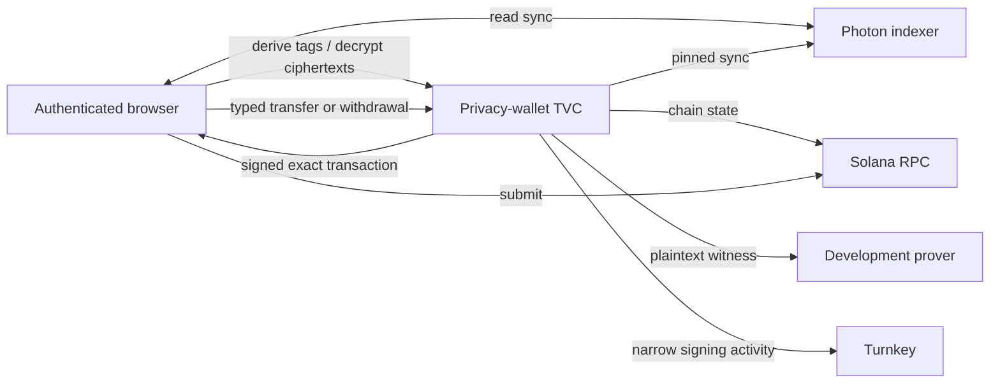

# Privacy-wallet TVC architecture

The product is called the privacy wallet. Its security model is a keyholder:
TVC retains the derivation seed, viewing key, and nullifier key, while the
browser owns connection verification, public chain actions, indexer relay,
submission, and local display state.

## Boundary

| Component | Responsibility |
| --- | --- |
| Browser | Verifies release and Boot Proof, authorizes typed requests with a device P-256 key, stores the sealed checkpoint, builds public registration/deposit transactions, relays reads, journals spends, and submits exact signed bytes. |
| TVC | Unseals privacy keys for one request, derives tags, decrypts candidates, and builds bounded private spends. |
| Turnkey | Holds the ordinary Ed25519 signing key, supplies the deterministic bootstrap signature, enforces policy, and signs accepted transactions. |
| Indexer and RPC | Serve browser reads; pinned endpoints also serve TVC spend construction. |
| Development prover | Receives the plaintext witness, including `nullifier_secret`, and is inside the PoC privacy trust boundary. |

The public surface is six closed operation discriminants. It never returns a
seed, privacy key, witness, generic Turnkey stamp, or arbitrary signature.

## Verification and state

`/v1/info` is discovery, not trust. The client first verifies an independently
signed release policy, binds discovery to it, completes the QOS ping, and
verifies the matching AWS Nitro Boot Proof. Only the resulting opaque
`VerifiedConnection` can execute wallet operations.

Requests are QOS-encrypted and descriptor-authorized. Results are encrypted to
a one-time response key. The App Proof binds request digest, encrypted result,
operation, and state digest.

The browser carries the sealed checkpoint; TVC stores no wallet database. A
lost or old-epoch checkpoint is replaced by re-running `BootstrapKeyholder`
and comparing the returned public identity with the known identity. The
underlying Turnkey wallet is the recovery root.

## Operations

| Operation | Checkpoint | Network use |
| --- | --- | --- |
| `BootstrapKeyholder` | Forbidden | Turnkey |
| `DeriveViewTags` | Required | None |
| `DecryptUtxos` | Required | None |
| `BuildTransfer` | Required | Pinned indexer, RPC, prover, Turnkey |
| `BuildSolWithdrawal` | Required | Pinned indexer, RPC, prover, Turnkey |
| `BuildCustomRingTransfer` | Required | Pinned indexer, RPC, prover, Turnkey |
| `BuildCustomRingSolWithdrawal` | Required | Pinned indexer, RPC, prover, Turnkey |
| `AuthorizeDefaultRingTransfer` | Forbidden | Turnkey |

Public registration and SOL/SPL deposits are client-built because they do not
require a privacy secret. The app accepts classic SPL assets registered by the
shielded pool; Token-2022 is not supported.

## Known production blocker

The pinned development prover can read `nullifier_secret` and compute wallet
nullifiers. Production requires in-enclave proving or an attested prover with a
channel bound to its attestation. Production descriptors and mainnet are
rejected until that boundary exists.
