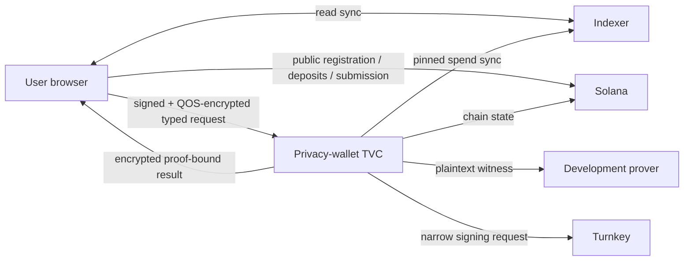

# Architecture

Zolana TVC is an attested privacy-wallet keyholder. Turnkey owns the ordinary
Solana signing key. TVC derives and temporarily opens the shielded privacy keys.
The browser verifies TVC, carries its opaque checkpoint, relays indexer reads,
builds public deposits, and submits exact signed transactions.

## Trust establishment

HTTPS does not establish enclave identity. The client independently verifies a
threshold-signed `ReleasePolicyV1`, treats `/v1/info` as untrusted discovery,
binds it to the policy, completes the Quorum-encrypted/Ephemeral-signed QOS
challenge, and verifies the corresponding AWS Nitro Boot Proof. Wallet calls
require the resulting opaque `VerifiedConnection`.

## Wallet state

`BootstrapKeyholder` derives a stable shielded identity from a fixed,
deterministic Turnkey signature. TVC returns the public identity and a seed
sealed to the QOS Quorum key. It never returns the seed or raw privacy keys.

The app is replica-stateless. The browser persists the sealed checkpoint and
presents it for key-dependent calls. Blob loss and Quorum rotation recover by
bootstrapping again and requiring an exact match with the known public identity.

## Network split

Read sync is relayed: TVC derives tags, the browser queries the indexer, and TVC
decrypts returned ciphertexts. Public registration and SOL/SPL deposits are
built in the browser because no privacy secret is required.

Private transfers and SOL withdrawals require the nullifier key. TVC therefore
syncs against pinned endpoints, constructs the witness, asks the pinned prover,
locally verifies its proof, and sends the exact transaction to Turnkey under a
narrow policy. The browser journals and submits the returned bytes.

The current prover sees a plaintext `nullifier_secret`. That makes the complete
spend flow useful for a devnet PoC but blocks production. See [Security](security.md).
