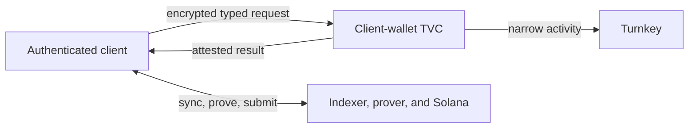
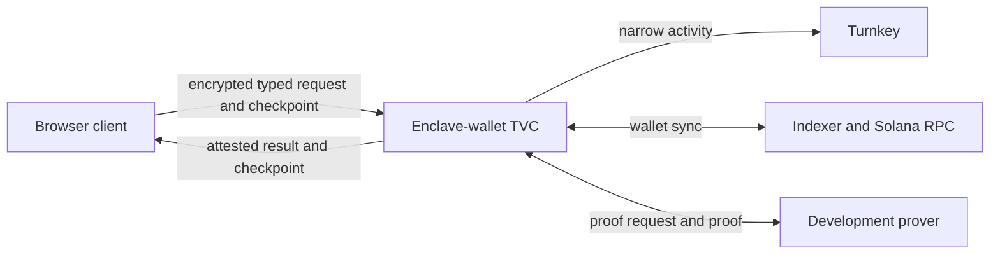

# Architecture

Zolana TVC combines Turnkey custody, an attested application, and the Zolana
shielded protocol. Turnkey protects the Solana signing key. Zolana supplies the
private balance and proof system. TVC restricts which wallet operations can use
the key and makes the running application independently verifiable.

The repository implements two deliberately different privacy boundaries.

## Shared foundation

Both profiles use the same:

- strict, versioned operation and evidence types;
- RFC 8785/JCS canonicalization and domain-separated digests;
- P-256 client authorization and QOS-compatible encryption;
- signed release policy and fail-closed Boot/App Proof verification;
- Turnkey-backed Ed25519 wallet key;
- typed operations rather than generic message or transaction signing.

`/v1/info` is discovery data, not a trust root. A relying client first verifies
an independently obtained release policy, then binds discovery, a fresh QOS
challenge, the App Proof, and the matching Boot Proof to that policy.

## Client-owned profile

The preferred development profile keeps private wallet state on the
authenticated client.

The client synchronizes the wallet, chooses inputs, calls the prover, builds the
default-ring transaction, and submits it. TVC performs deterministic bootstrap
and accepts only a tightly bounded Zolana transaction shape for Turnkey
authorization. The Turnkey signing key never leaves Turnkey, but the client can
see derived viewing/nullifier material and private history.

This profile has the smaller image and no TVC dependency on the indexer, prover,
Solana RPC, or wallet-sync crates. See the detailed
[client-wallet design](../apps/client-wallet/ARCHITECTURE.md).

## Enclave-owned profile

The full reference profile keeps derived private-wallet material inside TVC
execution and an opaque QOS-sealed checkpoint outside it.

TVC restores the checkpoint, synchronizes the wallet, constructs the operation,
coordinates proving and narrow Turnkey signatures, and returns an attested
result. This reduces private material exposed to browser code but adds egress,
state-continuation, prover, and recovery complexity. See the detailed
[enclave-wallet design](../apps/enclave-wallet/ARCHITECTURE.md).

## Why two applications, not two branches

The profiles have different trust claims, dependencies, runtime permissions,
operation sets, and release identities. Encoding that distinction as branches
would hide it from builds and deployments. Encoding it as Cargo features would
allow one artifact to be built with the wrong boundary.

Separate application workspaces make the choice visible in code review, lock
dependency graphs independently, and produce distinct OCI images. Shared
protocol code remains a library because byte formats and verification rules
must not drift between the profiles.

## Comparison

| Property | Client wallet | Enclave wallet |
| --- | --- | --- |
| Viewing/nullifier material | Authenticated client | TVC execution and sealed state |
| Wallet synchronization | Client | TVC |
| Prover caller | Client | TVC |
| Transaction construction | Client | TVC |
| Turnkey private key | Turnkey | Turnkey |
| TVC state | Stateless | Client-carried sealed checkpoint |
| Browser compromise reveals private history | Yes | Intended not to |
| Operational complexity | Lower | Higher |

The current external development prover receives private proof inputs in both
profiles. Moving the caller changes the software boundary, not that disclosure.
