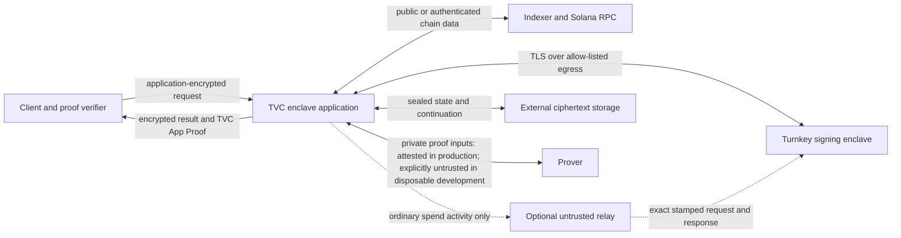
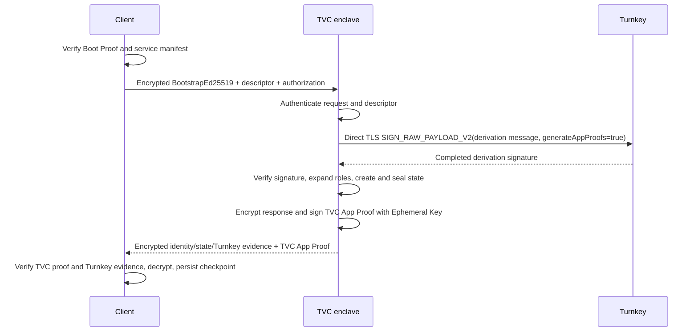
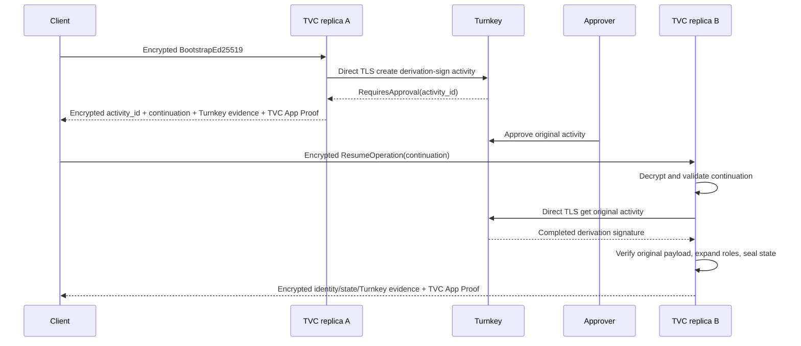
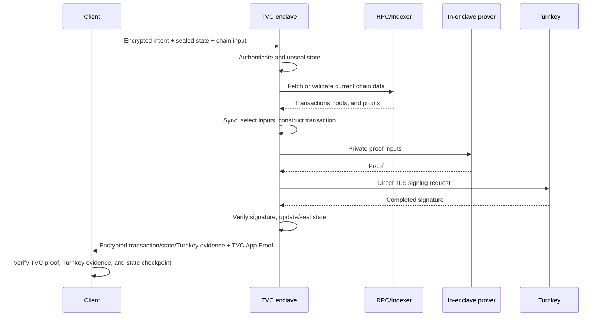
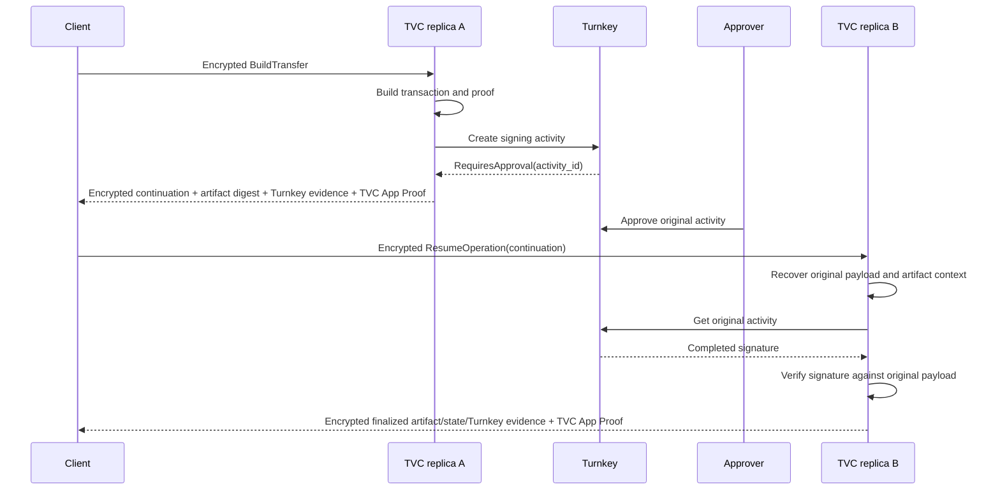

# Turnkey Verifiable Cloud Shielded Wallet Authority

| Field | Value |
| --- | --- |
| Status | Draft, security review revision 3; all design questions resolved, production blockers explicit |
| Target | TVC private beta |
| Initial rail | Ed25519 |
| Current safety level | Phase 0 only; production funds disabled |
| Last reviewed | 2026-08-21 |

## Table of Contents

- [Abstract](#abstract)
- [Decision](#decision)
- [Goals](#goals)
- [Non-goals](#non-goals)
- [Terminology](#terminology)
- [System Context](#system-context)
- [Trust Model](#trust-model)
  - [Trusted components](#trusted-components)
  - [Untrusted components](#untrusted-components)
  - [Security claims](#security-claims)
  - [Claims not made](#claims-not-made)
- [Architecture](#architecture)
  - [Authority boundary](#authority-boundary)
  - [Components](#components)
  - [Rust runtime dependency boundary](#rust-runtime-dependency-boundary)
  - [Turnkey connectivity](#turnkey-connectivity)
  - [Why bootstrap requires direct egress](#why-bootstrap-requires-direct-egress)
  - [Deployment profile](#deployment-profile)
- [Roles and Permissions](#roles-and-permissions)
- [Key Model](#key-model)
  - [TVC keys](#tvc-keys)
  - [Turnkey credential](#turnkey-credential)
  - [Ed25519 wallet bootstrap](#ed25519-wallet-bootstrap)
  - [P-256 wallets](#p-256-wallets)
- [Data Model](#data-model)
  - [Constants](#constants)
  - [Canonical encoding and digests](#canonical-encoding-and-digests)
  - [Wallet descriptor](#wallet-descriptor)
  - [Encrypted request](#encrypted-request)
  - [Operation request](#operation-request)
  - [Common operation types](#common-operation-types)
  - [Sealed wallet state](#sealed-wallet-state)
  - [Sealed continuation](#sealed-continuation)
  - [Encrypted response](#encrypted-response)
  - [TVC App Proof payload](#tvc-app-proof-payload)
  - [Visibility](#visibility)
- [API](#api)
  - [Public endpoints](#public-endpoints)
  - [Operations](#operations)
  - [Default-deny behavior](#default-deny-behavior)
  - [Authentication and freshness](#authentication-and-freshness)
  - [Client verification](#client-verification)
- [TypeScript WAAS Integration](#typescript-waas-integration)
  - [Package boundary](#package-boundary)
  - [Existing `wallet-kit` assessment](#existing-wallet-kit-assessment)
  - [POC surface](#poc-surface)
  - [Production surface](#production-surface)
  - [Verified result API](#verified-result-api)
  - [Readiness contract](#readiness-contract)
- [Flows](#flows)
  - [Provisioning](#provisioning)
  - [Bootstrap success](#bootstrap-success)
  - [Bootstrap approval](#bootstrap-approval)
  - [Wallet operation success](#wallet-operation-success)
  - [Spend approval](#spend-approval)
- [State and Recovery](#state-and-recovery)
  - [Replica independence](#replica-independence)
  - [Rollback](#rollback)
  - [Deterministic retries](#deterministic-retries)
  - [Extended downtime](#extended-downtime)
- [Transaction Construction and Proving](#transaction-construction-and-proving)
- [Turnkey Policies](#turnkey-policies)
- [Errors](#errors)
- [Logging and Observability](#logging-and-observability)
- [Deployment and Upgrades](#deployment-and-upgrades)
- [Testing and Acceptance](#testing-and-acceptance)
- [Delivery Phases](#delivery-phases)
- [Resolved Design Decisions](#resolved-design-decisions)
- [References](#references)

## Abstract

The TVC Shielded Wallet Authority is an attested service that runs Zolana wallet operations inside a Turnkey Verifiable Cloud enclave. Turnkey continues to hold and operate the wallet's signing key. TVC holds the derived viewing and nullifier secrets only while approved code is executing, so neither the ordinary application host nor a request relay receives private wallet material.

The client sends an authenticated, application-encrypted wallet request. The enclave derives or unseals the wallet, scans or validates the required state, constructs the private transaction, obtains any required Turnkey signature, and returns an encrypted result. A TVC App Proof binds the request and result to one attested TVC execution. Turnkey's currently documented address-derivation and policy-outcome App Proofs provide narrower evidence about Turnkey execution; the client combines those proofs with the exact activity response, request fingerprint, canonical intent, and independent signature verification. Production remains disabled until the supported Turnkey verifier can cryptographically validate every required linkage.

This document specifies the trust boundary, Ed25519 bootstrap, Turnkey transport, state portability, approval resumption, service API, proofs, deployment controls, and rollout gates. It does not change the Zolana protocol specified in [`spec.md`](../../docs/spec.md).

## Decision

Zolana SHOULD build this as a high-level shielded wallet service, not as a public wrapper around `zolana-keypair-turnkey` or `WalletAuthority`.

The first implementation MUST use the Ed25519 rail and direct enclave egress to Turnkey. It MUST remain non-production until the TVC proof chain, the precisely scoped Turnkey evidence chain, cross-replica approval resumption, secret-state handling, Quorum-Key revocation, and the resource gates in [Testing and Acceptance](#testing-and-acceptance) pass.

The service MUST NOT expose viewing keys, nullifier keys, derivation signatures, decrypted wallet state, generic Turnkey stamps, or generic signing methods.

## Goals

1. Keep the Turnkey signing key inside Turnkey.
2. Keep Ed25519-derived viewing and nullifier secrets inside approved TVC code.
   The disposable development external-prover profile deliberately discloses
   the per-operation proof inputs described below and makes no privacy claim
   for them.
3. Let a client verify which code processed a request and produced a result.
4. Support Turnkey quorum and authenticator approval without creating duplicate activities.
5. Support TVC's load-balanced replicas and non-persistent filesystem without replica affinity.
6. Keep external storage, relays, and the ordinary application host outside the confidentiality and integrity boundary.
7. Preserve byte-for-byte identity and signature parity with the [`zolana-keypair-turnkey`](../crates/keypair-turnkey/README.md) backend.
8. Define a path from a small non-production signing experiment to private transaction construction and proving.

## Non-goals

1. This service does not replace Turnkey as the signing-key custodian.
2. This service does not make the Turnkey P-256 signing key capable of ECDH.
3. This service does not make an unverified HTTPS response trustworthy. Clients must verify TVC App/Boot Proofs and Turnkey App Proofs.
4. This service does not guarantee availability against Turnkey, TVC, AWS, network, relay, or operator outages.
5. This service does not hide request timing, response size, destination hostnames, or all other traffic-analysis signals.
6. This service does not expose the low-level `ShieldedKeypairTrait`, `WalletAuthority`, or `TurnkeyActivities` interfaces over HTTP.
7. The initial delivery does not support production funds, P-256 wallets,
   arbitrary transaction messages, or custom ring execution. An external
   untrusted prover is permitted only by the named disposable-development
   profile in [Transaction Construction and Proving](#transaction-construction-and-proving).

## Terminology

| Term | Definition |
| --- | --- |
| TVC App Proof | A payload and signature from one TVC enclave replica's Ephemeral Key. |
| Turnkey App Proof | A proof produced by a Turnkey enclave application. This specification uses only proof types documented and verified by the pinned Turnkey verifier; it does not assume a generic signing proof exists. |
| Turnkey Activity Evidence | The exact canonical Turnkey intent, activity ID, request fingerprint, full activity response, and raw documented App Proofs needed to verify a Turnkey operation. |
| Boot Proof | AWS Nitro attestation plus the approved QOS manifest for the Ephemeral Key that signed a TVC App Proof. |
| Client | Software acting for a wallet user and verifying TVC proofs. |
| Continuation | Quorum-Key-encrypted state required to resume one Turnkey activity on any replica. |
| Derivation signature | The deterministic Ed25519 signature used as the seed from which Zolana expands viewing and nullifier roles. This value is secret. |
| Ephemeral Key | A per-enclave, per-boot QOS key used to sign TVC App Proofs. |
| Manifest Set | Operators whose threshold approval determines which code and configuration may run. |
| Provisioning Authority | An offline or separately controlled key that authorizes a wallet descriptor. |
| Quorum Key | A stable QOS application key reconstructed only inside approved enclave deployments. Its encryption and signing subkeys are distinct. |
| Relay | An untrusted component that can submit an exact stamped request to Turnkey and return the response. |
| Share Set | Operators whose threshold shares reconstruct the Quorum Key inside an approved deployment. |
| Turnkey signing reference | A Turnkey organization ID plus an explicit signing target: either a standalone private-key ID or an HD-wallet account binding. None of these identifiers is secret. |
| Wallet descriptor | A Provisioning-Authority-signed binding among a wallet ID, Turnkey signing reference, expected public key, client authorization keys, and policy version. |
| Wallet state | Secret role material plus the Zolana wallet's indexed state, cursors, and retry entropy. |

An unqualified “App Proof” elsewhere in this document means a TVC App Proof. A Turnkey-produced proof is always named a Turnkey App Proof.

## System Context



The direct `TVC enclave application → Turnkey` path is REQUIRED for Ed25519 bootstrap. The relay path is optional and restricted by [Turnkey connectivity](#turnkey-connectivity).

## Trust Model

### Trusted components

The security claims depend on:

1. AWS Nitro Enclave isolation and attestation.
2. The approved QOS release and its verification procedure.
3. The exact Zolana TVC executable and configuration approved in the QOS manifest.
4. A threshold of Manifest Set operators not approving malicious code or configuration.
5. A threshold of Share Set operators not provisioning the Quorum Key into an unapproved enclave.
6. Turnkey correctly protecting the wallet signing key and enforcing the configured organization policies.
7. The client verifier using an independently distributed release policy containing the expected application digest, QOS measurements, operator sets, Quorum public key, and Turnkey production trust root.
8. The Provisioning Authority and, in production, the separately enrolled wallet-owner credential correctly binding wallets and client authorization keys.

### Untrusted components

The design treats these components as untrusted for confidentiality and integrity:

1. The TVC public load balancer and any TLS terminator outside the enclave.
2. The ordinary Zolana API service and deployment host.
3. External databases and object storage.
4. A Turnkey request relay.
5. Indexer, RPC, relayer, and prover responses until the enclave validates the data required by the operation.
6. Network intermediaries.
7. Any single manifest or share operator below the configured threshold.
8. Callers that cannot produce a valid client authorization.

### Security claims

When all required verification succeeds:

1. The Turnkey signing key does not leave Turnkey.
2. The derivation signature, viewing keys, nullifier key, wallet entropy, and
   decrypted state do not leave approved enclave code. Private proof inputs also
   remain inside an attested boundary in production; the named disposable
   development profile is an explicit exception with no witness-confidentiality
   claim.
3. External state is confidential and authenticated; external storage can delete or roll it back but cannot silently modify its plaintext.
4. A relay cannot change an exact Turnkey activity body after the enclave stamps it.
5. A forged or substituted Turnkey signing response is rejected because the backend verifies the signature against the expected key and original payload.
6. An accepted TVC App Proof binds the response to a specific enclave replica and independently approved executable/configuration. Accepted Turnkey evidence proves only the claims exposed by the documented proof types and pinned verifier; the returned signature separately proves that the expected wallet key signed the exact payload.
7. An approval resume consumes the original Turnkey activity rather than creating a second one.

### Claims not made

1. A malicious threshold of Manifest Set operators can approve code that exfiltrates the Quorum Key or wallet secrets.
2. A malicious threshold of Share Set operators can provision the Quorum Key according to the QOS share process.
3. External storage can deny service and can present old, valid ciphertext. [Rollback](#rollback) defines detection and recovery.
4. An indexer can omit transactions unless the client or enclave checks a trusted completeness commitment.
5. An external prover that receives private proof inputs is inside the privacy boundary only when its own attestation is verified and its secure channel is bound to that attestation.
6. TVC and Turnkey share an operational provider, so failures and censorship can be correlated.
7. Application encryption does not conceal message sizes unless a later version adds padding.
8. Requests encrypted to the stable Quorum encryption key do not have forward secrecy against a later Quorum Key compromise.
9. Removing an old release from the client release policy does not revoke that release's ability to decrypt data already encrypted to a Quorum Key it received. A security revocation requires Quorum-Key rotation; old ciphertext cannot be made secret retroactively.

## Architecture

### Authority boundary

`WalletAuthority::sync_material`, `viewing_keys`, and `spend_nullifier_key` return secret material to their caller. They are valid internal interfaces only when the caller is already inside the trusted wallet-service boundary.

The TVC public API MUST instead expose complete operations over secrets:

- bootstrap a wallet identity;
- synchronize and return an encrypted balance/history result;
- construct a transfer or split from an authenticated intent;
- generate the required proof inside the trusted boundary;
- request or resume Turnkey authorization;
- return the final transaction artifact, TVC App Proof, and required Turnkey App Proofs.

No public operation may return the secret intermediate values used to perform those operations.

### Components

| Component | Responsibility |
| --- | --- |
| `zolana-keypair-turnkey` | Turnkey key lookup, Ed25519 bootstrap, approval resumption, response decoding, and signature verification. |
| `zolana-transaction` | Wallet scanning, UTXO selection, transaction construction, encryption, and proof-input construction. |
| TVC application core | Request authentication, state unsealing, policy checks, operation orchestration, result sealing, and proof payload construction. |
| TVC HTTP adapter | HTTP/1 endpoints, request-size limits, QOS key loading, and generic error mapping. |
| Direct Turnkey transport | `TurnkeyApiActivities` over enclave-originated TLS egress. |
| Client library | Application encryption, client authorization, independent release policy validation, TVC App/Boot Proof and Turnkey evidence verification, rollback checkpointing, and response decryption. |
| External state store | Availability-only storage for sealed wallet state and continuations. |

The TVC application MUST use the asynchronous Turnkey methods. It MUST NOT use the synchronous blocking bridge in request handlers.

### Rust runtime dependency boundary

The enclave executable MUST use the official, exactly pinned `qos_core = 0.12.1` and `qos_p256 = 0.12.1` crates for QOS-owned runtime behavior. This is the newest release accepted for new deployments by the private-beta control plane; upgrading it requires a new compatibility review and deployment manifest. It MUST load the manifest, pivot, Quorum Key, and Ephemeral Key through `qos_core::handles::Handles` using the path constants exported by `qos_core`. It MUST use `qos_p256::P256Pair`/`P256Public` for QOS decryption, encryption, signing, signature verification, and the 130-byte public-key representation. The enclave adapter MUST NOT duplicate QOS key-file parsing, ECDH/KDF/AAD/Borsh-envelope construction, or P-256 signing code, and it MUST NOT verify a signature it just produced with a second local implementation. The SHA-512 prose comments on the pinned signing methods are stale; the pinned `p256::ecdsa::Signer` implementation hashes messages with SHA-256, which is normative here. Because `P256Pair::sign` can return either valid ECDSA `s` representative, the adapter MUST parse its raw 64-byte result and normalize only `s` to low-S before placing it on the Zolana wire.

`zolana-tvc-protocol` owns Zolana-specific strict JSON schemas, RFC 8785 canonicalization, domain-separated digests, client authorization, release policy, HTTP wire types, and independent verification/conformance logic. Its portable QOS-compatible envelope implementation exists for non-QOS clients and byte-exact cross-language fixtures; the enclave executable MUST NOT use it to operate QOS-owned private keys. The official QOS crate remains the interoperability oracle in Rust tests.

The `tvc` crate in Turnkey's Rust SDK is deployment/operator CLI code, not an enclave application runtime, and MUST NOT be linked into the enclave. `turnkey_client` is added only when direct enclave egress is implemented. The relying side MUST use the exactly pinned `turnkey_proofs = 0.14.0` crate for App Proof signature, AWS Nitro attestation, QOS manifest/envelope/PCR, and Ephemeral-key binding verification once a live Boot Proof and the Rust-to-client integration bridge are available; it MUST NOT be linked into the enclave merely to verify a proof the enclave just produced. `turnkey_proofs` establishes cryptographic self-consistency, while the independently signed Zolana release policy decides which manifest, executable, and operator policy are trusted. Neither dependency changes the Turnkey activity-evidence classification rules in this specification.

Because QOS 0.12.1 is AGPL-3.0-only and pins its own runtime dependency graph, the enclave executable MUST be an AGPL-3.0-only, independently locked Cargo workspace. It may depend on `zolana-tvc-protocol` by path, but it MUST NOT force QOS runtime dependencies into the main Zolana workspace lockfile.

### Turnkey connectivity

Two connectivity modes exist:

| Mode | Allowed operations | Security properties |
| --- | --- | --- |
| Direct egress | All allow-listed Turnkey operations | REQUIRED when a Turnkey response contains a derivation signature or other secret. Preferred for every operation. |
| Stamp and relay | Ordinary spend signatures whose request and response are safe for the relay to observe | Relay can submit only the exact stamped activity. Relay can censor, delay, replay while valid, or lie about status; the enclave verifies a completed signature. |

Direct egress MUST:

1. Use the versioned `qos-transparent-v1` profile and be enabled in the approved manifest. The current QOS transparent tunnel is connectivity, not a hostname allow-list: provider filtering is defense in depth, never the security boundary.
2. Have one compile-time origin, exactly `https://api.turnkey.com:443`, selected through a closed internal operation path. Proxies, redirects, caller-provided URLs, alternate ports, and environment overrides are rejected.
3. Treat DNS as untrusted discovery, use only manifest-pinned resolver IPs, reject non-global results, and initially support IPv4 only. Connect to the resolved IP while keeping TLS SNI, certificate SAN validation, and HTTP `Host` fixed to `api.turnkey.com`.
4. Use TLS 1.2 or newer and an embedded, reviewed CA bundle whose SHA-256 digest is in `TurnkeyEgressPolicyV1` and the release policy. It MUST NOT inherit host proxy or CA configuration.
5. Bound connect/request/overall time, response bytes, and concurrency before allocation, and keep the stamper and response body inside the enclave process.

Private-beta egress entitlement and the exact resolver configuration MUST pass a live conformance test before deployment, but they do not weaken this application policy.

Relay mode MUST NOT:

1. Handle Ed25519 bootstrap or bootstrap resumption.
2. Handle any future Turnkey activity whose result contains secret material.
3. Expose a general stamp endpoint.
4. Accept a caller-supplied Turnkey activity body.
5. Treat relay status as authoritative for anything beyond availability.

### Why bootstrap requires direct egress

The Ed25519 derivation signature is the wallet's derivation seed. Anyone who receives it can derive the wallet's viewing and nullifier secrets.

The TVC template's stamp-and-relay pattern returns a stamped activity body to an external caller. That pattern is safe for an ordinary transaction signature, but the relay also receives the Turnkey response. Using it for Ed25519 bootstrap would disclose the derivation signature to the relay and defeat the TVC privacy boundary.

Therefore the bootstrap request and every poll of its approval-gated activity MUST travel over a TLS connection originated by the enclave application. If direct egress is unavailable, production bootstrap MUST fail with `SecretResponseEgressRequired`.

### Deployment profile

The application MUST be a statically linked Linux AMD64 ELF packaged using the TVC template's reproducible build pattern. The OCI image and executable MUST be pinned by digest.

Version 1 requires QOS application encryption for every protected request and response, unconditionally. Public HTTPS is transport hygiene around an untrusted load balancer/TLS terminator; there is no configuration, negotiation bit, or production escape hatch that disables the inner encrypted envelope. Removing it requires a new protocol version with an attestation-bound client-to-enclave key exchange and downgrade/replay tests.

The initial application MUST assume:

- three or more load-balanced replicas;
- no persistent filesystem;
- 2 vCPUs and 1 GiB RAM per replica unless Turnkey grants a different profile;
- HTTP/1 public ingress;
- one active deployment per TVC application;
- egress requiring explicit private-beta enablement.

No correctness property may depend on a request returning to the same replica.

## Roles and Permissions

| Action | Component | Authorized caller |
| --- | --- | --- |
| Approve executable/configuration | TVC manifest workflow | Manifest Set threshold |
| Provision Quorum Key | TVC share workflow | Share Set threshold |
| Register TVC credential in a Turnkey organization | Turnkey organization | Turnkey organization administrator |
| Configure Turnkey key policies | Turnkey organization | Turnkey organization administrator |
| Authorize a development wallet binding | Wallet descriptor | Provisioning Authority |
| Authorize a production wallet binding | Wallet descriptor | Provisioning Authority plus separately enrolled owner credential |
| Start bootstrap | TVC application | Client key listed in the wallet descriptor |
| Resume bootstrap | TVC application | Client key listed in the same wallet descriptor |
| Request wallet sync | TVC application | Client key allowed the `sync` operation |
| Request transfer or split | TVC application | Client key allowed the named spend operation |
| Approve a pending spend | Turnkey | Turnkey policy approvers |
| Resume a pending spend | TVC application | Client key allowed the original operation |
| Submit a finalized Solana transaction | Solana RPC | Client |

Manifest and share membership changes use the TVC operator workflows. Wallet-client authority rotation MUST produce a new wallet descriptor with a strictly greater `policy_version`. The enclave MUST reject a descriptor version older than the version in the supplied sealed state.

The Provisioning Authority alone MUST NOT control a production wallet. Initial production enrollment requires a separately enrolled owner WebAuthn ES256 credential bound into the descriptor and a provisioning signature over the complete evidence digest. A normal rotation requires the Provisioning Authority, current authorized client, and owner ceremony. Recovery uses the fixed guardian/certificate protocol in [Resolved Design Decisions](#resolved-design-decisions), never ordinary rotation or wallet raw signing.

Phase 0 MAY use Provisioning-Authority-only descriptors because the application rejects production descriptors and controls no production funds.

Production Manifest Set and Share Set thresholds MUST each be at least two. A production application SHOULD use independently controlled 2-of-3 or stronger sets. A non-production 1-of-1 application MUST NOT be authorized against a Turnkey key that controls production funds.

## Key Model

### TVC keys

The application receives two QOS key pairs:

1. The Quorum Key is stable across replicas and ordinary compatible upgrades within one key epoch. Its signing subkey acts as the Turnkey API stamper. Its encryption subkey decrypts requests and sealed state. A security revocation starts a new key epoch and requires controlled state migration.
2. The Ephemeral Key is unique to one enclave boot. Its signing subkey signs TVC App Proofs.

The application MUST load both from the QOS-provided paths. Paths MUST come from `qos_core` constants rather than duplicated literals.

The application MUST use the distinct signing and encryption subkeys supplied by `qos_p256`. It MUST NOT reinterpret one subkey as the other.

### Turnkey credential

The Quorum signing public key MUST be registered as an API credential in every Turnkey sub-organization the application is allowed to address. Turnkey policies MUST restrict activities as described in [Turnkey Policies](#turnkey-policies). Turnkey queries are not policy-controlled and authenticated users have organization-wide read access, so credential scope also depends on isolating each wallet or reviewed security domain in its own sub-organization with minimal metadata.

A single shared application credential across many sub-organizations expands the impact of an approved malicious deployment. The first delivery MUST use one non-production Turnkey organization and one wallet. The first production profile is dedicated-tenant: one unrelated tenant/security domain has its own TVC application, hostname, random 32-byte `security_domain_id`, Quorum key and epoch; each wallet/end-user has one Turnkey sub-organization containing exactly one funded Ed25519 wallet key. The Quorum public key is registered inside each child as a delegated, API-only, non-root user and is never registered in the parent or another tenant. Reuse across child organizations is permitted only within that one accepted security domain. Parent credentials stay outside TVC, identifiers are opaque, and Turnkey metadata contains no PII. Pooling unrelated tenants is not a production option in this version.

### Ed25519 wallet bootstrap

The enclave uses `TurnkeyEd25519ShieldedKeypair::bootstrap_with_pubkey` with the public key from the approved wallet descriptor.

The backend MUST:

1. Construct the canonical Zolana Ed25519 derivation message.
2. Ask Turnkey to sign it using `SIGN_RAW_PAYLOAD_V2` and `HASH_FUNCTION_NOT_APPLICABLE`.
3. Keep the Turnkey response inside the direct enclave TLS connection.
4. Reassemble the signature without endian conversion.
5. Verify the signature against the descriptor's expected public key and original derivation message.
6. Expand the verified signature into the nullifier and viewing roles using the canonical Zolana derivation implementation.
7. Generate a separate wallet retry-entropy seed inside the enclave.
8. Seal all secret state before returning.
9. Zeroize temporary derivation material after state construction.

The derivation signature MUST NOT appear in a TVC App Proof, log, error, metric, relay response, or client response.

The existing backend bootstraps by asking Turnkey for the derivation signature. The TVC integration additionally requires an enclave-internal restore path that accepts a sealed, previously verified seed. That path MUST:

1. Reconstruct the canonical derivation message from the expected Ed25519 public key.
2. Verify the supplied seed as the signature of that message before expanding roles.
3. Bind the reconstructed backend to the same Turnkey organization and exact `sign_with` target from the wallet descriptor.
4. Retain the asynchronous `TurnkeyActivities` transport for later signatures.
5. Reject invalid seeds with `SeedSignatureInvalid` rather than deriving a different identity.

This restore path prevents every request and replica restart from creating a new secret-returning Turnkey bootstrap activity.

### P-256 wallets

P-256 is excluded from the initial implementation. TVC does not add a Turnkey key-agreement operation, so a Turnkey P-256 signing key still cannot derive the Zolana role secrets.

A later P-256 design MAY import caller-supplied role secrets through an attested encrypted channel and seal them under the Quorum Key. Such an identity has split roots and MUST NOT be described as wholly rooted in Turnkey.

## Data Model

### Constants

| Name | Value | Purpose |
| --- | --- | --- |
| `API_VERSION` | `1` | API object version. |
| `TVC_APP_PROOF_TYPE` | `zolana.tvc.wallet_operation.v1` | TVC App Proof type discriminator. |
| `TVC_APP_PROOF_SCHEME` | `SIGNATURE_SCHEME_EPHEMERAL_KEY_P256` | TVC App Proof signature scheme. |
| `CLIENT_AUTH_DOMAIN` | `ZOLANA_TVC_CLIENT_AUTH_V1` | Client-signature domain. |
| `PROVISIONING_AUTH_DOMAIN` | `ZOLANA_TVC_PROVISIONING_AUTH_V1` | Wallet-descriptor signature domain. |
| `OWNER_AUTH_DOMAIN` | `ZOLANA_TVC_OWNER_AUTH_V1` | Wallet-owner descriptor-authorization domain. |
| `OWNER_AUTH_EVIDENCE_DOMAIN` | `ZOLANA_TVC_OWNER_AUTH_EVIDENCE_V1` | Owner-ceremony evidence domain. |
| `ROTATION_AUTH_DOMAIN` | `ZOLANA_TVC_ROTATION_AUTH_V1` | Current-client descriptor-rotation domain. |
| `REQUEST_DIGEST_DOMAIN` | `ZOLANA_TVC_REQUEST_V1` | Request-digest domain. |
| `RESULT_DIGEST_DOMAIN` | `ZOLANA_TVC_RESULT_V1` | Result-digest domain. |
| `TURNKEY_EVIDENCE_DIGEST_DOMAIN` | `ZOLANA_TVC_TURNKEY_EVIDENCE_V1` | Turnkey activity-evidence bundle digest domain. |
| `STATE_DIGEST_DOMAIN` | `ZOLANA_TVC_STATE_DIGEST_V1` | Sealed-state digest domain. |
| `ARTIFACT_DIGEST_DOMAIN` | `ZOLANA_TVC_ARTIFACT_V1` | Transaction-artifact digest domain. |
| `WALLET_ID_HASH_DOMAIN` | `ZOLANA_TVC_WALLET_ID_V1` | Public wallet identifier hash domain. |
| `REQUEST_ID_HASH_DOMAIN` | `ZOLANA_TVC_REQUEST_ID_V1` | Public request identifier hash domain. |
| `ACTIVITY_ID_HASH_DOMAIN` | `ZOLANA_TVC_ACTIVITY_ID_V1` | Public Turnkey activity identifier hash domain. |
| `OPERATION_RANDOMNESS_DOMAIN` | `ZOLANA_TVC_OPERATION_V1` | Deterministic retry-entropy domain. |
| `STATE_CONTEXT` | `ZOLANA_TVC_WALLET_STATE_V1` | Sealed wallet-state context. |
| `CONTINUATION_CONTEXT` | `ZOLANA_TVC_CONTINUATION_V1` | Sealed continuation context. |
| `RELEASE_POLICY_DOMAIN` | `ZOLANA_TVC_RELEASE_POLICY_V1` | Independently distributed release-policy signature domain. |
| `RELEASE_CHANNEL_DOMAIN` | `ZOLANA_TVC_RELEASE_CHANNEL_V1` | Cumulative release-channel signature domain. |
| `RECOVERY_INTENT_DOMAIN` | `ZOLANA_TVC_RECOVERY_INTENT_V1` | Recovery-certificate intent domain. |
| `STATE_COMMITMENT_DOMAIN` | `ZOLANA_TVC_STATE_COMMITMENT_V1` | On-chain coordinator state-commitment domain. |
| `QUORUM_ROTATION_DOMAIN` | `ZOLANA_TVC_QUORUM_ROTATION_V1` | Cross-application Quorum-rotation plan domain. |
| `MAX_REQUEST_AGE_MS` | `300_000` ms | Maximum age of a new operation request. |
| `MAX_CLOCK_SKEW_MS` | `60_000` ms | Allowed clock difference for client requests. |
| `MAX_TRANSACTION_CONTINUATION_AGE_MS` | `86_400_000` ms | Absolute ceiling for a transaction continuation; its chain-validity expiry is normally earlier. |
| `PHASE0_MAX_ENCRYPTED_REQUEST_BYTES` | `262_144` bytes | Feasibility request limit. |
| `PHASE0_MAX_ENCRYPTED_RESPONSE_BYTES` | `262_144` bytes | Feasibility response limit. |
| `ABSOLUTE_MAX_ENCRYPTED_REQUEST_BYTES` | `16_777_216` bytes | Hard ceiling for a later approved state/sync profile. |
| `ABSOLUTE_MAX_ENCRYPTED_RESPONSE_BYTES` | `16_777_216` bytes | Hard ceiling for a later approved state/sync profile. |
| `MAX_DESCRIPTOR_BYTES` | `65_536` bytes | Wallet descriptor limit. |

Changes to a limit or timeout MUST be reflected in the approved manifest configuration and `/v1/info`. A client MUST use the lower of its compiled limit and the attested deployment limit. No operation may exceed an absolute maximum, and every deployment MUST bound concurrent decryptions before accepting a body allocation.

### Canonical encoding and digests

API payloads use JSON. Signed and hashed JSON MUST use RFC 8785 JSON Canonicalization Scheme. Binary values use lowercase, unprefixed hexadecimal unless a field explicitly names another encoding. Every API field modeled as Rust `u64` or `i64` MUST be encoded as a canonical base-10 JSON string with no sign for unsigned values and no leading zero except the value `0`; TypeScript parses it to `bigint`. This avoids silent precision loss above `Number.MAX_SAFE_INTEGER`. Small enums, versions, thresholds, and byte limits explicitly modeled as narrower integers remain JSON numbers.

Plaintexts that exist only inside Quorum-Key-encrypted state or continuations use versioned Borsh encoding. Collections originating from a `HashMap` or `HashSet` MUST be sorted before serialization so equivalent state has one encoding.

```text
request_digest = SHA256(
    REQUEST_DIGEST_DOMAIN || 0x00 ||
    JCS(operation_request_without_authorization.signature)
)

client_auth_digest = SHA256(
    CLIENT_AUTH_DOMAIN || 0x00 || request_digest
)

owner_auth_digest = SHA256(
    OWNER_AUTH_DOMAIN || 0x00 || JCS(owner_challenge)
)

owner_auth_evidence_digest = SHA256(
    OWNER_AUTH_EVIDENCE_DOMAIN || 0x00 ||
    JCS(owner_authorization_key, owner_authorization, prior_client_authorization)
)

provisioning_auth_digest = SHA256(
    PROVISIONING_AUTH_DOMAIN || 0x00 ||
    descriptor_digest || owner_auth_evidence_digest
)

rotation_auth_digest = SHA256(
    ROTATION_AUTH_DOMAIN || 0x00 || previous_descriptor_digest || descriptor_digest
)

result_digest = SHA256(
    RESULT_DIGEST_DOMAIN || 0x00 || encrypted_result_bytes
)

turnkey_activity_evidence_digest = SHA256(
    TURNKEY_EVIDENCE_DIGEST_DOMAIN || 0x00 || JCS(turnkey_activity_evidence)
)

state_digest = SHA256(
    STATE_DIGEST_DOMAIN || 0x00 || Borsh(sealed_wallet_state)
)

artifact_digest = SHA256(
    ARTIFACT_DIGEST_DOMAIN || 0x00 || artifact_bytes
)

state_commitment = SHA256(
    STATE_COMMITMENT_DOMAIN || 0x00 || wallet_ed25519_public_key ||
    U64_BE(generation) || state_digest || descriptor_digest ||
    U64_BE(quorum_key_epoch) || U64_BE(recovery_epoch) || sealed_state_salt
)
```

Every version and operation discriminator is included in the canonical object and therefore in its digest. Unknown fields MUST be rejected before canonicalization; they are not ignored.

Wallet, request, and activity identifier hashes use their respective domain, one zero separator byte, and the canonical identifier bytes. A descriptor digest uses `PROVISIONING_AUTH_DOMAIN`, one zero separator byte, and canonical descriptor JSON without the three authorization objects. The Provisioning Authority signs `provisioning_auth_digest`, which also commits to the exact owner and prior-client evidence. This prevents evidence substitution after provisioning. All digest constructors have byte-exact Rust/TypeScript fixtures.

### Wallet descriptor

```rust
struct WalletDescriptorV1 {
    version: u8,
    wallet_id: String,
    security_domain_id: [u8; 32],
    turnkey_parent_organization_id: String,
    turnkey_organization_id: String,
    turnkey_signing_target: TurnkeySigningTargetV1,
    turnkey_service_user_id: String,
    turnkey_api_key_id: String,
    expected_ed25519_public_key: [u8; 32],
    allowed_clients: Vec<ClientGrantV1>,
    policy_version: u64,
    previous_descriptor_digest: Option<[u8; 32]>,
    environment: Environment,
    provisioning_key_id: String,
    owner_authorization_key: Option<OwnerAuthorizationKeyV1>,
    recovery_binding: Option<RecoveryBindingV1>,
    provisioning_signature: Vec<u8>,
    owner_authorization: Option<OwnerAuthorizationV1>,
    prior_client_authorization: Option<DescriptorRotationAuthorizationV1>,
}

enum TurnkeySigningTargetV1 {
    PrivateKey {
        private_key_id: String,
    },
    HdWalletAccount {
        turnkey_wallet_id: String,
        wallet_account_id: String,
        address: String,
        derivation_path: String,
    },
}

struct ClientGrantV1 {
    client_key_id: String,
    scheme: ClientAuthorizationScheme,
    client_public_key: Vec<u8>,
    allowed_operations: Vec<OperationKind>,
    may_rotate_descriptor: bool,
}

struct RecoveryBindingV1 {
    version: u8,
    recovery_organization_id: String,
    recovery_epoch: u64,
    certificate_private_key_id: String,
    certificate_ed25519_public_key: [u8; 32],
    prepare_policy_id: String,
    prepare_policy_digest: [u8; 32],
    customer_guardian_credentials: Vec<Vec<u8>>,
    provider_guardian_credentials: Vec<Vec<u8>>,
    descriptor_lease_resource_id: String,
    delay_ms: u64,
    completion_window_ms: u64,
}

enum Environment {
    Development,
    Production,
}

struct OwnerAuthorizationKeyV1 {
    scheme: OwnerAuthorizationScheme,
    public_key: Vec<u8>,
    credential_id: Vec<u8>,
    generation: u64,
    policy_id: String,
    turnkey_user_id: String,
    turnkey_authenticator_id: String,
    backup_eligible: bool,
}

enum OwnerAuthorizationScheme {
    WebAuthnEs256,
}

struct OwnerAuthorizationV1 {
    challenge: OwnerChallengeV1,
    credential_id: Vec<u8>,
    authenticator_data: Vec<u8>,
    client_data_json: Vec<u8>,
    signature_der: Vec<u8>,
    user_handle: Option<Vec<u8>>,
}

struct OwnerChallengeV1 {
    version: u8,
    purpose: OwnerPurpose,
    ceremony_id: [u8; 32],
    descriptor_digest: [u8; 32],
    previous_descriptor_digest: Option<[u8; 32]>,
    owner_generation: u64,
    issued_at_ms: u64,
    expires_at_ms: u64,
}

struct DescriptorRotationAuthorizationV1 {
    previous_descriptor_digest: [u8; 32],
    descriptor_digest: [u8; 32],
    scheme: ClientAuthorizationScheme,
    client_key_id: String,
    signature: Vec<u8>,
}
```

The provisioning signature is a canonical low-S P-256/SHA-256 signature over `provisioning_auth_digest`. It commits to the descriptor and exact owner/prior-client evidence and is verified against a Provisioning Authority key pinned by the release policy.

For production, the only owner scheme is a WebAuthn ES256 passkey. Direct P-256 owner signatures are development/test only and production code rejects them. The owner credential is distinct from client, response, wallet, Quorum, and Provisioning-Authority keys. The same physical passkey MAY also be a Turnkey authenticator, but its two credential IDs and purposes remain separately bound.

The RP ID is one narrow dedicated hostname and the origin is one exact HTTPS origin. `UP` and `UV` are required; cross-origin assertions and unknown extensions are rejected. The random `ceremony_id` expires within five minutes and is consumed exactly once by the monotonic coordinator. Verification covers the exact `clientDataJSON` bytes, type, base64url challenge, origin, RP-ID hash, flags, credential/user handle, backup flags, and the ES256 signature over `authenticatorData || SHA256(clientDataJSON)`. WebAuthn signatures are strict ASN.1 DER; the raw `r || s` and low-S rule does not apply. A zero signature counter is permitted; once nonzero, it must strictly increase or the credential becomes suspect. Synchronized passkeys are permitted. No descriptor or recovery path may use wallet raw signing.

An initial descriptor has no previous descriptor or prior-client authorization. Normal client rotation names the current descriptor and requires its authorized rotation client, owner assertion, and a new Provisioning-Authority signature. Owner rotation requires old and new owner assertions, `generation + 1`, the current client, and the Provisioning Authority. Loss of the old owner credential enters the distinct recovery protocol in [Resolved Design Decisions](#resolved-design-decisions), never ordinary rotation.

The initial implementation permits only `Environment::Development`. Production descriptors MUST be rejected until the production acceptance gate is enabled in a separately approved deployment.

### Encrypted request

```rust
struct EncryptedRequestV1 {
    version: u8,
    quorum_key_id: String,
    quorum_key_epoch: u64,
    ciphertext: Vec<u8>,
}
```

`ciphertext` MUST use the exact versioned Borsh envelope emitted by an explicitly pinned `qos_p256` crate version's `P256Public::encrypt` implementation, addressed to the Quorum encryption public key in the verified QOS manifest. That implementation uses its QOS-defined P-256 ECDH, HMAC-SHA-512 key derivation, and AES-GCM construction; it is not RFC 9180 HPKE and MUST NOT be replaced by a nominally similar envelope. The Borsh envelope is `nonce: [u8; 12]`, `ephemeral_sender_public: [u8; 65]`, then `encrypted_message: Vec<u8>` including the 16-byte GCM tag. A serialized `P256Public` is exactly the 65-byte uncompressed SEC1 encryption public key followed by the 65-byte uncompressed SEC1 signing public key. Rust and TypeScript MUST accept shared byte-exact fixtures for the public key and encryption envelope before interoperability is claimed.

`quorum_key_id` and `quorum_key_epoch` identify the expected Quorum public key and are checked again against the decrypted request, verified release policy, and running key. They are not encryption-key selectors controlled by the caller.

### Operation request

```rust
struct OperationRequestV1 {
    version: u8,
    request_id: [u8; 32],
    issued_at_ms: u64,
    expires_at_ms: u64,
    target_release_id: String,
    target_manifest_digest: [u8; 32],
    target_executable_digest: [u8; 32],
    quorum_key_id: String,
    quorum_key_epoch: u64,
    wallet_descriptor: WalletDescriptorV1,
    sealed_wallet_state: Option<Vec<u8>>,
    expected_state_version: Option<u64>,
    expected_state_digest: Option<[u8; 32]>,
    client_response_public_key: Vec<u8>,
    operation: OperationV1,
    authorization: ClientAuthorizationV1,
}

struct ClientAuthorizationV1 {
    client_key_id: String,
    scheme: ClientAuthorizationScheme,
    signature: Vec<u8>,
}

enum ClientAuthorizationScheme {
    P256Sha256,
}
```

`request_id` MUST be generated with 256 bits of client randomness and MUST NOT be reused for a different request. `client_response_public_key` MUST be a one-time QOS-compatible P-256 encryption public key. The target release, manifest, executable, Quorum key ID, and key epoch MUST equal the running enclave and the client's verified release policy before any state is decrypted or Turnkey activity is submitted. This prevents a valid request from being replayed to a revoked but still provisioned deployment. The first Turnkey submission created by an operation MUST use `issued_at_ms` as its `timestampMs`, making the Turnkey POST body reproducible from the authenticated request.

`P256Sha256` is the only request-authentication scheme. It signs `client_auth_digest` and uses a 64-byte raw `r || s` low-S signature; DER and compressed keys are rejected. The referenced grant public key is exactly 65-byte uncompressed SEC1. Because only `authorization.signature` is omitted from `request_digest`, the signed request includes `client_key_id` and scheme. APIs that hash internally receive the domain-separated message; prehash APIs receive the digest, never the digest through another SHA-256 layer. The client authorization key is distinct from response, owner, wallet, Quorum, and Provisioning-Authority keys. Phase 0 MAY use software P-256; production uses a non-exporting WebCrypto, Secure Enclave/Android Keystore, HSM/KMS, or equivalent key. The TypeScript interface exposes `authorizeTvcRequest`, not a generic signer.

`expected_state_version` and `expected_state_digest` are either both present or both absent. The enclave recomputes the exact digest and rejects either mismatch before performing a mutating operation.

### Common operation types

```rust
enum OperationKind {
    CreateWallet,
    BootstrapEd25519,
    PrepareWallet,
    ShieldSol,
    SignTestPayload,
    SyncWallet,
    BuildTransfer,
    BuildSplit,
    ResumeOperation,
    ReconcileTurnkeySubmission,
}

struct WalletSnapshotV1 {
    identity: ShieldedAddress,
    asset_registry: AssetRegistry,
    viewing_key_history: Vec<ViewingKeyEntry>,
    utxos: Vec<WalletUtxo>,
    transactions: Vec<PrivateTransaction>,
    nullifiers: Vec<[u8; 32]>,
    last_synced: i64,
    cursors: Vec<CursorCheckpointV1>,
}

struct CursorCheckpointV1 {
    stream: CursorStream,
    value: Vec<u8>,
}

struct ChainInputV1 {
    version: u8,
    cluster_genesis_hash: [u8; 32],
    observed_slot: u64,
    recent_blockhash: [u8; 32],
    utxo_root: [u8; 32],
    nullifier_root: [u8; 32],
    transactions: Vec<ShieldedTransaction>,
    membership_proofs: Vec<MerkleProofV1>,
    non_inclusion_proofs: Vec<NonInclusionProofV1>,
    source_reports: Vec<ChainSourceReportV1>,
}

struct ChainSourceReportV1 {
    source_id: String,
    checkpoint: FinalizedCheckpointV1,
    transaction_stream_digest: [u8; 32],
    tag_stream_digest: [u8; 32],
    proofless_stream_digest: [u8; 32],
    nullifier_stream_digest: [u8; 32],
    scanned_through: Vec<StreamCursorV1>,
}

struct FinalizedCheckpointV1 {
    cluster_genesis_hash: [u8; 32],
    slot: u64,
    blockhash: [u8; 32],
}

struct TransferIntentV1 {
    recipients: Vec<RecipientIntentV1>,
    public_transfers: Vec<PublicTransferIntentV1>,
    fee_payer: Address,
    relayer: Option<Address>,
    shape: Option<Shape>,
    asset_registry_digest: [u8; 32],
}

struct RecipientIntentV1 {
    recipient: ShieldedAddress,
    asset: Address,
    amount: u64,
    memo: Vec<u8>,
}

struct PublicTransferIntentV1 {
    asset: Address,
    is_deposit: bool,
    amount: u64,
    target: SettlementTarget,
}

struct SplitIntentV1 {
    asset: Address,
    input_commitment: [u8; 32],
    number_of_outputs: u8,
    amount_per_output: u64,
    fee_payer: Address,
    asset_registry_digest: [u8; 32],
}
```

`WalletSnapshotV1` is the deterministic persisted form of the public-state fields in `zolana_transaction::Wallet`; authority secrets remain in `WalletStatePlaintextV1`. Cursor and nullifier collections MUST use the canonical ordering defined by their encoded keys.

`MerkleProofV1`, `NonInclusionProofV1`, `Shape`, `ShieldedTransaction`, and the wallet snapshot member types MUST use the canonical SDK/protocol definitions. `ChainInputV1` MUST be extended with an API version before an incompatible proof representation is accepted. The enclave MUST verify the cluster genesis hash and configured asset-registry digest rather than trusting caller selection.

### Sealed wallet state

```rust
struct WalletStatePlaintextV1 {
    version: u8,
    quorum_key_id: String,
    quorum_key_epoch: u64,
    wallet_id: String,
    descriptor_digest: [u8; 32],
    policy_version: u64,
    state_version: u64,
    previous_state_digest: Option<[u8; 32]>,
    ed25519_public_key: [u8; 32],
    authority_secret: Ed25519SecretStateV1,
    wallet_entropy: Secret<[u8; 32]>,
    wallet: WalletSnapshotV1,
}

struct Ed25519SecretStateV1 {
    version: u8,
    derivation_suite: String,
    derivation_seed: Secret<[u8; 64]>,
}

struct SealedWalletStateV1 {
    version: u8,
    quorum_key_id: String,
    quorum_key_epoch: u64,
    wallet_id_hash: [u8; 32],
    state_version: u64,
    previous_state_digest: Option<[u8; 32]>,
    ciphertext: Vec<u8>,
}
```

The entire plaintext object MUST be encrypted to the QOS Quorum encryption public key using `qos_p256`. The public header, including Quorum key ID and epoch, is duplicated inside the authenticated plaintext and MUST match after decryption. The outer state digest covers the complete sealed object. State from an older key epoch MUST enter an explicit migration flow and MUST NOT be accepted by an ordinary wallet operation.

The canonical authority secret is only the verified 64-byte Ed25519 derivation signature/seed. Expanded viewing and nullifier secrets MUST NOT be persisted. Restore uses strict Borsh decoding with no trailing bytes, reconstructs the canonical derivation message, verifies the seed against `ed25519_public_key`, expands roles with the named canonical derivation suite, and compares the resulting signing, nullifier, viewing, and shielded public identities to the snapshot before accepting state. A derivation change requires a new suite and state version; it MUST NOT reinterpret old bytes.

Secret types MUST zeroize on drop and MUST have redacted `Debug` implementations.

### Sealed continuation

```rust
struct ContinuationPlaintextV1 {
    version: u8,
    target_release_id: String,
    target_manifest_digest: [u8; 32],
    target_executable_digest: [u8; 32],
    quorum_key_id: String,
    quorum_key_epoch: u64,
    operation: OperationKind,
    request_digest: [u8; 32],
    wallet_id: String,
    descriptor_digest: [u8; 32],
    policy_version: u64,
    turnkey_organization_id: String,
    turnkey_sign_with: String,
    turnkey_activity_id: String,
    turnkey_request_body: Secret<Vec<u8>>,
    turnkey_request_fingerprint: Option<String>,
    original_payload: Secret<Vec<u8>>,
    expected_public_key: Vec<u8>,
    proposed_artifact_digest: Option<[u8; 32]>,
    resume_context: Secret<Vec<u8>>,
    issued_at_ms: u64,
    expires_at_ms: Option<u64>,
}

struct PreparedTurnkeyActivityV1 {
    version: u8,
    request_digest: [u8; 32],
    exact_request_body: Secret<Vec<u8>>,
    request_body_sha256: [u8; 32],
    observation: SubmissionObservation,
    activity_id: Option<String>,
    request_fingerprint: Option<String>,
}

enum SubmissionObservation {
    Prepared,
    SubmissionUnknown,
    ActivityKnown,
    Terminal,
}
```

The continuation MUST be encrypted to the Quorum encryption public key and MUST be portable across replicas in the same key epoch. A resume request MUST carry the continuation rather than only an activity ID. Moving a continuation to a new key epoch requires a verified migration that preserves the exact Turnkey activity ID and request body.

The original payload is REQUIRED because the backend verifies the completed signature against the exact original message or digest. `turnkey_request_body` is the exact submitted POST body, including its original `timestampMs` and `generateAppProofs: true`. Turnkey fingerprints the POST body and returns the same activity for an identical body, so ambiguous network retries MUST re-stamp and resubmit these exact bytes rather than reconstructing a request with a new timestamp.

A bootstrap continuation has `expires_at_ms = None` and MUST remain durably resumable until its Turnkey activity reaches a terminal state or the descriptor/policy is explicitly revoked. Turnkey activity persistence and approval-vote lifetime are separate concerns; an expired approval vote does not authorize creation of a replacement activity. A transaction continuation MUST expire no later than its recent blockhash, chain-root, request-intent, or `MAX_TRANSACTION_CONTINUATION_AGE_MS` validity bound, whichever is earliest.

An expired, revoked, or lost continuation is not proof that the Turnkey activity disappeared. It MUST NOT cause the SDK to submit a replacement activity automatically. The SDK enters explicit reconciliation or recovery, preserving the original activity identifier whenever one is known.

For transaction operations, `resume_context` contains the exact proposed artifact and candidate next state needed to finish without rebuilding. The continuation MUST NOT contain a completed derivation signature.

### Encrypted response

```rust
struct OperationResponseV1 {
    version: u8,
    request_id: [u8; 32],
    outcome: OperationOutcomeV1,
    sealed_wallet_state: Option<SealedWalletStateV1>,
    turnkey_activity_evidence: Vec<TurnkeyActivityEvidenceV1>,
}

enum OperationOutcomeV1 {
    Completed(CompletedResultV1),
    ApprovalRequired {
        activity_id: String,
        continuation: Vec<u8>,
    },
    Pending {
        activity_id: String,
        continuation: Vec<u8>,
    },
    Failed(PrivateErrorV1),
}

struct EncryptedResponseV1 {
    version: u8,
    request_id: [u8; 32],
    encrypted_result: Vec<u8>,
    tvc_app_proof: TvcAppProofV1,
}

enum CompletedResultV1 {
    Bootstrap {
        shielded_address: ShieldedAddress,
        solana_address: Address,
    },
    TestSignature {
        signature: [u8; 64],
    },
    Sync {
        balances: Vec<AssetBalance>,
        transactions: Vec<PrivateTransaction>,
        synced_through_slot: u64,
    },
    Transaction {
        artifact: SolanaSubmissionArtifactV1,
        artifact_digest: [u8; 32],
    },
}

struct SolanaSubmissionArtifactV1 {
    version: u8,
    cluster_genesis_hash: [u8; 32],
    transaction_format: SolanaTransactionFormat, // Legacy only in v1
    exact_wire_bytes: Vec<u8>,
    transaction_signature: [u8; 64],
    message_sha256: [u8; 32],
    fee_payer: Address,
    recent_blockhash: [u8; 32],
    blockhash_context_slot: u64,
    last_valid_block_height: u64,
    confirmation_commitment: Commitment, // Confirmed
}

struct PrivateErrorV1 {
    code: ErrorCode,
    retryable: bool,
}

struct TvcAppProofV1 {
    scheme: String,
    public_key: Vec<u8>,
    proof_payload: String,
    signature: Vec<u8>,
}

struct TurnkeyActivityEvidenceV1 {
    version: u8,
    activity_id: String,
    activity_type: String,
    activity_status: String,
    request_fingerprint: Option<String>,
    organization_id: String,
    sign_with: String,
    exact_request_body: Vec<u8>,
    canonical_intent: TurnkeyIntentV1,
    activity_response: Vec<u8>,
    app_proofs: Vec<TurnkeyAppProofV1>,
}

enum TurnkeyIntentV1 {
    SignRawPayloadV2 {
        payload: Vec<u8>,
        encoding: String,
        hash_function: String,
    },
    SignTransactionV2 {
        unsigned_transaction: Vec<u8>,
        transaction_type: String,
    },
}

struct TurnkeyAppProofV1 {
    proof_type: String,
    proof_body: Vec<u8>,
}
```

`OperationResponseV1` MUST be encrypted to the one-time client response key. Sensitive errors use the same encrypted response path.

`TurnkeyActivityEvidenceV1` is the verification package for one signing activity. It preserves the exact submitted body, the API fingerprint when present, the full status response, the exact application-level intent, and every raw App Proof returned by Turnkey. The service MUST request `generateAppProofs: true` on every signing activity. Evidence remains encrypted because it can reveal organization, key, user, approval, and payload metadata.

The supported Phase 0 proof profile is `turnkey-verified-policy-v1-2026-08`. It pins `turnkey_client = 0.14.0` (crates.io checksum `5d12169d8fde70c80ebed677b5ed5717e9b2b43abc8f9418698c547dc026b381`) and `turnkey_proofs = 0.14.0` (checksum `74faf51cdfaaf8ce3ecea45d4711d50cf1cb81feb0559a08a49d6a91486ff523`, tag commit `7e870a0893f5c970171429172a2095e4cef22b14`). The POC pins `@turnkey/crypto = 2.11.3` and `@turnkey/sdk-types = 1.5.1` by lockfile integrity; these are not the production verifier. The exact current outer schema is `{scheme, publicKey, proofPayload, signature}` where `publicKey` is the 130-byte QOS key in lowercase hex, `proofPayload` is the exact signed JSON string, and `signature` is 64-byte raw P-256 `r || s`. Turnkey does not promise RFC 8785/JCS member ordering for `proofPayload`; verification hashes the exact received UTF-8 bytes and MUST NOT parse and reserialize them first. The official Rust verifier accepts both valid ECDSA `s` representatives for this Turnkey-owned proof format, so the relying implementation MUST NOT impose the Zolana low-S wire rule on Turnkey App Proofs. It still rejects DER, malformed raw signatures, invalid P-256 keys, altered payload bytes, unknown proof types, and every failed App/Boot Proof linkage. This compatibility exception applies only to Turnkey App Proof evidence: TVC request authorization, release signatures, descriptor provisioning, and `TvcAppProofV1` remain raw low-S exactly as specified elsewhere. A policy payload contains `timestampMs`, `organizationId`, `outcome`, `decisionContextDigest`, `organizationDataDigest`, `parentOrganizationDataDigest`, and an array of `userRequestApprovals`. It does not contain a key digest. An address-derivation proof is not signing authorization and is normally irrelevant to Zolana raw-key bootstrap.

The official Rust verifier establishes AppProof/BootProof cryptographic and attestation self-consistency, not a pin to a canonical Turnkey production manifest. The release policy must independently pin the accepted Turnkey core-enclaves revision, manifest/operator policy, and signer/policy-engine application digests. The official TypeScript `verify()` is explicitly reference-grade and does not inspect PCR0-3 or a known-good manifest; it MUST NOT be the production verifier.

The Phase 0 TypeScript development POC MAY compose the pinned `@turnkey/crypto` COSE/X.509 verification helpers with stricter Zolana checks instead of waiting for a production upstream API. That composite verifier MUST verify the exact TVC App Proof bytes, AWS Nitro signature and certificate chain, the complete 32-entry SHA-384 PCR bank, independently pinned PCR0-3 values, the exact semantic QOS manifest hash returned by `VersionedManifest::manifest_hash()` and committed in the attestation `user_data`, and the QOS live manifest/Ephemeral-key commitment in PCR17. The SHA-256 of the raw serialized Borsh manifest is not this trust-policy value and MUST NOT be substituted for it. PCR identity values MUST come from an independent trusted release channel and MUST NOT be learned from `/v1/info` or from the Boot Proof being verified. Boot Proof retrieval is a narrow resolver backed by the caller's existing authenticated Turnkey session; absence of the resolver or any identity pin MUST fail closed. This composite is development-only until production policy distribution/revocation and the official decision-context binding are implemented.

As of this review, Turnkey publishes no versioned construction, canonicalization rule, hash algorithm, or test fixture that links `decisionContextDigest` to an exact activity ID, fingerprint, private key, type, and canonical intent. `list_app_proofs(activityId)` supplies an authenticated query association, but that association is not signed into the proof. A same-organization `ALLOW` proof can therefore be substituted between activities without detection from public proof material. Phase 0 MUST label the evidence `CryptographicallyValidButUnbound` and use only a disposable no-funds key. Production bootstrap, spending, and recovery that rely on policy evidence remain disabled until Turnkey publishes either an independently reproducible linkage algorithm with positive/negative fixtures or a signed proof schema directly committing the activity, fingerprint, organization, private key, type, request/intent digest, terminal result, and outcome. Independently, every Ed25519 signature is still verified against the exact original payload and descriptor public key.

`exact_request_body`, `activity_response`, and `TurnkeyAppProofV1.proof_body` contain the exact received or submitted UTF-8 JSON bytes, encoded as lowercase hex in the outer API JSON under the general binary-field rule. They MUST be retained without parsing and reserialization before fingerprint or proof-signature verification. A separately parsed representation MAY be used for semantic checks only after byte-level verification succeeds.

`TvcAppProofV1.proof_payload` is the exact UTF-8 byte string signed by QOS. It MUST be RFC 8785 canonical JSON, hashed with SHA-256, and signed with the Ephemeral P-256 signing key. `signature` is exactly 64 raw bytes `r || s`, MUST be low-S, and MUST NOT be DER. Verification MUST compare and verify the received string bytes; it MUST NOT parse and reserialize the payload before signature verification. Afterward it MUST independently reject a payload that is not valid JCS. `public_key` is the exact 130-byte QOS `P256Public` from the verified Boot Proof (`65-byte encryption SEC1 || 65-byte signing SEC1`); signature verification uses its second 65-byte key and equality checks bind the complete 130-byte value.

The transaction artifact is a fully serialized legacy Solana transaction, at most 1,232 bytes, with exactly one signature. The Turnkey wallet public key is account 0, fee payer, and sole required signer. Rust and TypeScript parse and reserialize it byte-for-byte, verify the one signature over the exact legacy message, compare every metadata field, and verify the RPC genesis hash. It contains no authority secret or private proof input. `PrivateErrorV1` deliberately excludes free-form dependency messages; detailed causes remain aggregate telemetry.

### TVC App Proof payload

```rust
struct WalletOperationProofPayloadV1 {
    r#type: String,
    version: u8,
    request_digest: [u8; 32],
    request_id_hash: [u8; 32],
    wallet_id_hash: [u8; 32],
    operation: OperationKind,
    outcome: PublicOutcome,
    result_digest: [u8; 32],
    turnkey_activity_evidence_digest: Option<[u8; 32]>,
    state_digest: Option<[u8; 32]>,
    activity_id_hash: Option<[u8; 32]>,
    timestamp_ms: u64,
}

enum PublicOutcome {
    Completed,
    ApprovalRequired,
    Pending,
    Failed,
}
```

The payload MUST be serialized canonically and signed by the running replica's Ephemeral signing key using the exact wire rules above. It MUST contain digests rather than raw wallet IDs, activity IDs, amounts, recipients, balances, or transaction history. `turnkey_activity_evidence_digest` is REQUIRED whenever the operation created, polled, or consumed a Turnkey activity and MUST match the canonical evidence bundle inside `OperationResponseV1`. It is `None` only when no Turnkey activity was involved.

The Quorum Key MUST NOT sign a TVC App Proof. Its stable identity does not prove which enclave instance and exact deployment produced a result.

### Visibility

| Field or value | Plaintext visibility | Reason |
| --- | --- | --- |
| Turnkey wallet private key | Turnkey enclave only | Turnkey custody boundary. |
| TVC Quorum secret | Approved TVC enclave only | Application identity, encryption, and Turnkey stamping. |
| Derivation signature/seed | Turnkey and approved TVC enclave only | Reveals viewing and nullifier roles. |
| Viewing/nullifier roles | Approved TVC enclave only | Private wallet and proof inputs. |
| Wallet descriptor | Client, TVC, and storage if stored separately | Contains public bindings and authorization keys. |
| Client request intent | Client and approved TVC enclave | Application-encrypted before public ingress. |
| Sealed wallet state | Client, host, or external storage as ciphertext | Portable persistence without plaintext disclosure. |
| Continuation | Client, host, or external storage as ciphertext | Cross-replica approval resumption. |
| Turnkey activity ID | Client and TVC; relay when relay mode is used | Required to approve and resume. |
| Ordinary spend payload/signature | TVC, Turnkey, and optionally relay | Becomes part of a submitted transaction or authorization artifact. |
| Turnkey activity evidence | Client, TVC, and Turnkey | Encrypted because the intent, activity response, and policy proofs may include payload, organization, key, or user metadata; the TVC proof exposes only its digest. |
| Encrypted result | Client and external infrastructure as ciphertext | Protects balances, intent, errors, and pre-submission details. |
| TVC App Proof payload | Public | Contains only operation metadata and digests. |
| Final submitted Solana transaction | Public | Protocol execution artifact. |

## API

### Public endpoints

```rust
struct HealthResponseV1 {
    status: HealthStatus,
}

enum HealthStatus {
    Healthy,
}

struct ServiceInfoV1 {
    version: u8,
    environment: Environment,
    security_domain_id: [u8; 32],
    release_id: String,
    manifest_digest: [u8; 32],
    executable_digest: [u8; 32],
    quorum_public_key: Vec<u8>,
    quorum_key_id: String,
    quorum_key_epoch: u64,
    ephemeral_public_key: Vec<u8>,
    supported_operations: Vec<OperationKind>,
    max_encrypted_request_bytes: u64,
    max_encrypted_response_bytes: u64,
    proof_type: String,
    boot_proof_lookup_key: Vec<u8>,
}
```

| Method | Path | Request | Response | Authentication |
| --- | --- | --- | --- | --- |
| `GET` | `/health` | None | `HealthResponseV1` | None |
| `GET` | `/v1/info` | None | `ServiceInfoV1` | None |
| `POST` | `/v1/ping` | `QosPingRequestV1` | `QosPingResponseV1` | Development pet only; challenge encrypted to Quorum Key |
| `POST` | `/v1/operations` | `EncryptedRequestV1` | `EncryptedResponseV1` | Inside encrypted request |

`/health` MUST report process readiness only. It MUST NOT access Turnkey, decrypt state, return key identifiers, or expose deployment details.

`/v1/info` MUST return:

- API version;
- environment;
- security-domain ID;
- current release ID, manifest digest, and executable digest;
- Quorum public key and identifier;
- Quorum key epoch;
- current Ephemeral public key;
- supported operation allow-list;
- attested request/response limits;
- proof type;
- the identifier needed to retrieve the Boot Proof for the current Ephemeral Key.

The client MUST NOT trust `/v1/info` until it verifies the corresponding Boot Proof against an independently obtained signed release policy. The endpoint is discovery data, not the source of truth for accepted executable digests, operator sets, or Quorum keys.

`/v1/ping` is a temporary no-funds deployment smoke test, not a wallet operation and not a production API. Its request contains a QOS envelope encrypted to the Quorum encryption subkey. The decrypted plaintext is the exact RFC 8785/JCS UTF-8 encoding of `QosPingChallengeV1` with type `zolana.tvc.qos_ping.v1` and a 32-byte random challenge. The enclave signs those exact plaintext bytes with the Ephemeral signing subkey and returns them as a `TvcAppProofV1`; it MUST NOT sign with the Quorum Key. The adapter uses `P256Pair::decrypt` and `P256Pair::sign` directly. A successful response proves only that the two QOS runtime key paths work and are not swapped. It is not a `VerifiedConnection`: the client still MUST verify the response's Boot Proof and independently signed development release policy.

```rust
struct QosPingChallengeV1 {
    r#type: String, // MUST equal "zolana.tvc.qos_ping.v1"
    version: u8,
    challenge: [u8; 32],
}

struct QosPingRequestV1 {
    version: u8,
    encrypted_challenge: Vec<u8>,
}

struct QosPingResponseV1 {
    version: u8,
    tvc_app_proof: TvcAppProofV1,
}
```

#### Non-normative local bootstrap harness

The feasibility service MAY provide a separate compile-time `local-dev` binary
and image for developer smoke tests. That binary may create a disposable
in-process Ed25519 mock signer and inject it through `TurnkeyActivities` to
exercise the real `TurnkeyEd25519ShieldedKeypair::bootstrap` derivation and
verification path. If present, its endpoint MUST live below `/dev/`, MUST label
every successful result `local-unattested`, MUST return only public wallet
material, MUST advertise no wallet operation in `/v1/info`, and MUST keep the
mock secret in memory for no longer than the container lifetime.

The local harness is not a Turnkey wallet, does not call the Turnkey service,
does not use QOS-provisioned key files, has no Boot Proof, and can never produce
a `VerifiedConnection`. Its feature, binary, endpoint, mock custody dependency,
and Dockerfile MUST be absent from the production `/tvc_app` build graph. A
local result MUST NOT be imported into a live deployment or funded on any
network.

### Operations

```rust
enum OperationV1 {
    // Operator-only feasibility operation with no caller-controlled wallet
    // parameters. It is not part of the public wallet API.
    CreateWallet,
    BootstrapEd25519,
    PrepareWallet {
        recent_blockhash: [u8; 32],
    },
    // Development-only typed public-to-private SOL deposit. This is not a
    // generic transaction-signing operation.
    ShieldSol {
        amount: u64,
    },
    SignTestPayload {
        payload: Vec<u8>,
    },
    SyncWallet {
        chain_input: ChainInputV1,
    },
    // Feasibility deployment only. Production replaces this with the
    // authenticated ChainInputV1 form in a new compatible API version.
    BuildTransfer {
        intent: DevelopmentTransferIntentV1,
    },
    BuildSplit {
        intent: SplitIntentV1,
        chain_input: ChainInputV1,
    },
    ResumeOperation {
        continuation: Vec<u8>,
    },
    ReconcileTurnkeySubmission {
        original_signed_request: Vec<u8>,
        original_request_digest: [u8; 32],
        exact_body_sha256: [u8; 32],
        known_activity_id: Option<String>,
        mode: ReconciliationMode,
    },
}

struct DevelopmentTransferIntentV1 {
    asset: DevelopmentAssetV1,
    recipient: String,
    amount: u64,
    prover_profile_id: String,
}

enum DevelopmentAssetV1 {
    Sol,
    Spl {
        mint: String,
        asset_id: u64,
    },
}
```

Operation availability is phase-gated:

| Operation | Feasibility deployment | Production deployment |
| --- | --- | --- |
| `CreateWallet` | Operator-only: creates one unfunded 24-word Turnkey HD wallet with exactly one Ed25519/Solana account at `m/44'/501'/0'/0'`; wallet name is derived from `request_id` | Disabled; production provisioning is a separate reviewed ceremony |
| `BootstrapEd25519` | Allowed for development descriptors | Allowed only during reviewed pre-funding enrollment; disabled after raw-sign revocation |
| `PrepareWallet` | From sealed bootstrap state, emits only the exact one-wallet registration transaction for an authenticated recent blockhash | Allowed only as part of reviewed enrollment; production funding is a separate ceremony |
| `ShieldSol` | Emits one exact devnet SOL deposit from the descriptor-bound wallet to its own shielded identity; amount is authenticated and bounded by the development release | Disabled; production deposits require the production chain-input and owner-intent profile |
| `SignTestPayload` | Fixed test-domain payloads only | Disabled |
| `SyncWallet` | Enabled after state tests pass | Allowed |
| `BuildTransfer` | Enabled after the development external-prover gates below | Allowed only after the production attested-prover gate |
| `BuildSplit` | Enabled after the development external-prover gates below | Allowed only after the production attested-prover gate |
| `ResumeOperation` | Allowed only for an enabled underlying operation | Allowed only for an enabled underlying operation |
| `ReconcileTurnkeySubmission` | Exact original body/query only | Exact original body/query only |

The feasibility implementation MUST constrain `SignTestPayload` to a compile-time domain and maximum length. It MUST reject the Zolana derivation-message shape and arbitrary Solana transaction messages.

`CreateWallet` is an operator acceptance operation, not an exported
`bootstrapWallet` API. Its request has no wallet parameters. The approved
executable derives the Turnkey wallet label from `request_id` and fixes one
`CURVE_ED25519` / `ADDRESS_FORMAT_SOLANA` account, `PATH_FORMAT_BIP32`, path
`m/44'/501'/0'/0'`, and a 24-word mnemonic. The Turnkey policy permits only
`ACTIVITY_TYPE_CREATE_WALLET` for the QOS-backed service user; the current
Turnkey policy surface does not constrain the create intent's account shape,
so the attested executable is the semantic boundary and production keeps this
operation disabled. The response returns only wallet/account public metadata,
the activity ID, and App Proofs; mnemonic export is forbidden. Exact-request
retry MUST reuse `issued_at_ms`, `request_id`, and the same derived label. The
provisioning descriptor authorizes this one operator action but is not a
descriptor for the newly created wallet; using the new wallet requires a new
independently signed exact descriptor.

`PrepareWallet` is a closed enrollment step, not a generic transaction signer.
It requires the exact sealed state and descriptor produced for the wallet,
accepts only a 32-byte recent blockhash, and constructs inside the enclave
exactly one Ed25519 user-registry transaction. The response carries that one
signed Solana artifact and its Turnkey proofs; the relying party verifies every
TVC/Turnkey proof, durably journals the exact bytes, and broadcasts with
preflight. It does not build a deposit, mint an asset, hold a faucet key, or
authorize arbitrary registration parameters.

The development UI's setup and claim steps are orchestration, not generic TVC
signing. Setup first grants the wallet up to a fixed 0.02 devnet SOL gas floor,
calls `PrepareWallet`, and submits the exact registration artifact. A separate
explicit `Claim 1 ZDEV` action uses an external constrained faucet to deposit
exactly `1_000_000_000` base units into the registered shielded address. The
faucet key and mint authority remain outside TVC and outside the repository.
The faucet verifies the devnet genesis hash, pins the ZDEV mint, asset ID,
default tree and indexer, accepts only same-origin localhost calls behind an
explicit dev-funds acknowledgement, caps distinct recipients, and writes a
fail-closed per-address journal before submission. `ShieldSol` is different:
it builds and signs inside TVC one exact SOL deposit funded by the
descriptor-bound wallet, never by the ZDEV faucet. The gas grant is not fee
sponsorship: the Turnkey wallet remains the on-chain fee payer and sole signer
for registration, SOL shielding, and shielded transfers. The development
faucet is not exported by `@zolana/tvc-wallet` and is absent from production
deployments.

### Default-deny behavior

The service MUST reject:

1. An unknown API version, operation discriminator, authorization scheme, environment, proof type, or state version.
2. Unknown JSON fields.
3. An operation absent from both the executable's allow-list and the approved deployment configuration.
4. A wallet descriptor not signed by an approved Provisioning Authority.
5. A Turnkey organization or signing target not equal to the descriptor binding. For an HD-wallet account, `signWith` MUST be the descriptor's exact address; the wallet ID, wallet-account ID, derivation path, address, and expected public key MUST all match the live Turnkey account metadata before bootstrap.
6. A client public key or operation not present in the descriptor grants.
7. A derivation-shaped payload outside `BootstrapEd25519`.
8. A relay request for any response classified as secret.

### Authentication and freshness

For each operation the enclave MUST:

1. Reject the encrypted body before allocation if it exceeds the attested per-deployment limit or `ABSOLUTE_MAX_ENCRYPTED_REQUEST_BYTES`.
2. Verify the outer Quorum key ID and epoch against the running enclave before decryption.
3. Decrypt it with the running Quorum encryption key.
4. Parse with duplicate-field and unknown-field rejection.
5. Verify `API_VERSION`, time bounds, and `request_id` length.
6. Verify that the authenticated target release ID, manifest digest, executable digest, Quorum key ID, and key epoch equal the running enclave.
7. Verify the wallet descriptor, environment, and `security_domain_id` against the running release before state access or Turnkey I/O.
8. Compute `request_digest` with `authorization.client_key_id` and `authorization.scheme`, omitting only `authorization.signature`.
9. Verify the client signature over `client_auth_digest`.
10. Verify that the client grant permits the requested operation.
11. Unseal state or continuation and compare all duplicated bindings.
12. Verify state version and descriptor policy version.
13. Execute only after every check succeeds.

The service is replica-stateless and cannot globally remember every request ID. Spend operations MUST therefore be deterministic for a given authenticated request, as defined in [Deterministic retries](#deterministic-retries). Replaying an identical start request MUST produce the identical proposed transaction artifact and exact Turnkey POST body; changing any authenticated field changes both digests. A correct client uses `ResumeOperation` with the returned continuation to consume the original activity.

Turnkey documents submission idempotency by exact POST-body fingerprint. The TVC service MUST set the Turnkey `timestampMs` from a value committed in the authenticated request, not from `now_ms()` during each attempt. If a submission response is lost, the service re-stamps the saved exact body and receives the original activity. A body mismatch on retry is `TurnkeyActivityMismatch` and MUST NOT be submitted automatically.

The existing `TurnkeyApiActivities` implementation generates `timestampMs` internally, and the upstream high-level polling helper can return `ExceededRetries` without the activity ID after an initial `PENDING` response. The TVC transport MUST therefore add a low-level prepared-request path that owns the exact body and parses every Turnkey `Activity` response before polling. It MUST return and seal the activity ID, status, request fingerprint, and raw proof bodies for every nonterminal response, including the first `PENDING`. It MUST NOT map a known activity to an ID-less retry error or call the signing method again with a fresh `now_ms()`. This requirement does not change the ordinary convenience API for non-TVC callers.

After an ambiguous start-request timeout, the client MUST retry the byte-identical signed plaintext request with the same request ID, `issued_at_ms`, and `expires_at_ms`; it MUST NOT create a new request ID. If the request expires before the client receives an activity ID or completed result, the SDK returns `AmbiguousTurnkeySubmission` and requires reconciliation through an authorized Turnkey activity view or operator workflow. It MUST NOT automatically create a possibly duplicate activity.

Request and transaction-continuation time checks are defense in depth. Spend safety MUST NOT rely only on the enclave's system clock: deterministic artifacts, explicit recent blockhashes, client checkpoints, signature verification, and on-chain nullifier checks provide the correctness controls when host-provided time is delayed or unavailable. Bootstrap continuation validity is governed by descriptor/policy revocation and the original Turnkey activity state rather than a host clock.

### Client verification

Before accepting any operation result, the client MUST:

1. Load a signed, non-revoked release policy from the package, application bundle, or another channel independent of the TVC endpoint.
2. Hash the original canonical request and compare it with the TVC App Proof `request_digest`.
3. Retrieve the Boot Proof for the exact Ephemeral public key in the TVC App Proof, not merely the latest deployment proof.
4. Verify the AWS Nitro certificate chain and required PCR values.
5. Verify that the attestation and QOS manifest are linked.
6. Verify the QOS version, executable digest, arguments, environment, request limits, egress configuration, operator sets, and Quorum public key against the signed release policy.
7. Verify that the TVC App Proof public key equals the Boot Proof Ephemeral public key.
8. Verify the Ephemeral-Key signature over the canonical TVC App Proof payload.
9. Hash `encrypted_result` and compare it with `result_digest`.
10. Decrypt the result with the one-time client response private key.
11. Hash the included Turnkey activity-evidence bundle and compare it with `turnkey_activity_evidence_digest`.
12. Verify every documented Turnkey App Proof with the pinned Rust verifier and independently pinned Turnkey release material. Reject unknown proof types. Until the official decision-context construction exists and passes cross-activity substitution fixtures in Rust and the production TypeScript core, classify the evidence as unbound and reject production operations that depend on it.
13. Compare each evidence activity ID, exact request body, fingerprint, canonical intent, organization, exact `sign_with` value, status, and proofs with the original request, descriptor, and continuation.
14. Verify every returned Turnkey signature against the exact original payload and descriptor public key independently of both services.
15. Compare the result request ID, state digest, activity digest, operation, release, manifest, executable, and Quorum key epoch with the verified request and TVC proof.
16. Persist the newest accepted state version and digest before initiating another mutating operation.

If any verification fails, the client MUST discard the result and MUST NOT submit its transaction artifact.

## TypeScript WAAS Integration

The client integration target is a dedicated `@zolana/tvc-wallet` package layered above the existing TypeScript transaction and wallet packages. It is a wallet-as-a-service client, not a remote keypair: callers express wallet operations and receive verified outcomes, never generic signing access or secret key material.

### Package boundary

The package owns request canonicalization, one-time response keys, application encryption, client authorization, TVC Boot/App Proof verification, Turnkey activity-evidence verification, continuation handling, and state checkpoints. It accepts an injected HTTP transport and persistence adapter so browser, React Native, Node.js, and server integrations can share the same verification core.

### Existing `wallet-kit` assessment

The sibling `../wallet-kit` repository is the selected starting point for product integration and packaging, not for the TVC security core. Reuse its pnpm/TypeScript build, ESM/CJS/type subpath exports, React provider/hook pattern, Next.js example and route factory, Helius RPC/history integrations, and ESLint-enforced single internal backend seam. Its existing full-transaction-to-lowercase-hex `SIGN_TRANSACTION_V2/SOLANA` call is useful as a no-funds compatibility fixture.

The existing `useHeliusWallet` and Turnkey adapter MUST NOT implement TVC operations. They talk from the browser directly to Turnkey and expose generic `signTransaction`, `signAndSendTransaction`, `signMessage`, and `exportWallet`; TVC forbids each generic/export surface. The current bootstrap trusts ordinary `/waas/config` data, uses global `fetch`, has no QOS envelope, TUF/proof verifier, transactional checkpoint store, or Browser/React-Native/Node adapters, and its send paths use `skipPreflight: true` without verified-artifact/finality semantics. Its wallet registrar also sends Turnkey IDs and the public address to the control plane; a TVC integration may do this only under the explicit tenancy/metadata policy, never implicitly from the proof core.

The current lock resolves `@turnkey/crypto = 2.8.14` and `@turnkey/sdk-types = 0.14.0`, while the Phase 0 proof profile pins different versions. The TVC core declares its exact dependencies directly and cannot rely on the React wallet kit's caret-ranged transitive verifier. The workspace currently advertises Node 18; a Node build that uses the selected `tuf-js` oracle must raise its engine to that package's supported Node version, or ship the externally reviewed runtime-neutral verifier instead. The existing provider enables non-passkey authentication options and wallet creation/export flows; it MUST NEVER be mounted against the same funded key/child organization used by TVC. Owner ceremonies use a dedicated WebAuthn implementation unless a future EWK capability review proves that it returns the exact assertion bytes for the TVC challenge while granting no generic signing/export capability. EWK is not the TVC verifier or wallet authority.

The target workspace shape is:

```text
packages/tvc-wallet/
  src/protocol/       # schemas, strict codecs, canonicalization, digests
  src/crypto/         # QOS envelope and P-256/Ed25519 verification
  src/verify/         # TUF, TVC Boot/App Proof, Turnkey evidence
  src/state/          # transactional interfaces and crash journal
  src/platform/       # browser, React Native, and Node adapters
  src/client/         # headless verified operation state machine
  src/react/          # provider/hooks over opaque verified values
  src/next/           # optional control-plane/RPC helpers, never trust roots
```

The package exports headless core first and React/Next adapters as subpaths. `TvcWalletProvider`/`useTvcWallet` are separate from the existing embedded-wallet provider so generic legacy methods cannot appear by structural typing. The development POC exposes only the named `connectAndVerify`, `createWallet`, `bootstrapEd25519`, `prepareWallet`, `shieldSol`, and `buildTransfer` methods. The wallet is a normal Turnkey HD wallet; there is no `DevelopmentWallet` type or legacy setup variant. `PrepareWallet` is the single closed registration step for a newly provisioned wallet. `shieldSol` is a typed development-only deposit constructor, not a generic signer. It does not export `bootstrapWallet`, `resumeOperation`, `signTestPayload`, `signTransaction`, `signAndSendTransaction`, or `signMessage`. Verified artifact broadcast remains a separate explicit concern and is not hidden inside `shieldSol` or `buildTransfer`. This is a selective extraction into a new `@zolana/tvc-wallet` package, not a flag inside the existing generic wallet hook.

The browser may mount the official `@turnkey/react-wallet-kit` outside `TvcWalletProvider` solely to obtain an authenticated Boot Proof resolver. A persistent Turnkey session stores only session metadata/token material in local storage and uses its non-exportable P-256 stamping key from IndexedDB; `autoRefreshSession` may refresh it before expiry. That Turnkey session is not a TVC client-authorization grant, wallet descriptor, release authority, or generic signing surface. A narrow bridge may call `fetchBootProofForAppProof` for the exact TVC App Proof and pinned parent organization. Absence of an authenticated session in this mode fails closed. The local development demo MAY instead use a localhost-only operator resolver and request authorizer guarded by an explicit devnet-funds acknowledgement; it MUST validate the complete unsigned operation request and exact compiled descriptor before signing and MUST NOT expose a digest-only or generic signing oracle.

The attested development image supports a same-wallet `CreateWallet -> BootstrapEd25519 -> PrepareWallet -> (ShieldSol | BuildTransfer)` transition. `CreateWallet` returns the exact Turnkey wallet ID, wallet-account ID, Solana address, and derivation path. Before bootstrap, a localhost-only external provisioner independently re-queries that non-exported HD wallet/account, installs the exact per-wallet Turnkey policies, derives the browser client-key ID from its P-256 public key, and signs a dynamic descriptor. The enclave accepts that descriptor only for the returned account, the fixed `m/44'/501'/0'/0'` path, one non-rotating browser grant, and the four closed post-creation operations. The client MUST reconnect and re-verify the live release before using the new descriptor. This provisioner is acceptance infrastructure, not a production enrollment or recovery authority.

```ts
type TvcWalletClientConfig = {
  endpoint: URL;
  releasePolicy: SignedReleasePolicyV1;
  releaseAuthorities: PinnedReleaseAuthoritiesV1;
  qosIdentityPcrs?: QosIdentityPcrs;
  resolveBootProof?: BootProofResolver;
  developmentOperations?: {
    walletDescriptor: WalletDescriptorV1;
    authorizer: {
      clientKeyId: string;
      authorizeTvcRequest(input: AuthorizeTvcRequestInput): Promise<Uint8Array>;
    };
  };
  transport?: TvcTransport;
};

declare function createTvcWalletClient(
  config: TvcWalletClientConfig,
): TvcWalletClient;
```

`releasePolicy` MUST arrive through a package release, signed application configuration, or separate release API whose trust root is pinned by the integrating application. Supplying `/v1/info` as `releasePolicy` is invalid.

```ts
type LowerHex = string & { readonly __lowerHex: unique symbol };
type DecimalU64 = string & { readonly __decimalU64: unique symbol };

type ReleasePolicyV1 = {
  version: 1;
  releaseId: string;
  environment: "development" | "production";
  tvcApplicationId: string;
  securityDomainId: LowerHex;
  acceptedQosVersions: readonly string[];
  acceptedQosMeasurements: readonly string[];
  acceptedManifestDigests: readonly string[];
  acceptedExecutableDigests: readonly string[];
  quorumKeyId: string;
  quorumKeyEpoch: DecimalU64;
  quorumPublicKey: LowerHex;
  manifestSetId: string;
  shareSetId: string;
  minimumManifestThreshold: number;
  minimumShareThreshold: number;
  allowedOperations: readonly OperationKind[];
  maxEncryptedRequestBytes: number;
  maxEncryptedResponseBytes: number;
  turnkeyTrustRootId: string;
  turnkeyProofSchemaVersions: readonly string[];
  turnkeyVerifierVersion: string;
  turnkeyEgressPolicy: TurnkeyEgressPolicyV1;
  chainSources: readonly ChainSourceV1[];
  clusterGenesisHash: LowerHex;
  shieldedProgramIds: readonly string[];
  maximumFinalizedLagSlots: number;
  ownerWebAuthnRpId?: string;
  ownerWebAuthnOrigins?: readonly string[];
  requireOwnerUserVerification?: boolean;
  validFromMs: DecimalU64;
  expiresAtMs: DecimalU64;
  revocationEpoch: DecimalU64;
};

type SignedReleasePolicyV1 = {
  policy: ReleasePolicyV1;
  authoritySetId: string;
  signatures: readonly ReleaseAuthoritySignatureV1[];
};

type ReleaseAuthoritySignatureV1 = {
  keyId: string;
  scheme: "p256-sha256";
  signature: LowerHex;
};

type TurnkeyEgressPolicyV1 = {
  mode: "qos-transparent-v1";
  origin: "https://api.turnkey.com:443";
  resolverIpv4: readonly string[];
  addressFamily: "ipv4";
  minimumTlsVersion: "1.2";
  rootBundleSha256: LowerHex;
  maximumResponseBytes: number;
};

type ReleaseChannelV1 = {
  version: 1;
  environment: "development" | "production";
  tvcApplicationId: string;
  channelSequence: DecimalU64;
  issuedAtMs: DecimalU64;
  expiresAtMs: DecimalU64;
  revocationEpoch: DecimalU64;
  minimumQuorumKeyEpoch: DecimalU64;
  activePolicies: readonly { releaseId: string; policySha256: LowerHex }[];
  revokedReleaseIds: readonly string[];
  revokedManifestDigests: readonly LowerHex[];
  revokedExecutableDigests: readonly LowerHex[];
  revokedQuorumKeyIds: readonly string[];
};

type SignedReleaseChannelV1 = {
  channel: ReleaseChannelV1;
  authoritySetId: string;
  signatures: readonly ReleaseAuthoritySignatureV1[];
};
```

`LowerHex` is a validated lowercase, unprefixed, even-length hexadecimal JSON string; `DecimalU64` is a validated canonical unsigned decimal string. Each brand is applied only after validation. Policy and channel signatures cover their domain, one zero byte, and JCS. They use 65-byte SEC1 public keys and 64-byte raw low-S `r || s` signatures. A production threshold is exactly 2-of-3 distinct offline release keys pinned by trusted TUF root metadata; duplicate and unknown key IDs do not count. An endpoint cannot authorize its own executable, extend its policy, undo a revocation, or make an old Quorum epoch current.

### POC surface

Phase 0 exposes only this API:

```ts
interface TvcWalletClient {
  connectAndVerify(): Promise<VerifiedConnection>;
  createWallet(
    connection: VerifiedConnection,
  ): Promise<CreateWalletResult>;
  bootstrapEd25519(
    connection: VerifiedConnection,
  ): Promise<BootstrapEd25519Result>;
  prepareWallet(
    connection: VerifiedConnection,
    input: PrepareWalletInput,
  ): Promise<PrepareWalletResult>;
  shieldSol(
    connection: VerifiedConnection,
    input: ShieldSolInput,
  ): Promise<ShieldSolResult>;
  buildTransfer(
    connection: VerifiedConnection,
    input: BuildDevelopmentTransferInput,
  ): Promise<BuildTransferResult>;
}
```

`connectAndVerify()` fetches discovery data and the exact Boot Proof, validates both against the independent release policy, and returns a connection bound to the verified release ID, manifest, environment, Quorum key and epoch, executable digest, limits, and Ephemeral key. `createWallet()` creates an ordinary Turnkey HD wallet; only the operation and environment are development-gated. The other methods expose the closed bootstrap, setup, SOL-shielding, and transfer shapes implemented by the attested development release. There is no generic signing, message signing, transaction-signing, export, resume, or submission method. `shieldSol()` and `buildTransfer()` return verified signed artifacts; exact-byte journaling and broadcast remain explicit client responsibilities.

### Production surface

After the corresponding delivery gates pass, the same package MAY add:

```ts
interface ProductionTvcWalletClient extends TvcWalletClient {
  syncWallet(
    connection: VerifiedConnection,
    input: SyncInput,
  ): Promise<VerifiedResult<SyncOutcome>>;
  getBalances(state: VerifiedWalletState): readonly AssetBalance[];
  getTransactions(state: VerifiedWalletState): readonly PrivateTransaction[];
  buildTransfer(
    connection: VerifiedConnection,
    input: TransferInput,
  ): Promise<VerifiedResult<TransactionOutcome>>;
  buildSplit(
    connection: VerifiedConnection,
    input: SplitInput,
  ): Promise<VerifiedResult<TransactionOutcome>>;
}
```

Balance and history accessors operate only on a verified decrypted state. Transaction methods return a finalized submission artifact; broadcasting remains an explicit caller or relayer action outside this package. An optional adapter MAY implement the existing high-level Zolana wallet interface, but MUST NOT implement or emulate a generic `Signer`, `WalletAuthority`, or raw-key API.

### Verified result API

`VerifiedConnection`, `VerifiedResult<T>`, and `VerifiedWalletState` MUST be opaque branded values whose constructors are not exported. A result becomes available only after the package has completed TVC proof verification, result decryption, Turnkey evidence verification, signature verification where applicable, and checkpoint comparison.

The public package MUST NOT expose `decryptUnchecked`, `skipProofVerification`, a caller-supplied accepted executable digest, or a production insecure mode. Development-only verifier overrides MUST live in a separate entry point that cannot accept a production descriptor.

The Rust and TypeScript implementations MUST share byte-exact conformance vectors for RFC 8785 canonicalization, the pinned QOS `P256Public` 130-byte serialization, QOS Borsh encryption envelopes, 64-byte raw low-S P-256 signatures, exact UTF-8 TVC proof payloads, all domain-separated digests, release-policy verification, and Turnkey activity evidence. The repository currently has no TypeScript implementation of the QOS envelope; creating and validating that implementation is a Phase 0 deliverable, not an assumed capability. A TypeScript integration is WAAS-ready only when the POC surface passes those vectors and the production surface remains impossible to call until its advertised server operations and release policy are verified.

### Readiness contract

| Capability | Phase 0 POC | Production WAAS |
| --- | --- | --- |
| TVC Boot/App Proof verification | Required | Required with independent release policy and revocation |
| Turnkey activity evidence and policy-proof verification | Required for documented proof types | Required for every signing path; fail closed if intent linkage cannot be proven |
| Wallet bootstrap and approval resume | One development wallet; first `PENDING` retains its ID | Separately credentialed owner descriptors and specified recovery quorum |
| Balance and history | Not exposed | Verified encrypted sync result |
| Transfer and split | Not exposed | Enabled per reviewed deterministic operation shape |
| Pure deposit or other no-nullifier operation | Disabled | Disabled until its dedicated replay gate passes |
| Generic raw signing | Test-domain challenge only | Never exposed |
| Mutating clients | One authorized client | One active writer initially; multi-device spend needs a reviewed coordinator or merge protocol |
| Tenancy | One development organization and wallet | One reviewed security domain per app/credential initially |
| Funds | No production funds | Allowed only after the production acceptance gate |

Passing Phase 0 proves the cryptographic and operational seam needed by a TypeScript integration. It does not make the deployment a production WAAS. Production readiness requires every row in the right column plus the full acceptance gate.

## Flows

### Provisioning

Precondition: a separate development TVC application exists with a non-public Quorum Key and approved Manifest/Share Sets.

1. Create or select one non-production Ed25519 private key in a Turnkey sub-organization.
2. Register the TVC Quorum signing public key as an API credential in that sub-organization.
3. Apply the policy restrictions in [Turnkey Policies](#turnkey-policies).
4. Construct a development-environment wallet descriptor binding the wallet ID, Turnkey key reference, expected Ed25519 public key, client grants, and policy version.
5. Sign the descriptor with the Provisioning Authority.
6. Give the descriptor to the authorized client. No wallet secret exists outside Turnkey or TVC.

Production enrollment additionally requires the separately enrolled owner passkey ceremony over the exact descriptor digest. Client rotation requires the Provisioning Authority, current authorized client, and owner; recovery uses the fixed guardian/certificate protocol. No production flow may silently fall back to provisioner-only authorization or wallet raw signing.

### Bootstrap success



The derivation signature exists only in Turnkey and enclave memory. The client receives the shielded address and sealed state, not the signature or role secrets.

### Bootstrap approval



Failure path:

1. If the activity remains pending, the replica returns the same activity ID in a newly sealed continuation.
2. If the activity is rejected or failed, the replica returns an encrypted terminal error and no wallet state.
3. If the activity ID, key, organization, payload, or signature does not match the continuation, the replica returns `TurnkeyActivityMismatch` or `TurnkeySignatureInvalid`.
4. The replica MUST NOT submit a new derivation-sign activity during resume.

### Wallet operation success



Failure path:

1. Invalid or incomplete chain data is rejected before transaction signing.
2. Proving failure produces no Turnkey signing activity.
3. Turnkey signing failure produces no finalized transaction.
4. A response-encryption failure produces no plaintext fallback.
5. The previous sealed state remains the recovery point unless the client verifies and persists a newer state.

### Spend approval



The continuation MUST bind and carry the proposed artifact context and candidate next state. Resume MUST NOT rebuild with fresh randomness, a new recent blockhash, changed chain input, or changed transaction intent.

## State and Recovery

### Replica independence

Every request MUST identify all durable state required to execute or resume:

- wallet descriptor;
- sealed wallet state for stateful operations;
- sealed continuation for approval resumption;
- expected state version and digest checkpoint;
- authenticated operation intent.

In-memory caches MAY improve performance but MUST be disposable and MUST NOT affect correctness.

Both local transactional storage and remote immutable object storage are mandatory. Local state is the rollback anchor and crash journal. Remote state is availability/disaster-recovery data and is never a freshness oracle. Every state and continuation object uses a random namespace/object ID, create-if-absent upload, exact digest/size metadata, and a signed remote index updated by compare-and-swap. At least two remote durable copies in independent failure domains exist in addition to the local copy. A browser uses persistent IndexedDB, React Native uses a transactional native/atomic-file store, and Node uses a transactional database or fsync-plus-atomic-rename filesystem; `localStorage`, AsyncStorage blobs, and production in-memory stores are forbidden.

For a mutation the client atomically writes a local candidate and pending journal, uploads immutable ciphertext, reads it back and verifies digest/size, CAS-updates the signed remote index, commits the local high-water record, and only then releases or broadcasts the transaction artifact. Remote unavailability blocks completion of a state-changing operation. A CAS conflict is not merged and must not cause another Turnkey activity. Pending approval continuations follow the same local-plus-remote durability rule before they are shown as resumable.

State and continuation ciphertext are each limited to 8 MiB, uncompressed, and padded to 64 KiB, 256 KiB, 1 MiB, 4 MiB, or 8 MiB buckets. At 80% of the limit the wallet compacts display history while preserving protocol state and disables new spends if safe compaction is impossible. A newly installed device without a trusted checkpoint performs a full rescan; a remote “latest” pointer is only a hint.

### Rollback

Quorum-Key encryption authenticates state but does not prove that external storage supplied the newest valid ciphertext.

The client MUST retain the greatest verified `(state_version, state_digest)` checkpoint for each wallet. The enclave MUST reject a state version lower than `expected_state_version` and a digest different from the client's expected digest.

A new client without a checkpoint MUST perform a full wallet rescan from a trusted protocol checkpoint before it may initiate a spend. It MUST NOT accept externally supplied wallet state as fresh merely because decryption succeeds.

The enclave MUST validate input UTXO membership and nullifier status against accepted chain roots before authorizing a spend. Stale local state must not be the sole spend-validity check.

Production mutations use an immutable audited Solana coordinator program:

```rust
struct WalletCoordAccountV1 {
    version: u8,
    wallet_authority: [u8; 32],
    descriptor_digest: [u8; 32],
    descriptor_policy_version: u64,
    quorum_key_epoch: u64,
    recovery_epoch: u64,
    generation: u64,
    state_commitment: [u8; 32],
    status: CoordStatus, // Active | Finalizing | RecoveryFrozen | RotationFrozen | Revoked
    last_operation_id_hash: [u8; 32],
}

struct CommitWalletMutationV1 {
    expected_generation: u64,
    expected_state_commitment: [u8; 32],
    expected_descriptor_digest: [u8; 32],
    expected_quorum_key_epoch: u64,
    expected_recovery_epoch: u64,
    next_generation: u64,
    next_state_commitment: [u8; 32],
    request_digest: [u8; 32],
    operation_id_hash: [u8; 32],
    artifact_digest: [u8; 32],
}
```

Each wallet PDA is derived from a fixed domain and wallet public key. Program ID, genesis, executable hash, PDA/instruction encoding, and account layout are pinned by release policy. `state_version` equals `generation`.

Every state-changing transaction atomically contains the Zolana instruction and exactly one `CommitWalletMutationV1` instruction. The latter compares the current generation, state commitment, descriptor, and epochs, then advances generation by exactly one and commits the next state, request, operation, and artifact digests. Thus two signed artifacts may race but at most one finalizes; an artifact from before a commit, client/descriptor change, recovery, or Quorum rotation becomes unusable on-chain. The coordinator serializes all mutations by design and leaks their public count/timing. Solana finalized consensus and correctness of this immutable program become explicit trusted dependencies.

A separate serializable reservation gateway prevents duplicate Turnkey activities but is not a safety root: a malicious split-brain gateway can cause denial of service or metadata leakage, while the on-chain CAS still prevents two commits. A reservation is keyed by wallet PDA, expected generation/commitment, request digest, and fencing token. Before Turnkey it can expire; after prepared or ambiguous submission it becomes durable until reconciliation and stores the candidate state/object references, exact body hash, activity ID, blockhash, and validity height. Long approvals that exceed blockhash lifetime and durable nonce are disabled until a reviewed cancellation protocol exists.

The client persists candidate state locally and in two remote immutable copies before Turnkey submission, holds the wallet in `Finalizing` after broadcast, and advances the remote index only after the PDA change is finalized. A CAS loser permanently discards its artifact, rescans the new head, and starts a newly authorized request; it never replays the old intent automatically. Read-only sync may be parallel and device-local. Offline devices may only prepare an unsigned intent. The first enabled profile still has one mutating client; multiple mutating clients require the coordinator implementation, audit, and concurrency/failover suite, but no further architecture choice.

### Deterministic retries

For a state-changing operation, all wallet randomness MUST derive from the sealed `wallet_entropy`, authenticated `request_digest`, and a unique ASCII label:

```text
operation_randomness(label) = HKDF-SHA256(
    ikm = wallet_entropy,
    salt = request_digest,
    info = "ZOLANA_TVC_OPERATION_V1" || 0x00 || label
)
```

Labels MUST be unique per use, including at least `blinding_seed`, `encryption_salt`, and any proof randomness controlled by the wallet layer. The transaction API MUST accept injected randomness before `BuildTransfer` or `BuildSplit` is enabled.

The recent blockhash, fee payer, relayer, asset registry version, chain roots, and every other transaction-affecting input MUST be part of the authenticated request or sealed continuation. Retrying the same request MUST produce the same proposed transaction artifact. Once Turnkey returns an activity ID, clients MUST resume through the sealed continuation rather than replaying the start request.

The first transaction release MUST enable only operations that consume at least one real shielded input and therefore publish an on-chain nullifier. `BuildSplit` inherently meets this condition; `BuildTransfer` MUST reject a pure deposit or any other no-nullifier shape with `OperationShapeDisabled`.

A no-nullifier operation MAY be enabled only after crash/retry tests prove that the same authenticated start request produces a byte-identical proof, transaction message, Turnkey POST body and fingerprint, signature, and finalized submission artifact on every replica. A proof system or dependency that retains hidden randomness or cannot accept deterministic randomness fails this gate. Such an operation requires either a deterministic implementation or a separately reviewed attested single-assignment coordinator before it can create a signing activity. A best-effort cache, client request ID alone, or continuation returned only after the first submission is not sufficient.

### Extended downtime

After downtime longer than the indexer's retained cursor or the accepted chain-root window:

1. The client supplies the latest verified sealed state and checkpoint.
2. The enclave attempts normal incremental sync.
3. If the cursor or root is unavailable, the enclave returns `FullRescanRequired` without signing.
4. The client obtains data from the protocol's durable checkpoint through the current chain head.
5. The enclave validates and performs a full rescan, then returns a new sealed state version.

## Transaction Construction and Proving

The production privacy claim requires transaction construction and proof generation to remain inside an attested boundary. Sending viewing keys, nullifier keys, UTXOs, blindings, or other private proof inputs to the ordinary host or an untrusted prover violates that claim.

### Disposable development external prover

The first real default-ring end-to-end test MAY use the closed
`zolnet-devnet-external-http-v1` profile. It is allowed only when all of the
following hold:

1. The descriptor and operation environment are `Development`, the Solana
   genesis is devnet, and the wallet and funds are disposable. Production
   descriptors and mainnet genesis fail closed.
2. The prover origin is exactly
   `http://zolnet-devnet-1779374825.eu-north-1.elb.amazonaws.com`; its
   `/prove` and `/prove/*` paths are forwarded by the standard-port ALB listener
   to the same prover target group used by the compatibility `:3001` listener.
   It is compiled into the executable or included in the approved QOS manifest. A
   request cannot supply or override it, and proxies and redirects are disabled.
3. The expected prover image is
   `558215002830.dkr.ecr.eu-north-1.amazonaws.com/zolana-prover:sync-proofs-e9c75b6d67c9@sha256:07b4666bc4a6f7b557f4f39b9e82ea41034830f0ea76e9bb98ee5e0936cf5bfe`.
   The profile is re-approved if the endpoint, image digest, circuit set, or
   response encoding changes.
4. The Rust wallet client opts in through
   `ZolanaClient::from_urls_allowing_insecure_http`; the ordinary checked
   constructor remains the default everywhere else. This exception knowingly
   exposes the wallet's proof inputs to the prover operator and to observers on
   the plaintext network path. It provides no transaction-privacy claim.
5. Only `transfer_confidential` for the default ring is enabled. Custom-ring,
   P-256, merge, setup, forester, and caller-selected circuit operations are
   rejected.
6. The enclave verifies the returned Groth16 proof against the compiled
   shape-specific verifying key and the locally constructed public-input hash
   before it creates a Turnkey `SIGN_TRANSACTION_V2` activity. A malformed,
   substituted, or unavailable response is only a privacy/availability failure;
   it never authorizes a transaction.
7. Request and response sizes, timeouts, proof concurrency, and exact-body retry
   behavior are bounded. Neither proof-input bytes nor prover bodies are logged
   or emitted as telemetry.

This profile removes the need to fit the prover into the first TVC pet image; it
does not weaken proof soundness because proof verification remains local. It is
not a route to production. Production continues to require the same-enclave
profile below or a separately attested prover whose secure channel is bound to
its verified attestation.

The disposable `wallet-dev-e2e` executable implements the feasibility wires as
`ShieldSol { amount }` and
`BuildTransfer { intent: DevelopmentTransferIntentV1 }`. Both accept only the
compiled development prover profile, default tree, HTTPS Solana devnet RPC, and
compiled Photon origin. `ShieldSol` accepts a positive authenticated amount no
greater than the compiled one-SOL development cap, verifies the
descriptor-bound wallet's public balance, and builds exactly one proofless SOL
deposit from that wallet to its own shielded identity. It never accepts caller
transaction bytes.

`BuildTransfer` accepts a positive authenticated amount, an arbitrary valid
registered recipient Solana address, and either `Sol` or `Spl { mint,
asset_id }`. SOL always maps to reserved asset ID `1`. For SPL, the enclave
derives and fetches the canonical on-chain `SplAssetRegistry` PDA and rejects a
missing record or any mint, owner, discriminator, or asset-ID mismatch before
constructing a transfer. The pinned ZDEV mint
`BEZe5CuQxzjwTHoqobHA3XJw34GJTph8nrXqP9zJRLjx` remains the only faucet-backed
test asset and currently maps to asset ID `14`; other registered SPL assets are
transferable only when the shielded wallet already owns them. The descriptor
wallet remains the fee payer, but the private recipient need not equal it.

For a private transfer, the enclave reconstructs its wallet by scanning Photon
on every call, obtains only the recipient registry account, selected SPL
registry record when applicable, and a recent blockhash from Solana RPC,
verifies the external proof locally, and then asks Turnkey for
`SIGN_TRANSACTION_V2/SOLANA`. RPC, Photon, prover, tree, programs and
instruction/account shapes are not caller-selectable. Asset, recipient, and
amount are caller-selectable only through these authenticated typed fields;
raw or partially built transaction bytes are never accepted.

This wire is intentionally not the production `ChainInputV1` wire and MUST be
rejected by production releases. It makes the first attested end-to-end test
possible but does not claim multi-source finalized chain completeness,
transaction privacy, deterministic retries, or production policy-evidence
binding. The returned Turnkey policy evidence remains
`CryptographicallyValidButUnbound` even after the official Rust verifier passes.

The operator acceptance harness has a development-only, single-host persistence
drill. `--bootstrap-save-only --state-file <path>` performs the attested
bootstrap, verifies the TVC and Turnkey proof chains, and atomically creates an
owner-only JCS checkpoint containing the opaque `SealedWalletStateV1` plus the
verified endpoint, release, manifest, executable, security-domain, Quorum,
descriptor, Turnkey-wallet, Solana-address, state-version, and state-digest
bindings. It does not run registration, faucet funding, or transfer. A later process
using `--resume-transfer --state-file <path>` re-verifies live discovery and all
stored bindings, re-parses the Borsh sealed-state header, recomputes its
domain-separated digest, and calls only `BuildTransfer`; it never repeats
bootstrap or `PrepareWallet`.

The development file store rejects symlinks, non-canonical or unknown JSON,
oversized files, permissive group/other modes, and overwrite of an existing
initial checkpoint. A persistent sibling lock serializes local processes.
Updates use a same-directory owner-only temporary file, file `fsync`, atomic
rename, directory `fsync`, and compare-and-swap against the SHA-256 digest of
the previously read canonical file. After a verified `BuildTransfer` response,
the exact signed transaction, precomputed signature, request ID/digest, and
Turnkey activity ID are durably recorded as pending before any RPC submission.
After a crash, the next invocation checks status and submits only those exact
bytes with preflight; it never rebuilds while the pending artifact exists. The
pending record is cleared and the local journal generation advances only after
the transaction reaches finalized status without error.

This drill stores no plaintext derivation seed, API private key, viewing key, or
nullifier key. A Turnkey Embedded Wallet session is an authentication/session
credential and does not persist this TVC sealed state or Zolana chain
checkpoint. The local journal generation is not protocol `state_version` and
is not an on-chain freshness oracle. This single file does not provide remote
redundancy, filesystem rollback resistance, multi-device safety, the Solana
coordinator CAS, or reconciliation for a crash after the TVC request is sent but
before its verified response is persisted. It is therefore an acceptance drill,
not the production storage design specified under
[State and Recovery](#state-and-recovery) and [Rollback](#rollback).

For this feasibility profile only, a failure after authenticated request
validation MAY be returned as a `DevelopmentFailure` operation result with a
coarse `DevelopmentFailureStage`. It MUST be encrypted to the request's
one-time response key and covered by the TVC App Proof exactly like a successful
result; it MUST NOT contain URLs, identifiers, payloads, balances, keys, or
free-form errors. The unauthenticated HTTP error remains generic. Production
releases MUST use the reviewed terminal-error and continuation model instead.

Production chain completeness uses three independent `ChainSourceV1` definitions pinned in the release policy. Each source combines finalized-only Photon data with an archival Solana RPC and has a distinct operator, upstream, TLS identity, and failure domain. The enclave selects the highest common finalized `(genesis_hash, slot, blockhash)` reported by at least two sources and no more than 64 slots behind the accepted head. Every transaction, tag, proofless, nullifier, and membership/non-inclusion query is bounded to that checkpoint and returns a `scanned_through` cursor. The enclave canonicalizes and hashes each complete stream and accepts only a matching two-source digest; it never merges divergent streams. A finalized blockhash conflict freezes the wallet with `FinalityViolation`.

Completeness does not replace correctness. The enclave also checks program ID, successful transaction status, event decoding, note decryption/commitments, roots, membership and non-inclusion proofs, pending queues, and non-nullifier status against two accepted sources immediately before signing. `confirmed` transactions remain pending; a receipt becomes final only after the two-source finalized checkpoint. A new client scans from a pinned deployment anchor; snapshots only accelerate the scan. This is an explicit honest-majority assumption: two colluding sources, common parser bugs, or a chain finality violation remain residual risks.

The selected Phase 2 profile is a minimal Ed25519 `transfer_confidential` prover in the same attested executable. No public light-prover/Redis listener is present. Only the required fixed circuit shapes are compiled; P-256, arbitrary rings, merge, forester, setup, and unused shapes are disabled. Circuit IDs, Groth16 proving/verifying-key hashes and sizes, proof encoding, and gnark version are release-policy inputs. Public proving keys are fetched into RAM, size/hash checked before parsing, and cached as at most one entry. Proof concurrency is one; overload returns `ProverBusy` before private-input allocation. Every proof is locally Groth16-verified before Turnkey is contacted.

The current gnark randomness interface is a production blocker because it does not accept an explicit per-call RNG. The approved build requires a reviewed fork or upstream API whose prover randomness is supplied by a domain-separated CSPRNG over wallet entropy, request/state/circuit identity, and the private-witness digest; global `crypto/rand.Reader` is forbidden. Cross-replica byte identity is mandatory. A release benchmark runs every enabled cold/warm shape, burst/flood/error cases, all three replicas, and a 24-hour or 10,000-proof soak: p95 at most 3 seconds, p99 at most 5 seconds, p99 RSS below 80% of 1 GiB, maximum RSS below 90%, no OOM/restart, and health/overload response at most 250 ms. If it fails, the first fallback is a larger same-enclave allocation, not an untrusted prover.

Client- or relay-supplied indexer data MAY be used, but the enclave MUST validate all protocol commitments needed for the operation. Data completeness remains a separate concern; a source can omit inbound transactions and cause stale balances without forging a spend.

The client, not TVC, submits the finalized artifact in version 1. It durably saves the verified artifact before sending exact base64 wire bytes with preflight enabled, `confirmed` commitment, and the artifact's `minContextSlot`. The RPC-returned signature must equal the precomputed transaction signature. Retrying sends the same bytes and transaction ID only while `last_valid_block_height` remains valid; status polling uses `getSignatureStatuses`, with the final query enabling history search. A confirmed/finalized status with no error is success; a chain error is terminal only at the configured terminal commitment. After expiry or an indeterminate final status, the client stops broadcasting. Rebuilding needs a new owner-authorized request, new request ID/blockhash/activity, a `supersedes` digest, and a fresh two-source non-nullifier check. TVC never broadcasts and the TypeScript SDK never silently rebuilds or signs. Relayers and fee sponsorship require a later protocol; version 1's wallet key is the public SOL fee payer and only signer.

## Turnkey Policies

For each authorized Turnkey sub-organization:

1. The TVC Quorum credential MUST be a dedicated credential, not a general backend credential.
2. The policy MUST restrict signing activities to the descriptor's named private key using the documented top-level `private_key.id` policy field and to the smallest required activity set.
3. Turnkey queries are not governed by policies, and an authenticated organization user can read organization-wide resources. The deployment MUST NOT claim a `GET_PRIVATE_KEY` or `GET_ACTIVITY` policy allow-list. The first production profile MUST isolate one wallet or reviewed security domain in its own sub-organization, store minimal metadata there, and include parent-organization readers in the threat model.
4. Phase 0 permits `SIGN_RAW_PAYLOAD_V2` only for Ed25519 bootstrap and a compile-time-domain test challenge. It MUST use `HASH_FUNCTION_NOT_APPLICABLE`, the required encoding, the named private key, and `generateAppProofs: true`.
5. Under the currently documented policy language, `activity.params` for `SIGN_RAW_PAYLOAD_V2` exposes `hash_function` and `encoding`, not the payload or `signWith` value. A Turnkey policy therefore cannot distinguish the Zolana derivation message from another raw payload for the same key. TVC manifest approval and the enclave's default-deny operation code are the payload boundary for this bootstrap credential.
6. The raw-sign credential MUST NOT be used for production spends, descriptor owner authorization, recovery, or a generic signing endpoint. No other unattended credential may request a raw signature from the same wallet key.
7. User and organizational approval requirements remain enforced by Turnkey and are not replaced by TVC client authentication. Required policy-outcome proofs MUST be requested and verified according to [Encrypted response](#encrypted-response); this document does not require a nonexistent generic signing proof.
8. Spending uses `SIGN_TRANSACTION_V2` with `TRANSACTION_TYPE_SOLANA`. `unsignedTransaction` is lowercase hex of the complete serialized unsigned legacy transaction, including its zeroed signature slot; it is not message bytes and not base64. The returned full transaction must have an identical message and only the expected valid signature-slot change. Versioned transactions, address lookup tables, extra signers, and partially signed inputs are rejected.
9. The current Turnkey Solana policy can constrain transaction structure, program IDs, accounts, instruction bytes, flags, and direct transfers, but it cannot interpret Zolana's custom `0x0c`/wincode shielded semantics, CPI effects, recipient, amount, nullifier, cluster, or blockhash freshness. The no-funds compatibility profile permits the pinned compute-budget and shielded-program instructions; the production coordinator profile additionally requires exactly one pinned `CommitWalletMutationV1` instruction and PDA. No additional instruction or direct transfer is allowed. Production funds and spending nevertheless remain disabled until an on-chain-validated, Turnkey-policy-decodable semantic commitment binds the user intent, or Turnkey exposes an equivalent reviewed policy surface. Structural policy plus TVC code alone does not satisfy the independent semantic-policy requirement. There is no raw-sign fallback.
10. The service MUST reject an activity type, organization, `signWith` target, key curve, public key, transaction type, or intent that differs from the descriptor and authenticated operation. A standalone key signs with its private-key ID; an HD-wallet account signs with its exact descriptor-bound address.

A production wallet MUST be bootstrapped before it receives funds, and that pre-funding raw-sign activity MUST require the reviewed Turnkey owner/admin consensus in addition to TVC authorization. After the client verifies bootstrap and stores redundant sealed-state/checkpoint copies, the organization administrator MUST remove `SIGN_RAW_PAYLOAD_V2` permission from the TVC credential and confirm that no raw-sign activity remains pending before the address is eligible to receive funds. Normal restore uses the verified sealed derivation seed and does not re-enable raw signing. Emergency re-derivation for a funded key is outside this version and MUST fail closed until a separate high-threshold recovery protocol is specified.

Phase 0 is therefore intentionally no-funds: raw signing is needed to derive the Ed25519 shielded identity, but Turnkey cannot inspect that raw payload in policy. The POC tests whether attestation, secret bootstrap, exact-activity resumption, and cross-language verification work before any asset is exposed to that broader capability.

## Errors

| Error | Trigger | Recovery |
| --- | --- | --- |
| `UnsupportedVersion` | Unknown API, state, continuation, or proof version. | Upgrade the client or use a compatible deployment. |
| `UnsupportedOperation` | Operation is not in the attested allow-list. | Use an enabled operation. |
| `OperationShapeDisabled` | The requested transaction shape, including a no-nullifier deposit, has not passed its replay gate. | Use an enabled shape or wait for a separately approved release. |
| `RequestTooLarge` | Encrypted request exceeds the attested limit. | Reduce request size or use a deployment with an approved higher limit. |
| `InvalidEncryptedEnvelope` | QOS request decryption or parsing fails. | Re-fetch verified service info and encrypt once to the current Quorum public key. |
| `ReleaseBindingMismatch` | Authenticated release, manifest, or executable target differs from the running enclave. | Fetch and verify current service info, then create a new request only for an independently accepted release. |
| `QuorumKeyEpochMismatch` | Request, state, continuation, running key, and release policy do not name the same Quorum key epoch. | Use the current epoch or run the explicit verified migration. |
| `InvalidWalletDescriptor` | Provisioning signature or descriptor structure fails. | Obtain a descriptor from the Provisioning Authority. |
| `OwnerAuthorizationInvalid` | Required owner credential, WebAuthn context, or descriptor authorization fails. | Re-enroll or re-authorize with the separately bound owner credential. |
| `WalletBindingMismatch` | Wallet, Turnkey key, public key, or environment differs across request/state/continuation. | Use artifacts for the same wallet binding. |
| `UnauthorizedClient` | Client signature or operation grant fails. | Use an authorized client key or rotate policy. |
| `ExpiredRequest` | Request time is outside the accepted interval. | Create a new request only when pre-submission rejection is certain; after an ambiguous submission, reconcile instead. |
| `StalePolicyVersion` | Descriptor policy version is older than sealed state. | Use the latest descriptor. |
| `StateRollback` | Supplied state is older than or different from the client checkpoint. | Restore the latest state or perform a full rescan. |
| `StateDecryptFailed` | State authentication or decryption fails. | Restore an untampered state encrypted to this application Quorum Key. |
| `FullRescanRequired` | Cursor or accepted root is no longer available. | Execute the extended-downtime recovery flow. |
| `SecretResponseEgressRequired` | A secret-returning Turnkey operation is attempted without direct egress. | Enable approved direct egress; do not use a relay. |
| `TurnkeyEgressUnavailable` | DNS, TLS, timeout, or connection failure. | Retry the same authenticated request. |
| `TurnkeyEgressPolicyViolation` | Origin, resolver result, TLS identity, CA bundle, proxy, redirect, or response limit differs from policy. | Fail closed and investigate the deployment/network. |
| `AmbiguousTurnkeySubmission` | A start request may have reached Turnkey, but no activity ID/result was received before the exact request expired. | Reconcile through an authorized activity view or operator workflow; do not automatically create a new activity. |
| `TurnkeyRequiresApproval` | Original activity needs approval. | Preserve the returned continuation, approve, then resume. |
| `TurnkeyActivityPending` | Original activity is not terminal. | Resume later with the same continuation. |
| `TurnkeyActivityRejected` | Approvers rejected the original activity. | Terminal for this request; create a new request only if the user intends a new operation. |
| `TurnkeyActivityMismatch` | Activity context differs from the sealed continuation. | Treat as a security error and investigate. |
| `TurnkeyEvidenceInvalid` | A proof, decision-context digest, fingerprint, activity binding, or required verifier linkage is missing or invalid. | Fail closed; update only through a reviewed proof-schema/verifier release. |
| `TurnkeyEvidenceUnbound` | Proof cryptography passes but public material cannot bind it to this activity/key/intent. | No production operation; use only the disposable no-funds POC. |
| `TurnkeySignatureInvalid` | Completed signature fails verification against the original payload/key. | Treat as a security error and investigate. |
| `ChainInputInvalid` | Required membership, root, nullifier, or transaction validation fails. | Refresh chain input and create a new authenticated request. |
| `FinalityViolation` | Finalized sources disagree on genesis/slot/blockhash or no two complete streams agree. | Freeze the wallet and investigate sources/chain finality. |
| `StatePersistenceUnavailable` | Local journal or required immutable remote copies cannot be verified. | Do not release an artifact; restore durable storage. |
| `MutationConflict` | Coordinator generation/commitment was consumed by another mutation. | Discard the artifact, rescan the finalized head, and authorize a new request. |
| `RecoveryFrozen` | Recovery proposal/finalization is pending or failed after old-lease deletion. | Complete or cancel through the recovery state machine; never reactivate the old lease. |
| `RotationFrozen` | Quorum migration has started but target activation is incomplete. | Reconcile and retry the same rotation plan; never fall back to the old epoch. |
| `ProverUnavailable` | Approved prover cannot complete the proof. | Retry the same request or restore service; do not sign. |
| `ProverBusy` | The single in-enclave proof slot is occupied. | Retry later without allocating private proof input. |
| `ResourceLimitExceeded` | Operation crosses approved memory, CPU, or size limits. | Use a smaller operation or an approved larger deployment profile. |
| `ResponseEncryptionFailed` | Result cannot be encrypted to the client target key. | Create a new request with a fresh response key; no plaintext result is returned. |

Before request decryption and authentication, public errors MUST be generic and MUST NOT reveal whether a wallet, key, or descriptor exists. After authentication, error details MUST be returned only inside `EncryptedResponseV1` and covered by a TVC App Proof.

## Logging and Observability

The application MUST NOT log:

- request or response bodies;
- wallet descriptors;
- wallet IDs or Turnkey organization/key IDs;
- activity IDs;
- signatures or payloads;
- viewing/nullifier material;
- decrypted or sealed wallet state;
- transaction intent, amounts, recipients, balances, or history;
- authorization public keys or signatures.

Allowed metrics are aggregate counts, status classes, bounded latency histograms, memory high-water marks, and dependency-health counters. Metrics MUST NOT contain per-wallet labels or unbounded identifiers.

`/health` and `/v1/info` are the only unauthenticated plaintext endpoints. A metrics endpoint MUST NOT be exposed through public ingress in production.

Debug deployments MUST use a separate TVC application, Quorum Key, Turnkey organization, credential, and wallet keys. A Quorum Key ever used in TVC debug mode MUST be considered compromised permanently and MUST NOT later authorize production Turnkey activities.

## Deployment and Upgrades

1. Development and production MUST be separate TVC applications with separate Quorum Keys.
2. The quickstart's known/default Quorum Key MUST NOT protect wallet state or act as a Turnkey credential.
3. The image MUST be single-platform `linux/amd64` and pinned by OCI digest.
4. The executable digest MUST be computed independently and committed in the deployment request.
5. Every environment variable, executable argument, ingress port, health port, egress setting, request limit, Provisioning Authority key, and operation allow-list MUST be part of the approved manifest configuration.
6. Manifest approvers MUST reproduce the build or verify the published reproducibility evidence before approval.
7. Share operators MUST verify the manifest and attestation before provisioning.
8. Every accepted release MUST have a signed `ReleasePolicyV1` distributed independently of the TVC service. The client MUST NOT learn or accept a new executable digest solely from `/v1/info`, a Boot Proof lookup response, or any other endpoint controlled by the deployment.
9. A release policy update MUST follow independent manifest approval, use the offline release-authority threshold, increase the revocation epoch when revoking a release, and define a bounded validity period.
10. An old client that does not recognize a new proof, release-policy, or state version MUST fail closed.
11. A new deployment MUST decrypt the prior sealed-state test vector and resume a pending-activity test vector before production traffic moves to it.
12. Every request MUST bind the target release, manifest, executable, Quorum key ID, and key epoch. The running enclave MUST reject a mismatch before decrypting wallet state or contacting Turnkey.

For an ordinary compatible upgrade, the Quorum Key MAY remain stable within the same key epoch so sealed state remains decryptable. A format migration MUST be explicit, versioned, deterministic, and return a newly sealed state with a greater `state_version`. The old ciphertext remains the rollback artifact until the client verifies the migration TVC App Proof.

A security revocation is different. Removing a release from `ReleasePolicyV1` protects clients from accepting its future responses but does not erase a provisioned Quorum secret. Production uses the frozen, cross-application `ExportEpoch`/`ImportEpoch` procedure in decision 16: fresh target genesis, old-user revocation, exact state/continuation migration, dual-proof verification, redundant persistence, coordinator CAS, then target activation. Future requests and state use the new epoch. Old ciphertext remains historically exposed; rotation protects future state, not the past.

If TVC cannot support that rotation and migration, the production threat model would have to trust every release ever provisioned with the Quorum Key forever. This specification does not accept that weaker model for production funds.

Release distribution is a separate TUF 1.0.35 repository with consistent snapshots, served by at least two read-only HTTPS mirrors in different administrative/failure domains. It is not hosted by the TVC endpoint, Boot-Proof service, or Turnkey API. TUF root is 3-of-5 offline; release/targets authority is 2-of-3 offline; snapshot and timestamp use distinct online HSM/KMS keys and accounts. No person, device, CI credential, or deployment credential controls two keys of one threshold. The application bundle pins `root.json`; every production mutation performs an online refresh no older than five minutes. Timestamp expires in 15 minutes and is published every five minutes; snapshot expires in 24 hours and is published every six hours; target, release policy, and channel expire within 30 days. Root expires in 365 days and rotates at least 90 days early.

The signed cumulative `ReleaseChannelV1` names active policy hashes, permanent revoked release/manifest/executable/Quorum-key IDs, `channelSequence`, `revocationEpoch`, and the minimum Quorum epoch. Clients persist high-water values and reject rollback, set shrinkage, expiry, clock error above five minutes, or same-version/different-body mirror equivocation. Emergency stop is a 2-of-3 offline channel update with an empty active set, followed by targets, snapshot, and timestamp publication; detection is bounded by the 15-minute timestamp lifetime. There is no “unrevoke.” Policies/channels are logged in public Rekor with independent monitors; transparency detects but cannot prevent a colluding release threshold. If a revoked release ever received the Quorum key, operations stay off until the key/Turnkey credential migration protocol completes.

One runtime-neutral verification core uses injected transport, clock, and transactional metadata storage. Node `tuf-js` may serve as an oracle only at a version compatible with the supported Node runtime. Browser and React Native production verification must pass the same complete TUF conformance corpus and an external review; the currently unaudited `tuf-browser` implementation is not a production trust core. TUF's own canonical metadata rules apply and are tested separately from RFC 8785/JCS and QOS signature fixtures.

## Testing and Acceptance

### Unit and property tests

1. Request canonicalization and digest vectors match Rust and TypeScript clients.
2. Unknown and duplicate JSON fields are rejected.
3. Every authorization field mutation invalidates the signature.
4. Wallet descriptor, state, and continuation cross-binding mutations are rejected.
5. QOS request/state encryption detects truncation, corruption, wrong keys, and header substitution.
6. Secret-bearing types zeroize and format as redacted.
7. Operation randomness is stable for the same request and distinct across labels or request IDs.
8. TVC proof and Turnkey activity-evidence digests match Rust and TypeScript vectors; deletion, reordering, substitution, fingerprint changes, decision-context changes, or activity-ID rebinding fails verification.
9. Release-policy signatures, validity bounds, revocation epochs, environment bindings, and Quorum key epochs match Rust and TypeScript vectors.
10. Every error trigger maps to its named error.
11. Exact TVC proof-payload UTF-8 bytes, JCS validation, 65-byte SEC1 keys, 64-byte raw low-S signatures, 130-byte QOS public keys, and QOS Borsh envelopes match cross-language fixtures; parse-and-reserialize verification fails the negative fixture.

### Backend compatibility tests

1. Ed25519 bootstrap produces the same shielded identity as the canonical software keypair.
2. Turnkey signatures match the existing backend behavior byte for byte.
3. Bootstrap and signing resumption use the original activity ID and never submit a replacement activity.
4. A signature for the wrong payload or key is rejected.
5. Derivation-shaped payloads are rejected outside bootstrap.
6. An ambiguous submission retry sends the exact saved Turnkey POST body and receives the original activity; changing `timestampMs`, `generateAppProofs`, or any payload byte fails before submission.
7. A first-response `PENDING` status returns and seals its activity ID instead of becoming an ID-less retry error.
8. A missing or invalid required policy-outcome proof, decision-context linkage, request fingerprint, or intent binding is rejected even when the signature itself is valid.
9. The documented Turnkey verifier accepts the archived supported proof fixtures and rejects unknown or altered schemas without inventing a generic signing-proof claim.

### TVC integration tests

1. A production-mode enclave performs bootstrap through direct Turnkey egress.
2. A network capture outside the enclave does not contain the derivation signature, role secrets, request plaintext, or response plaintext.
3. Bootstrap approval starts on one replica and completes on another.
4. Spend approval starts on one replica and completes on another without changing the artifact digest.
5. Sealed state produced by every replica decrypts on every other replica.
6. A client verifies the exact Boot Proof corresponding to the response's Ephemeral Key.
7. Verification fails for the wrong or revoked release policy, release ID, executable digest, manifest, Quorum key or epoch, environment, Ephemeral key, Turnkey trust root, or Turnkey activity binding.
8. Debug configuration cannot load a production wallet descriptor.
9. Relay mode rejects bootstrap and every secret-returning activity.
10. Direct egress rejects redirects, invalid certificates, wrong hostnames, oversized responses, and timeouts.
11. Production enrollment without both provisioner and separately enrolled owner authorization fails; WebAuthn origin/RP/challenge substitution fails; rotation without the current client fails; the separate recovery protocol succeeds.
12. Identical transaction starts on different replicas produce byte-identical proof inputs, artifacts, Turnkey POST bodies, fingerprints, signatures, and final artifacts.
13. Pure deposits and every other no-nullifier shape remain rejected until their dedicated crash/retry suite passes.
14. The TypeScript POC verifies a Rust-produced response end to end and refuses to expose a decrypted result after the TVC proof or any required Turnkey evidence is tampered with.
15. A revoked release rejects a request targeted to another release; a Quorum-Key rotation migrates current state and a pending continuation to a new epoch, while ordinary operations reject the old epoch.
16. The production `SIGN_TRANSACTION_V2` fixture verifies the exact signed Solana bytes and every policy field used for program/account/instruction/transfer limits; raw-sign spend is rejected.
17. Before a wallet receives funds, the enrollment test proves raw-sign permission was removed and no raw-sign activity is pending; restore from sealed state succeeds without re-enabling it.
18. Exact-body reconciliation after outer expiry either finds/queries the original activity or remains ambiguous; it never creates a different body/activity.
19. Two clients and a deliberately split-brain reservation gateway race one coordinator generation; exactly one transaction finalizes and the loser changes neither shielded nor coordinator state.
20. Recovery changes the coordinator recovery/descriptor generation and makes every prior artifact, descriptor lease, and reservation unusable.
21. Cross-app Quorum rotation rejects QOS Key Forward for a different key, revokes the old Turnkey user, migrates `ActivityKnown` byte-for-byte, blocks `SubmissionUnknown`, and never accepts two active epochs.
22. Candidate state is readable and digest-correct in local plus two remote stores before Turnkey submission; crash injection at every boundary recovers without accepting a rollback.
23. The three source configuration accepts only two matching complete finalized stream digests and freezes on common-checkpoint or finalized-blockhash disagreement.
24. Browser, React Native, and Node reject expired/rolled-back/equivocating TUF metadata and an emergency channel revokes a live connection and pending continuation within the documented window.

### Resource gates

1. The application remains below 80% of the approved memory allocation at the 99th percentile for every enabled operation.
2. Health checks remain responsive during the largest enabled operation.
3. Request and response sizes remain within attested limits.
4. Proof generation completes within the product's accepted latency target without swap or persistent storage.
5. Three replicas can process concurrent operations without correctness depending on local caches.
6. Concurrent decryptions and in-flight operations are capped before large allocations, and overload fails closed without destabilizing health checks.
7. Phase 0 requests and responses remain within 256 KiB; any larger approved profile still remains below the 16 MiB absolute ceiling.

### Production acceptance gate

Production remains disabled until:

1. All tests above pass in a non-debug TVC application.
2. An external security review covers request encryption, state rollback, Turnkey policy/evidence linkage, TVC proofs, owner authorization, Quorum-Key revocation, and upgrade governance.
3. Manifest and Share Sets use production thresholds.
4. Turnkey confirms the egress and policy configuration intended for the private beta.
5. The in-enclave or separately attested prover profile passes the resource and privacy review.
6. A recovery exercise succeeds from only the Turnkey key reference, verified descriptor, client checkpoint, and stored sealed state.
7. Production descriptor enrollment, normal rotation, and recovery satisfy their distinct two-party or quorum authorization rules.
8. Clients reject an executable release that is validly attested but absent from, expired in, or revoked by the independently distributed release policy.
9. The TypeScript production surface passes the cross-language vectors and never exposes an unchecked result or generic signing method.
10. Every enabled spend shape passes its deterministic crash/retry gate; no-nullifier shapes remain disabled otherwise.
11. The deployment enforces the reviewed single-writer or multi-device checkpoint model and rejects stale descriptor grants.
12. The pinned Turnkey proof schema and verifier cryptographically link every required policy decision to the exact activity context; unsupported linkage keeps the affected operation disabled.
13. The separate owner-credential enrollment/revocation and recovery protocols pass their replay and compromise exercises without wallet raw signing.
14. Quorum-Key rotation, Turnkey API-credential rotation, state/continuation migration, client checkpoint advancement, and old-epoch rejection pass a security-revocation exercise.
15. Production spends pass the exact `SIGN_TRANSACTION_V2` Solana compatibility and policy test; otherwise all spend operations remain disabled.
16. Every production wallet completes bootstrap and redundant sealed-state backup before funding, then removes raw-sign permission and reconciles pending raw activities.
17. Two-of-three independent finalized chain sources agree on complete bounded streams; divergence, lag, and finalized-blockhash conflicts freeze mutations.
18. Local crash journal plus two immutable remote copies survive injected crashes at every persistence, approval, signature, broadcast, and finality boundary.
19. TUF rollback/freeze/mix-and-match/equivocation tests, expiry behavior, offline thresholds, emergency stop, and Rekor monitoring pass in Browser, React Native, and Node.
20. The audited immutable coordinator program rejects concurrent/stale artifacts after ordinary commit, descriptor rotation, recovery, and Quorum rotation; a malicious reservation gateway cannot produce two finalized mutations.
21. The guardian recovery delay/cancel/finalize ceremony passes exact credential, one-use challenge, lease revocation, Turnkey-time, and compromise drills; unsupported Early Access behavior keeps recovery off.
22. Exact client submission retries never rebuild after expiry, never accept a mismatched RPC signature, and advance state only after the coordinator PDA is finalized.

## Delivery Phases

### Phase 0: feasibility

- Separate development TVC application and Turnkey organization.
- One ordinary Turnkey Ed25519 HD wallet and one authorized client in the
  isolated development environment.
- Operator-only fixed-shape creation of one unfunded wallet, with App/Boot
  Proof verification, exact wallet-account re-query, and no mnemonic export.
- Direct Turnkey egress.
- `/health`, `/v1/info`, `CreateWallet`, `BootstrapEd25519`, `PrepareWallet`, `ShieldSol`, and `BuildTransfer`.
- 256-KiB request/response limits and bounded concurrent decryptions.
- Exact-body Turnkey retry with `generateAppProofs: true`, including retention of the activity ID from the first `PENDING` response.
- Request/response encryption and end-to-end TVC proof plus documented Turnkey-evidence verification.
- `@zolana/tvc-wallet` POC methods: `connectAndVerify`, `createWallet`, `bootstrapEd25519`, `prepareWallet`, and `buildTransfer`.
- No production funds and no privacy claim for transaction construction. The raw-sign bootstrap policy cannot inspect the payload, so Phase 0 uses an isolated development key with no assets.

Exit condition: identity parity, secret bootstrap, cross-replica resume, independent release verification, documented proof/evidence verification, and byte-exact Rust/TypeScript conformance vectors all pass.

### Phase 1: sealed wallet state and sync

- Client-carried sealed state and checkpointing.
- Enclave wallet reconstruction and sync.
- Encrypted balance/history results.
- Full-rescan recovery.
- TypeScript `syncWallet`, `getBalances`, and `getTransactions` behind verified-result types.
- No spend operations.

Exit condition: rollback tests, chain-data validation, resource limits, and recovery exercise pass.

### Phase 2: transaction construction

- Deterministic operation randomness.
- `BuildTransfer` and `BuildSplit`.
- The named external-untrusted prover profile for disposable development;
  in-enclave or separately attested proving for production.
- Turnkey spend approval and resumption.
- Mandatory `SIGN_TRANSACTION_V2` with `TRANSACTION_TYPE_SOLANA`; a failed compatibility or policy test leaves spends disabled.
- Initial operations consume a real shielded input/nullifier; no-nullifier shapes remain disabled.
- Final artifact TVC proof plus exact Turnkey activity evidence and verified policy-outcome proofs.
- TypeScript `buildTransfer` and `buildSplit` behind verified-result types.

Exit condition: production acceptance gate passes.

### Phase 3: production and tenancy

- Separate production app, Quorum Key, Turnkey credentials, and operator sets.
- One reviewed security domain per app/credential; any shared-tenant architecture requires a later separate review.
- Production descriptors, client rotation, and recovery use their required owner/quorum authorizations.
- Security-revocation runbook rotates the Quorum Key epoch, Turnkey API credential, sealed state, and live continuations.
- Operational monitoring, incident response, credential rotation, and disaster recovery.
- P-256 considered only as a separate split-root design.

## Resolved Design Decisions

All architecture choices from review revision 2 are closed below. “Resolved” means the intended secure design is selected; it does not mean its acceptance gate has passed. Production remains disabled by the explicit blockers in decisions 4, 13, 15, and 16 and until the selected chain, release, recovery, storage, and coordinator infrastructure is implemented and audited.

1. **Ingress transport:** version 1 always uses QOS application encryption. Public TLS termination is not trusted and cannot negotiate the inner envelope away.
2. **Egress restrictions:** use `qos-transparent-v1` with the single compile-time `api.turnkey.com:443` origin, manifest-pinned IPv4 resolvers, embedded CA-bundle hash, TLS/SNI/SAN/Host checks, and no proxy or redirect. TVC provider filtering is defense in depth; beta entitlement is a live conformance gate.
3. **Secret state:** persist only versioned, verified Ed25519 derivation seed state. Recompute expanded roles on restore and compare all public identities.
4. **Prover:** disposable development MAY use the closed
   `zolnet-devnet-external-http-v1` profile, with local proof verification and no
   transaction-privacy claim. Production uses the minimal same-enclave Ed25519
   prover with concurrency one and the resource gates above, and remains blocked
   until explicit per-call deterministic prover RNG exists and all
   cross-replica/soak limits pass.
5. **Chain completeness:** require matching complete stream digests from two of three independent finalized Photon-plus-archival-RPC sources. This is an explicit honest-majority trust model.
6. **Tenancy:** start with one TVC app/hostname/Quorum epoch per unrelated tenant security domain and one Turnkey child organization per wallet. Unrelated-tenant pooling is not allowed.
7. **Client authorization:** use direct P-256/SHA-256 request signatures with non-exporting production keys. WebAuthn is not used on every service request.
8. **Owner authorization:** use WebAuthn ES256 only in production, with an exact RP/origin and one-use five-minute ceremonies. Direct owner P-256 is development-only.
9. **Recovery authorization:** use a distinct Turnkey-backed, two-phase recovery-certificate protocol; never use wallet raw signing, email/SMS/OAuth recovery, or a provisioner override. Each wallet has a separate recovery sub-organization containing no funded key, a non-funded Ed25519 certificate key, and an irrevocable descriptor-lease resource. The descriptor pins its recovery organization/epoch, certificate key and public key, policy IDs/digests, exact guardian credentials, lease resource IDs, a 72-hour delay, and a completion window no longer than seven days.

   Recovery requires one-of-at-least-two pinned customer guardians, two-of-three independent provider security operators, possession proofs from the proposed owner and client, and a new Provisioning-Authority signature. Root/admin bypass is not accepted unless an exact pinned policy proof establishes the same threshold. A `RecoveryIntentV1` commits the old descriptor/recovery epoch/lease, latest coordinator state and chain checkpoint, proposed descriptor/owner/client/recovery binding, target release and Quorum epoch, and a random ceremony ID. A Turnkey policy-authorized signature by the non-funded recovery key is the certificate.

   The linear state machine is `Stable → Proposed(CAS) → Frozen(delete old lease and reconcile) → Committed(after delay) → Activated(epoch + 1)`. A fresh per-attempt finalize key and Turnkey `time.now` policy enforce the delay/window; because that policy is Early Access, live conformance is mandatory and recovery is otherwise disabled. Cancellation before finalize still advances the recovery epoch and creates a fresh descriptor/lease; it never reactivates the old lease. If sealed authority state is unavailable, recovery can authorize a full rescan but cannot reconstruct a lost derivation seed. Loss of every seed copy is permanent. The on-chain coordinator and release channel prevent an old descriptor or release from resuming after recovery.
10. **State availability:** require both transactional local storage and two independently failure-scoped immutable remote copies. Remote “latest,” ETag, and CAS improve availability but never define freshness; the finalized coordinator PDA does.
11. **Transaction submission:** the client durably stores and broadcasts exact verified legacy Solana bytes. TVC and a relayer do not submit in version 1; fee sponsorship is a later protocol.
12. **Exact-body resubmission:** a Turnkey activity is not recreated because an outer TVC request or approval vote aged out. Before an activity ID is observed, retry only the exact prepared POST bytes with a fresh `X-Stamp`; after an ID is observed, call only `get_activity`. The state machine is `Prepared → SubmissionUnknown → ActivityKnown → terminal`, and the exact body/hash is persisted before network I/O. A nonterminal response is parsed and its ID durably recorded before polling.

    After outer request expiry, a fresh authorized `ReconcileTurnkeySubmissionV1` carries the original signed request/digest, exact body hash, known activity ID if any, and reconciliation mode. The enclave revalidates the old authorization and reconstructs the same bytes. With an ID it only queries; without an ID it may resubmit only the identical bytes. It cannot create a fresh body. The SDK displays “result unknown; check original operation,” never a recreate button. Operator reconciliation matches the full fingerprint/intent; zero or multiple candidates are fail-closed. Long-lived, post-24-hour, credential-rotation, and ambiguous-network fixtures are mandatory beta tests.
13. **Solana compatibility:** send the complete zero-signature-slot legacy transaction as lowercase hex to `SIGN_TRANSACTION_V2/SOLANA`, then require identical message bytes and one valid returned signature. The selected structural policy pins the exact instruction/account profile, but current policy fields cannot understand Zolana's custom shielded semantics. Production spending stays disabled until a policy-decodable, on-chain-validated commitment binds recipient, amount, nullifier, cluster, and freshness to user intent. Raw signing is never a fallback.
14. **Release distribution:** use independent TUF 1.0.35 consistent-snapshot distribution with 3-of-5 offline root, 2-of-3 offline release authority, separate online snapshot/timestamp keys, two mirrors, a cumulative signed release channel, 15-minute revocation visibility, permanent revoked sets, and public transparency monitoring. Emergency revocation stops client acceptance; an old enclave's actual Turnkey authority is removed only by decision 16.
15. **Turnkey proofs:** pin the Rust 0.14 proof profile and archive exact no-funds fixtures. The current official TypeScript verifier is POC-only, and the public proof schema does not cryptographically bind `decisionContextDigest` to an exact activity/key/intent. Evidence is `CryptographicallyValidButUnbound`; production operations depending on it remain disabled until an official linkage construction/schema and a full cross-runtime verifier reject cross-activity substitution.
16. **Quorum-Key revocation:** use two-phase migration between different TVC applications and QOS namespaces, not in-place rotation. QOS Key Forward moves only the same Quorum key inside the same namespace; a new key requires a new genesis/namespace. An offline-threshold-signed `QuorumRotationPlanV1` binds a random rotation ID, security domain, distinct source/target app and namespace, source key/epoch, target key/public key/`epoch + 1`, migration-only releases, both policy digests, and revocation epoch.

    The release channel first sets `FrozenForRotation`: ordinary operations and funding stop; only the named source `ExportEpoch` and target `ImportEpoch` releases are active. The target app performs a fresh production genesis. A separate new API-only Turnkey user is registered and policies authorize it; the old user/keys are removed, a negative old-stamp test must fail, and an independent admin inventory reconciles every pre-cutoff activity. `SubmissionUnknown` cannot migrate, and any unknown pending activity keeps the wallet frozen.

    For each wallet, the coordinator CAS record binds the current owner/client-authorized descriptor, source state version/digest, continuation digests, and activity-inventory digest. The minimal source migration executable, provisioned only with the old key and with no Turnkey egress or ordinary wallet endpoints, decrypts exactly those objects, verifies the plan/checkpoint/authorizations, changes no wallet semantic state, and emits a target-key-encrypted export package plus an App Proof. The target import executable verifies the plan and source Boot/App Proof, revalidates the Ed25519 seed/public identity and all bindings, reseals state at `epoch + 1` and `state_version + 1`, and re-encrypts continuations while preserving byte-exact activity ID, request body/fingerprint, payload, intent, artifact, and request digest. A migrated resume may only query the saved activity.

    Activation occurs only after the client verifies both proofs, saves local plus two remote copies, proves the new credential can query each migrated activity, CAS-advances the coordinator, and accepts the new TUF channel. Any failure remains frozen; fallback to the old epoch is forbidden. Old ciphertext is quarantine evidence and historically exposed. Loss of all old state/seed backups makes migration impossible. The public TVC beta does not currently document atomic cross-app rotation, so production requires a real three-replica/source-target/Turnkey conformance drill and provider confirmation that simultaneous migration-only apps and full old-user revocation are supported.
17. **Multi-device state:** use the immutable Solana wallet-coordinator PDA plus a non-authoritative reservation gateway described under [Rollback](#rollback). The on-chain instruction and shielded mutation are atomic, making old signed artifacts unusable; the gateway limits duplicate activities but can only cause denial of service or metadata leakage. The first profile remains one mutating client until the program audit and race/failover suite pass. This is an implementation gate, not an unresolved design choice.

## References

- [Zolana protocol specification](../../docs/spec.md)
- [Zolana Turnkey backend](README.md)
- [Zolana wallet authority](../transaction/src/wallet/authority.rs)
- [TVC overview](https://docs.turnkey.com/features/verifiable-cloud/overview)
- [TVC quickstart](https://docs.turnkey.com/features/verifiable-cloud/quickstart)
- [Building a TVC application](https://docs.turnkey.com/features/verifiable-cloud/onboarding)
- [TVC manifest sets and share sets](https://docs.turnkey.com/features/verifiable-cloud/manifest-sets-and-share-sets)
- [TVC proofs and verification](https://docs.turnkey.com/features/verifiable-cloud/proofs-and-verification)
- [TVC debug mode](https://docs.turnkey.com/features/verifiable-cloud/debug-mode)
- [Turnkey Verified](https://docs.turnkey.com/security/turnkey-verified)
- [Turnkey Activities overview and idempotency](https://docs.turnkey.com/api-reference/activities/overview)
- [Turnkey Queries overview and access model](https://docs.turnkey.com/api-reference/queries/overview)
- [Turnkey List App Proofs for an activity](https://docs.turnkey.com/api-reference/queries/list-app-proofs-for-an-activity)
- [Turnkey Sign Raw Payload](https://docs.turnkey.com/api-reference/activities/sign-raw-payload)
- [Turnkey Sign Transaction](https://docs.turnkey.com/api-reference/activities/sign-transaction)
- [Turnkey Solana policy examples](https://docs.turnkey.com/features/policies/examples/solana)
- [Turnkey enclave secure channels](https://docs.turnkey.com/security/enclave-secure-channels)
- [Turnkey Rust proof verifier](https://github.com/tkhq/rust-sdk/tree/main/proofs)
- [Turnkey TypeScript proof verifier](https://github.com/tkhq/sdk/blob/main/packages/crypto/src/proof.ts)
- [QOS](https://github.com/tkhq/qos)
- [QOS boot standard](https://github.com/tkhq/qos/blob/main/docs/boot_standard.md)
- [QOS key forwarding](https://github.com/tkhq/qos/blob/main/docs/key_forward.md)
- [QOS P-256 key-set specification](https://github.com/tkhq/qos/blob/main/src/qos_p256/SPEC.md)
- [The Update Framework specification](https://github.com/theupdateframework/specification/blob/master/tuf-spec.md)
- [Sigstore Rekor transparency log](https://docs.sigstore.dev/logging/overview/)
- [TVC application template](https://github.com/tkhq/tvc-template)
- [TVC template Turnkey stamper state](https://github.com/tkhq/tvc-template/blob/main/crates/helloworld/src/state.rs)
- [TVC template stamp-and-relay handler](https://github.com/tkhq/tvc-template/blob/main/crates/helloworld/src/handlers/turnkey.rs)
