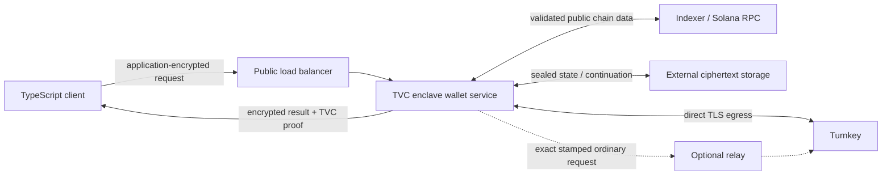

# Turnkey Verifiable Cloud для приватного кошелька Zolana

| Поле | Значение |
| --- | --- |
| Статус | Черновик, security review revision 3; проектные вопросы закрыты, production blockers названы явно |
| Цель | TVC private beta |
| Первая криптографическая схема | Ed25519 |
| Текущий уровень безопасности | Только Phase 0; production funds запрещены |
| Язык | Русский, простая техническая редакция |
| Последняя проверка | 2026-08-21 |

## Как читать этот документ

Это русская версия [`TVC_SPEC.md`](TVC_SPEC.md), написанная более простым языком. Она описывает ту же систему и те же ограничения безопасности.

Названия типов, полей API, операций и криптографических доменов оставлены на английском. Их нельзя переводить в реализации: они являются частью протокола.

Слова **ОБЯЗАН**, **НЕЛЬЗЯ**, **МОЖНО** и **РЕКОМЕНДУЕТСЯ** имеют нормативный смысл:

- **ОБЯЗАН** — без этого реализация не соответствует спецификации;
- **НЕЛЬЗЯ** — такое поведение запрещено;
- **МОЖНО** — допустимый, но необязательный вариант;
- **РЕКОМЕНДУЕТСЯ** — вариант по умолчанию, от которого можно отступить только с понятным обоснованием.

Если русская и английская редакции расходятся в точном формате байтов или полей, до исправления расхождения используется английская редакция. Изменения безопасности должны одновременно попадать в обе версии.

## Коротко

Мы хотим запустить приватный кошелёк Zolana внутри Turnkey Verifiable Cloud.

Разделение ответственности выглядит так:

- Turnkey хранит основной ключ подписи кошелька;
- TVC запускает проверенный код кошелька внутри enclave;
- TVC временно получает производные viewing/nullifier-секреты, но не выпускает их наружу;
- клиент шифрует запрос прямо для TVC-приложения;
- клиент проверяет TVC proofs, точные данные Turnkey activity и только те Turnkey App Proofs, которые реально описаны документацией;
- обычный сервер, балансировщик, база данных и relay не видят секреты кошелька.

Это не HTTP-обёртка над удалённым signer. Публичный API принимает высокоуровневые команды: создать кошелёк, синхронизировать его, построить перевод, продолжить операцию после approval. API никогда не должен превращаться в `sign(any_bytes)`.

## Основное решение

Систему РЕКОМЕНДУЕТСЯ строить как отдельный wallet-as-a-service слой над `zolana-keypair-turnkey` и `zolana-transaction`.

Первая версия:

- работает только с Ed25519;
- использует прямой egress из enclave в Turnkey;
- поддерживает один тестовый кошелёк и одного клиента;
- не работает с реальными средствами;
- проверяет bootstrap, approval/resume, шифрование, TVC proof и ограниченную по смыслу Turnkey evidence chain;
- имеет TypeScript-клиент `@zolana/tvc-wallet`.

Запуск с реальными средствами запрещён, пока не выполнен production acceptance gate из этого документа.

Enclave runtime использует официальные crates `qos_core = 0.12.1` и
`qos_p256 = 0.12.1` с точным закреплением версий. Это последняя версия,
которую private-beta control plane принимает для новых deployments; любое
обновление требует новой проверки совместимости и нового manifest. QOS runtime
graph остаётся в отдельном AGPL-3.0-only Cargo workspace и не попадает в
основной lockfile Zolana.

## Что мы хотим получить

1. Ключ подписи кошелька не выходит из Turnkey.
2. Viewing key, nullifier key и derivation signature не выходят из проверенного enclave-кода. Одноразовый development-профиль внешнего prover намеренно раскрывает ему private proof inputs и не даёт для них privacy claim.
3. Клиент может доказательно проверить, какой код обработал запрос.
4. Quorum и authenticator approvals в Turnkey можно продолжить после паузы и на другой TVC-реплике.
5. Повтор запроса не создаёт незаметно новую Turnkey activity.
6. Зашифрованное состояние можно хранить снаружи и переносить между репликами.
7. Rust и TypeScript получают одинаковые digest, подписи и результаты проверки.
8. Путь от маленького POC к настоящему WAAS заранее ограничен проверяемыми этапами.

## Чего система не делает

1. Она не заменяет Turnkey как хранилище ключа подписи.
2. Она не делает P-256 ключ Turnkey пригодным для ECDH или вывода Zolana-секретов.
3. Она не считает обычный HTTPS-ответ доверенным без proof verification.
4. Она не гарантирует доступность Turnkey, TVC, AWS, RPC, indexer или relay.
5. Она не скрывает время и размер сетевых запросов.
6. Она не публикует наружу низкоуровневые `WalletAuthority`, `TurnkeyActivities` или generic signer API.
7. Первый POC не поддерживает production funds, произвольные транзакции, P-256 и custom ring. Внешний недоверенный prover разрешён только закрытым disposable-development профилем из раздела про proving.

## Термины

| Термин | Простое объяснение |
| --- | --- |
| TVC App Proof | Подпись одной запущенной TVC-реплики над digest запроса и ответа. |
| Turnkey App Proof | Подписанный факт от конкретного enclave-приложения Turnkey. Сейчас документированы address-derivation и policy-outcome proofs; универсального signing proof мы не предполагаем. |
| Turnkey Activity Evidence | Пакет для проверки одной activity: точный request body, activity ID, fingerprint, intent, полный response и raw App Proofs. |
| Boot Proof | AWS Nitro attestation и QOS manifest, которые связывают Ephemeral Key с запущенным кодом. |
| Quorum Key | Стабильный ключ TVC-приложения. Восстанавливается только внутри разрешённого enclave. |
| Ephemeral Key | Ключ конкретного запуска enclave. Им подписываются TVC App Proofs. |
| Wallet descriptor | Подписанное описание того, какой Turnkey-ключ относится к кошельку и кто может им пользоваться. |
| Sealed state | Состояние кошелька, зашифрованное Quorum Key. |
| Continuation | Зашифрованные данные, необходимые для продолжения той же Turnkey activity. |
| Provisioning Authority | Отдельный административный ключ, который подтверждает wallet descriptor. |
| Manifest Set | Группа операторов, разрешающая конкретный код и конфигурацию TVC. |
| Share Set | Группа операторов, разрешающая восстановление Quorum Key внутри одобренного enclave. |
| Relay | Недоверенный посредник, который может переслать уже подписанный запрос в Turnkey. |
| Derivation signature | Секретная Ed25519-подпись, из которой Zolana выводит viewing и nullifier роли. |

## Архитектура



### Где проходит граница доверия

Внутри доверенной границы находятся:

- одобренный TVC executable и его конфигурация;
- AWS Nitro и проверенная версия QOS;
- восстановленный Quorum Key;
- Turnkey и его production trust root;
- клиентский verifier с независимо полученной release policy;
- порог операторов Manifest Set и Share Set.

Снаружи и поэтому недоверенными считаются:

- public load balancer и внешний TLS terminator;
- обычный backend Zolana;
- VM/host, на котором работает внешняя часть сервиса;
- база данных и object storage;
- relay;
- RPC, indexer и relayer до проверки их данных;
- сеть;
- любой один оператор ниже необходимого threshold.

### Главные гарантии

Если клиент успешно проверил все proofs, evidence и политики:

1. Turnkey signing key не покидал Turnkey.
2. Zolana role secrets не покидали одобренный enclave-код.
3. Внешнее хранилище не могло незаметно изменить plaintext sealed state.
4. Relay не мог изменить Turnkey request после stamping.
5. Подменённая подпись Turnkey была бы отвергнута проверкой исходного payload и public key.
6. TVC App Proof связывает ответ с конкретным executable и manifest.
7. Turnkey App Proof доказывает только поля своего документированного типа. Математическая Ed25519 signature отдельно доказывает, что нужный wallet key подписал точный payload.
8. Resume использует исходную activity, а не создаёт новую.

### Чего эти гарантии не покрывают

- Порог злонамеренных Manifest operators может разрешить вредоносный код.
- Порог злонамеренных Share operators может выдать Quorum Key разрешённому, но нежелательному deployment.
- Внешнее хранилище может удалить или откатить старый корректный ciphertext.
- Indexer может скрыть входящую транзакцию, если нет отдельной проверки полноты.
- TVC и Turnkey связаны с одним операционным провайдером, поэтому отказы могут быть коррелированы.
- Компрометация стабильного Quorum Key в будущем позволяет расшифровать сохранённые старые ciphertext; forward secrecy здесь нет.
- Удаление старого release из client release policy не отнимает у уже запущенного release ранее выданный Quorum Key. Для security revocation нужна ротация ключа; старый ciphertext нельзя сделать секретным задним числом.

## Почему bootstrap требует прямого egress

Для Ed25519 Zolana просит Turnkey подписать специальное derivation message. Полученная подпись фактически является seed для viewing/nullifier ролей.

Если отправлять такой запрос через обычный stamp-and-relay flow, relay увидит ответ Turnkey и получит derivation signature. После этого privacy boundary сломан.

Поэтому:

- `BootstrapEd25519` и его resume ОБЯЗАНЫ ходить из enclave прямо в Turnkey по TLS;
- TLS certificate, hostname, DNS result и размер ответа проверяются внутри enclave-процесса;
- redirect запрещён;
- connect/request/overall timeout ограничены;
- если direct egress недоступен, bootstrap завершается ошибкой `SecretResponseEgressRequired`;
- relay МОЖНО использовать только для обычной подписи, которую допустимо показать relay.

Для version 1 внутреннее application encryption обязательно для всех защищённых request/response. Public HTTPS — только transport hygiene вокруг недоверенного load balancer/TLS terminator. Флага отключения или negotiation нет. Отказ от внутреннего envelope возможен лишь в новой версии с attestation-bound client→enclave key exchange и downgrade/replay tests.

Выбран egress-профиль `qos-transparent-v1`. QOS tunnel даёт связь, но не считается hostname allow-list. В коде ровно один origin: `https://api.turnkey.com:443`; caller URL, proxy, redirect, другой port и env override запрещены. DNS — недоверенный discovery через resolver IPv4 addresses из manifest; non-global IP отклоняется. TCP идёт к найденному IP, но TLS SNI, SAN и HTTP Host остаются `api.turnkey.com`. Используются TLS 1.2+, встроенный CA bundle с digest в release policy, bounded timeouts/response/concurrency. Private-beta egress entitlement и resolver config проверяются live conformance test, но не заменяют эти правила.

## Роли и полномочия

| Действие | Кто разрешает |
| --- | --- |
| Запуск нового TVC executable/config | Порог Manifest Set |
| Восстановление Quorum Key | Порог Share Set |
| Регистрация TVC credential в Turnkey | Администратор Turnkey organization |
| Development wallet descriptor | Provisioning Authority |
| Первый production wallet descriptor | Provisioning Authority + отдельный owner WebAuthn ES256 passkey |
| Обычная ротация клиента | Provisioning Authority + текущий client grant + owner authorization |
| Recovery | Новый Provisioning Authority + заранее закреплённый guardian quorum и Turnkey recovery-certificate policy |
| Bootstrap/sync/spend | Разрешённый client key из descriptor |
| Approval spend | Approvers, заданные policy в Turnkey |
| Отправка готовой транзакции | Клиент; relayer не входит в version 1 |

Provisioning Authority в одиночку НЕЛЬЗЯ делать корнем custody для production-кошелька. Owner authorization и recovery НЕЛЬЗЯ строить через raw signature основным Ed25519 wallet key.

Для production Manifest Set и Share Set ОБЯЗАНЫ иметь threshold не меньше двух. Рекомендуемый старт — независимые 2-of-3 группы.

## Ключи

### Quorum Key

Quorum Key стабилен между репликами и обычными совместимыми обновлениями внутри одного `quorum_key_epoch`. У него разные subkeys:

- signing subkey — Turnkey API credential/stamper;
- encryption subkey — расшифровка клиентских запросов, sealed state и continuations.

НЕЛЬЗЯ использовать один subkey в роли другого.

Known/default Quorum Key из quickstart НЕЛЬЗЯ регистрировать как credential для production-кошелька и НЕЛЬЗЯ использовать для production sealed state.

### Ephemeral Key

Ephemeral Key создаётся для конкретного запуска enclave. Его signing subkey подписывает TVC App Proof.

Quorum Key НЕЛЬЗЯ использовать для TVC App Proof: стабильный ключ не доказывает, какая именно реплика и версия кода обработала запрос.

### Turnkey credential

Quorum signing public key регистрируется как отдельный API credential в нужной Turnkey sub-organization.

Credential ОБЯЗАН быть ограничен:

- конкретным wallet key;
- минимальным набором signing activities;
- policy approvals владельца;
- отдельным security domain.

Turnkey queries не контролируются policy engine: любой authenticated user видит данные всей organization, а parent organization может читать sub-organizations. Поэтому нельзя обещать policy allow-list для `GET_PRIVATE_KEY`/`GET_ACTIVITY`. Нужны отдельная sub-organization на wallet или проверенный security domain, минимум metadata и явный учёт parent readers в threat model.

Первый production profile — dedicated tenant. Один несвязанный tenant/security domain получает свой TVC application, hostname, случайный 32-byte `security_domain_id`, Quorum Key и epoch. Каждый wallet/end-user живёт в отдельной Turnkey sub-organization с ровно одним funded Ed25519 key. Quorum public key регистрируется внутри child как API-only delegated non-root user и никогда — в parent или другом tenant. Один credential можно повторить только между child organizations того же принятого security domain. Parent credentials не попадают в TVC, IDs непрозрачны, PII в Turnkey metadata нет. Пул несвязанных tenants в этой версии запрещён.

## Ed25519 bootstrap

Enclave выполняет следующие шаги:

1. Берёт ожидаемый Ed25519 public key из wallet descriptor.
2. Строит каноническое Zolana derivation message.
3. Отправляет `SIGN_RAW_PAYLOAD_V2` с `HASH_FUNCTION_NOT_APPLICABLE` и `generateAppProofs: true`.
4. Получает подпись напрямую из Turnkey.
5. Собирает байты подписи без endian conversion.
6. Проверяет подпись на исходном message и ожидаемом public key.
7. Выводит nullifier и viewing roles через каноническую реализацию Zolana.
8. Создаёт отдельный случайный `wallet_entropy` для deterministic retries.
9. Шифрует секреты в sealed state.
10. Обнуляет временные secret buffers.

Клиент получает только публичные адреса и sealed state. Derivation signature и role secrets ему не возвращаются.

После первого bootstrap новая реплика восстанавливает wallet из sealed derivation seed. Перед использованием seed она ОБЯЗАНА снова проверить его как подпись канонического derivation message.

## P-256

P-256 не входит в первую версию.

Signing key P-256 в Turnkey нельзя автоматически использовать для ECDH и вывода Zolana roles. Возможная будущая схема с импортом roles в TVC будет split-root конструкцией и не должна называться полностью rooted in Turnkey.

## Формат данных

### Каноническая сериализация

Публичный API использует JSON. Всё, что подписывается или хешируется, сериализуется через RFC 8785 JCS.

Binary fields в JSON передаются lowercase hexadecimal без `0x`, если поле явно не задаёт другой encoding.

Все API fields, которые в Rust имеют тип `u64` или `i64`, передаются как канонические decimal JSON strings без leading zeros; TypeScript читает их в `bigint`. Иначе большие `state_version`, epochs или timestamps могут незаметно потерять точность в JavaScript. Маленькие versions, enums, thresholds и явно более узкие integers остаются JSON numbers.

Внутренние plaintext для sealed state и continuation используют versioned Borsh. Неупорядоченные коллекции перед сериализацией сортируются.

Unknown и duplicate JSON fields отклоняются. Их нельзя молча игнорировать.

### Основные digest

```text
request_digest = SHA256(
    "ZOLANA_TVC_REQUEST_V1" || 0x00 ||
    JCS(request_without_authorization.signature)
)

client_auth_digest = SHA256(
    "ZOLANA_TVC_CLIENT_AUTH_V1" || 0x00 || request_digest
)

owner_auth_digest = SHA256(
    "ZOLANA_TVC_OWNER_AUTH_V1" || 0x00 || JCS(owner_challenge)
)

owner_auth_evidence_digest = SHA256(
    "ZOLANA_TVC_OWNER_AUTH_EVIDENCE_V1" || 0x00 ||
    JCS(owner_key, owner_assertion, prior_client_authorization)
)

result_digest = SHA256(
    "ZOLANA_TVC_RESULT_V1" || 0x00 || encrypted_result
)

turnkey_activity_evidence_digest = SHA256(
    "ZOLANA_TVC_TURNKEY_EVIDENCE_V1" || 0x00 || JCS(turnkey_activity_evidence)
)

state_digest = SHA256(
    "ZOLANA_TVC_STATE_DIGEST_V1" || 0x00 || Borsh(sealed_wallet_state)
)

artifact_digest = SHA256(
    "ZOLANA_TVC_ARTIFACT_V1" || 0x00 || artifact
)

state_commitment = SHA256(
    "ZOLANA_TVC_STATE_COMMITMENT_V1" || 0x00 || wallet_public_key ||
    U64_BE(generation) || state_digest || descriptor_digest ||
    U64_BE(quorum_epoch) || U64_BE(recovery_epoch) || sealed_state_salt
)
```

Каждый digest имеет отдельный ASCII domain. Это не даёт использовать подпись одного типа объекта как подпись другого типа.

`state_commitment` публикуется в coordinator PDA, но случайная 32-byte salt остаётся внутри sealed state. Поэтому публичный PDA фиксирует точный state head, не раскрывая сам state digest для простого перебора metadata.

### Лимиты

| Лимит | Значение для POC |
| --- | --- |
| Encrypted request | 256 KiB |
| Encrypted response | 256 KiB |
| Wallet descriptor | 64 KiB |
| Абсолютный потолок request/response для будущих профилей | 16 MiB |
| Возраст нового request | 5 минут |
| Допустимый clock skew | 1 минута |

Сервис ОБЯЗАН ограничивать число одновременных decrypt/operation до выделения больших buffers. Изменение лимита требует нового approved manifest и release policy.

## Wallet descriptor

Упрощённая структура:

```rust
struct WalletDescriptorV1 {
    version: u8,
    wallet_id: String,
    security_domain_id: [u8; 32],
    turnkey_parent_organization_id: String,
    turnkey_organization_id: String,
    turnkey_signing_target: TurnkeySigningTargetV1,
    turnkey_service_user_id: String,
    turnkey_api_key_id: String,
    expected_ed25519_public_key: [u8; 32],
    allowed_clients: Vec<ClientGrantV1>,
    policy_version: u64,
    previous_descriptor_digest: Option<[u8; 32]>,
    environment: Environment,
    provisioning_key_id: String,
    owner_authorization_key: Option<OwnerAuthorizationKeyV1>,
    recovery_binding: Option<RecoveryBindingV1>,
    provisioning_signature: Vec<u8>,
    owner_authorization: Option<OwnerAuthorizationV1>,
    prior_client_authorization: Option<DescriptorRotationAuthorizationV1>,
}

enum TurnkeySigningTargetV1 {
    PrivateKey {
        private_key_id: String,
    },
    HdWalletAccount {
        turnkey_wallet_id: String,
        wallet_account_id: String,
        address: String,
        derivation_path: String,
    },
}
```

Descriptor связывает вместе:

- локальный wallet ID;
- точную Turnkey organization и signing target: standalone private-key ID либо полный HD-wallet account binding;
- ожидаемый Ed25519 public key;
- список client keys и разрешённых операций;
- development/production environment;
- монотонный `policy_version`.

Для development достаточно подписи Provisioning Authority.

Для production descriptor ОБЯЗАН содержать отдельный `owner_authorization_key` и подпись владельца над `owner_auth_digest`. Сам ключ владельца входит в descriptor digest и поэтому связан подписью Provisioning Authority. Wallet Ed25519 key для этого не используется.

В production выбран один вариант owner credential: WebAuthn ES256 passkey. Обычная P-256 owner signature допустима только в development/test и production-кодом отклоняется. Owner key не может быть client key, response key, wallet key, Quorum key или ключом Provisioning Authority. Один физический passkey можно также зарегистрировать в Turnkey, но это две разные credential-записи и два разных назначения.

Owner challenge содержит purpose, случайный `ceremony_id`, digest нового и предыдущего descriptor, номер поколения, время выдачи и срок не больше пяти минут. Координатор хранит ceremony и атомарно сжигает её после первого использования. Проверяются точные `clientDataJSON` bytes, `webauthn.get`, challenge, один узкий RP ID, один точный HTTPS origin, `crossOrigin = false`, RP hash, `UP`, `UV`, credential/user handle и backup flags. WebAuthn ES256 signature приходит в строгом ASN.1 DER, а не в QOS-формате raw `r || s`; правило low-S на неё не переносится. Синхронизируемые passkeys разрешены. Счётчик `0 → 0` допустим; после первого ненулевого значения он обязан расти, иначе credential становится подозрительной.

Подпись Provisioning Authority связывает descriptor и digest точных owner/prior-client evidence. Обычная client rotation требует текущий client с `may_rotate_descriptor`, owner assertion и Provisioning Authority. Owner rotation требует старый и новый passkey, `generation + 1`, текущий client и Provisioning Authority. Потеря старого passkey — это recovery, а не обычная rotation. Wallet raw signing нигде здесь не используется.

## Encrypted request

```rust
struct EncryptedRequestV1 {
    version: u8,
    quorum_key_id: String,
    quorum_key_epoch: u64,
    ciphertext: Vec<u8>,
}
```

Весь внутренний request шифруется точной реализацией закреплённой версии `qos_p256::P256Public::encrypt` на Quorum encryption public key из проверенного manifest. Это custom QOS-схема P-256 ECDH + HMAC-SHA-512 + AES-GCM, а не RFC 9180 HPKE. Borsh envelope имеет поля `nonce[12]`, `ephemeral_sender_public[65]`, `encrypted_message` с 16-byte GCM tag.

Полный QOS `P256Public` — ровно 130 bytes: `encryption SEC1[65] || signing SEC1[65]`. TypeScript ОБЯЗАН реализовать этот формат byte-for-byte и пройти общие Rust fixtures; похожая, но другая ECIES/HPKE library несовместима.

`quorum_key_id` и `quorum_key_epoch` проверяются и снаружи, и после decrypt. Клиент не может выбрать произвольный server key.

Внутри ciphertext находятся:

- случайный 256-bit `request_id`;
- `issued_at_ms` и `expires_at_ms`;
- `target_release_id`, `target_manifest_digest`, `target_executable_digest`;
- `quorum_key_id` и `quorum_key_epoch`;
- wallet descriptor;
- sealed state, если операция stateful;
- ожидаемые state version/digest;
- одноразовый response encryption public key;
- операция;
- подпись разрешённого client key.

Running enclave до работы с state ОБЯЗАН убедиться, что target release/manifest/executable/key epoch совпадают с ним и с проверенной client release policy. Первая Turnkey activity использует `issued_at_ms` как `timestampMs`. Поэтому одинаковый authenticated request строит ровно одинаковый Turnkey POST body.

Client request всегда авторизуется прямой P-256/SHA-256 подписью. Grant содержит `client_key_id`, scheme и 65-byte uncompressed SEC1 public key; authorization повторяет только ID, scheme и 64-byte raw low-S `r || s` signature. `request_digest` исключает только саму signature, поэтому key ID и scheme тоже подписаны. DER, high-S, compressed keys и двойное SHA-256 отклоняются. WebAuthn оставлен для owner/recovery ceremonies, а не для каждого API request. В Phase 0 допустим software key; в production client key должен быть non-exporting в WebCrypto, Secure Enclave/Android Keystore, HSM/KMS или эквиваленте. Response encryption key всегда другой.

## Sealed wallet state

Sealed state содержит:

- `quorum_key_id` и `quorum_key_epoch` снаружи и внутри ciphertext;
- wallet и descriptor binding;
- `policy_version`;
- монотонный `state_version`;
- digest предыдущего состояния;
- `Ed25519SecretStateV1`: version, имя derivation suite и проверенный 64-byte Ed25519 derivation seed;
- `wallet_entropy`;
- snapshot UTXO, transaction history, nullifiers и sync cursors.

Весь plaintext шифруется Quorum encryption key. Public header дублируется внутри authenticated plaintext и после decrypt должен совпасть. State старого key epoch нельзя использовать в обычной операции — только в явном attested migration flow.

Secret types обязаны zeroize память и скрывать содержимое в `Debug`.

Это единственное каноническое secret-представление: expanded viewing/nullifier keys в state не сохраняются. При restore enclave строго Borsh-декодирует без trailing bytes, заново строит derivation message, проверяет seed как Ed25519 signature ожидаемого public key, расширяет roles одной канонической реализацией и сверяет публичную identity со snapshot. Изменение derivation требует нового suite и state version; старые bytes нельзя молча толковать по-новому.

## Continuation и approvals

Когда Turnkey отвечает `RequiresApproval` или `PENDING`, TVC возвращает клиенту зашифрованную continuation. В ней находятся:

- исходный request digest;
- target release/manifest/executable и Quorum key epoch;
- wallet/descriptor/policy binding;
- исходный Turnkey activity ID;
- точный Turnkey POST body, включая `timestampMs` и `generateAppProofs`;
- исходный payload и ожидаемый public key;
- transaction artifact и candidate next state, если это spend;
- контекст для безопасного resume.

Continuation зашифрована Quorum Key, поэтому её может открыть любая разрешённая реплика того же key epoch. Миграция на новый epoch обязана сохранить исходные activity ID и POST body.

Правила:

1. Resume всегда опрашивает исходную activity.
2. Resume НЕЛЬЗЯ строить с новым payload, blockhash, randomness или intent.
3. НЕЛЬЗЯ автоматически создавать новую activity, если старая pending или её статус неоднозначен.
4. Bootstrap continuation не имеет локального срока действия и хранится до terminal activity или явного revoke descriptor/policy.
5. Transaction continuation истекает не позже blockhash/root/intent validity и не позже 24 часов.
6. Истёкшая или потерянная continuation не означает, что Turnkey activity исчезла. Нужна явная reconciliation/recovery процедура.

## Idempotency: как не создать две activities

Turnkey дедуплицирует activity по точному POST body. Если изменить хотя бы `timestampMs`, получится другой fingerprint и потенциально новая activity.

Поэтому TVC ОБЯЗАН:

1. Строить body полностью детерминированно.
2. Сохранять его точные байты в continuation.
3. При сетевой неоднозначности заново подписывать `X-Stamp`, но отправлять те же body bytes.
4. До отправки отклонять любой mismatch как `TurnkeyActivityMismatch`.

Текущий high-level helper в `turnkey_client` после нескольких initial `PENDING` может вернуть `ExceededRetries` без activity ID. Для TVC это неприемлемо. Нужен low-level prepared-request transport, который сначала разбирает каждый `Activity` response и возвращает `activity_id`, status, fingerprint и raw proofs для любого nonterminal ответа, включая самый первый `PENDING`. Он НЕЛЬЗЯ повторно вызывать signing method с новым `now_ms()`.

После timeout клиент повторяет тот же подписанный plaintext request с теми же `request_id`, `issued_at_ms` и `expires_at_ms`. Новый request ID создавать нельзя.

Если request уже истёк, а activity ID так и не получен, SDK возвращает `AmbiguousTurnkeySubmission`. Он не начинает новую операцию автоматически: пользователь или оператор сначала сверяет activity через разрешённый Turnkey view.

## Encrypted response

Публичный ответ имеет форму:

```rust
struct EncryptedResponseV1 {
    version: u8,
    request_id: [u8; 32],
    encrypted_result: Vec<u8>,
    tvc_app_proof: TvcAppProofV1,
}
```

Внутри `encrypted_result` находятся:

- completed result, pending/approval continuation или private error;
- новый sealed wallet state, если он появился;
- `TurnkeyActivityEvidenceV1` для каждой затронутой signing activity.

Evidence остаётся зашифрованной, потому что содержит точный signing intent, organization/key IDs, activity response и approval metadata. Публичный TVC proof содержит только её digest.

TVC App Proof связывает:

- digest исходного request;
- hash request ID и wallet ID;
- operation и public outcome;
- digest encrypted result;
- digest Turnkey activity evidence;
- state digest;
- hash Turnkey activity ID;
- timestamp.

## Все proofs и подписи по полочкам

Здесь несколько разных доказательств. Они не заменяют друг друга.

| Объект | Кто подписывает | Зачем нужен | Чего сам по себе не доказывает |
| --- | --- | --- | --- |
| `SignedReleasePolicyV1` | Offline release authority Zolana | Какие TVC releases, manifests, executable digests, QOS versions и Quorum epochs клиент вообще принимает | Что endpoint действительно запущен в enclave |
| AWS Nitro attestation | AWS Nitro root chain | Что Ephemeral Key создан настоящим Nitro Enclave в ожидаемом AWS account и с нужными PCR | Что конкретный Zolana release разрешён владельцем клиента |
| QOS manifest/Boot Proof | QOS/TVC operator workflow, связанный с attestation | Какой executable, args, operator sets и Quorum public key загрузились рядом с Ephemeral Key | Что конкретный request/response обработан этим запуском |
| `TvcAppProofV1` | Ephemeral signing key одной TVC-реплики | Связывает authenticated request, encrypted result, state и Turnkey evidence с конкретным attested запуском | Что Turnkey действительно подписал payload |
| Turnkey policy-outcome App Proof | Ephemeral key policy-engine enclave Turnkey | Что policy engine получил свой decision context и выдал `ALLOW`, `DENY` или consensus outcome | Сам по себе не содержит activity ID, private-key ID или signing payload |
| Turnkey address-derivation App Proof | Ephemeral key signer enclave Turnkey | Что Turnkey правильно вывел адрес в поддерживаемом wallet-creation flow | Не является proof нашей raw Ed25519 signature и обычно не нужен для Zolana bootstrap |
| `TurnkeyActivityEvidenceV1` | Не отдельная подпись; это проверяемый bundle | Складывает рядом exact request/response, ID, fingerprint, intent и raw App Proofs | Ничего не доказывает без проверки вложенных proofs, fingerprint/linkage и signature |
| Ed25519 wallet signature | Wallet private key внутри Turnkey | Математически доказывает подпись точного payload ожидаемым wallet key | Какой policy outcome был применён и какой Turnkey executable работал |
| Client/owner/provisioning signatures | Соответствующий внешний P-256/WebAuthn key | Авторизуют request или descriptor | Attestation и корректность Turnkey исполнения |

### 1. Независимая release policy

Упрощённо она выглядит так:

```json
{
  "policy": {
    "releaseId": "...",
    "acceptedManifestDigests": ["..."],
    "acceptedExecutableDigests": ["..."],
    "quorumKeyId": "...",
    "quorumKeyEpoch": "7",
    "quorumPublicKey": "<130-byte hex>",
    "turnkeyTrustRootId": "...",
    "turnkeyProofSchemaVersions": ["..."]
  },
  "authoritySetId": "production-release-v1",
  "signatures": [
    { "keyId": "...", "scheme": "p256-sha256", "signature": "<64-byte raw r||s hex>" },
    { "keyId": "...", "scheme": "p256-sha256", "signature": "<64-byte raw r||s hex>" }
  ]
}
```

Подписываются байты:

```text
SHA256("ZOLANA_TVC_RELEASE_POLICY_V1" || 0x00 || JCS(policy))
```

Каждый release-authority public key — 65-byte SEC1 uncompressed. Каждая signature — ровно 64 bytes `r || s`, low-S, не DER; production требует 2-of-3 разных pinned key IDs. Policy приходит не с TVC endpoint, а через TUF channel. Исходный trust anchor клиента — bundled TUF root.

### 2. Boot Proof TVC

Boot Proof состоит из AWS Nitro attestation document и QOS manifest. Его точный внешний schema фиксируется версией TVC/QOS verifier; вручную придумывать совместимый JSON нельзя.

Клиент проверяет:

1. AWS certificate chain и signature attestation document.
2. Ожидаемый AWS account/PCR measurements.
3. Что `user_data` attestation связывает точный QOS manifest.
4. QOS version, executable digest, args, environment, egress, limits, Manifest/Share Sets.
5. Что Quorum public key и epoch разрешены независимой release policy.
6. Что Ephemeral `P256Public` в Boot Proof совпадает с ключом TVC App Proof.

Полный QOS `P256Public` имеет 130 bytes: сначала 65-byte encryption key, затем 65-byte signing key. Для proof signature используется вторая половина, но клиент сравнивает весь 130-byte ключ.

### 3. TVC App Proof

Wire object:

```rust
struct TvcAppProofV1 {
    scheme: String,          // SIGNATURE_SCHEME_EPHEMERAL_KEY_P256
    public_key: Vec<u8>,     // 130 bytes: encrypt[65] || sign[65]
    proof_payload: String,   // exact UTF-8 JCS bytes
    signature: Vec<u8>,      // 64 bytes raw r || s, low-S
}
```

Пример смысла `proof_payload`:

```json
{
  "type": "zolana.tvc.wallet_operation.v1",
  "version": 1,
  "request_digest": "...",
  "request_id_hash": "...",
  "wallet_id_hash": "...",
  "operation": "BootstrapEd25519",
  "outcome": "Completed",
  "result_digest": "...",
  "turnkey_activity_evidence_digest": "...",
  "state_digest": "...",
  "activity_id_hash": "...",
  "timestamp_ms": "0"
}
```

Ephemeral P-256 key подписывает SHA-256 от точных UTF-8 bytes строки `proof_payload`. Verifier сначала проверяет received bytes как есть — parse + reserialize перед signature verification запрещён. После подписи он отдельно убеждается, что строка действительно является RFC 8785 JCS. Это не даёт двум реализациям подписать «одинаковый JSON» разными байтами.

`result_digest` относится к ciphertext, поэтому proof можно проверить до decrypt. После decrypt клиент отдельно сравнивает request ID, operation, state digest и evidence digest.

### 4. Turnkey App Proofs

Документированный Turnkey wire object выглядит так:

```json
{
  "scheme": "SIGNATURE_SCHEME_EPHEMERAL_KEY_P256",
  "publicKey": "<hex>",
  "proofPayload": "<exact JSON string>",
  "signature": "<hex signature over hashed proofPayload>"
}
```

Raw object хранится byte-for-byte и проверяется pinned official Turnkey verifier с его Boot Proof и production trust root. Нельзя распарсить `proofPayload`, сериализовать заново и проверять уже новые bytes.

На текущий момент Turnkey публично описывает два типа:

```json
{
  "type": "APP_PROOF_TYPE_POLICY_OUTCOME",
  "timestampMs": "...",
  "policyOutcomeProof": {
    "organizationId": "...",
    "outcome": "OUTCOME_ALLOW",
    "decisionContextDigest": "...",
    "organizationDataDigest": "...",
    "parentOrganizationDataDigest": "...",
    "userRequestApprovals": [
      { "scheme": "...", "publicKey": "...", "message": "...", "signature": "..." }
    ]
  }
}
```

и `APP_PROOF_TYPE_ADDRESS_DERIVATION` с `organizationId`, `walletId`, derivation path и address.

Фиксируем профиль `turnkey-verified-policy-v1-2026-08`: Rust `turnkey_client = 0.14.0` с checksum `5d12169d8fde70c80ebed677b5ed5717e9b2b43abc8f9418698c547dc026b381` и `turnkey_proofs = 0.14.0` с checksum `74faf51cdfaaf8ce3ecea45d4711d50cf1cb81feb0559a08a49d6a91486ff523`/commit `7e870a0893f5c970171429172a2095e4cef22b14`. TypeScript POC фиксирует `@turnkey/crypto = 2.11.3` и `@turnkey/sdk-types = 1.5.1` через lockfile integrity; это не production verifier. Rust verifier проверяет подписи, AWS/QOS Boot Proof и внутреннюю согласованность App Proof, но release policy отдельно фиксирует конкретные Turnkey core-enclaves revision, manifest/operator policy и signer/policy-engine digests. TypeScript `verify()` официально reference-grade: он не проверяет PCR0–3 и известный manifest, поэтому production verifier им быть не может.

Phase 0 TypeScript development POC МОЖЕТ, не ожидая production API upstream, объединить закреплённые COSE/X.509 helpers из `@turnkey/crypto` с более строгими проверками Zolana. Такой composite verifier ОБЯЗАН проверить точные bytes TVC App Proof, AWS Nitro signature и certificate chain, полный набор из 32 SHA-384 PCR, независимо закреплённые PCR0–3, точный семантический hash QOS manifest из `VersionedManifest::manifest_hash()`, закреплённый в `user_data` attestation и подписанной release policy, а также live commitment manifest/Ephemeral key в PCR17. SHA-256 сырых сериализованных Borsh bytes manifest не является этим trust-policy значением и НЕ ДОЛЖЕН использоваться вместо него. PCR identity берётся только из независимого доверенного release channel, а не из `/v1/info` или проверяемого Boot Proof. Boot Proof получает узкий resolver поверх уже существующей authenticated Turnkey session вызывающей стороны; без resolver или любого identity pin проверка fail-close. Этот composite остаётся development-only до production distribution/revocation policy и официальной привязки decision context.

Критическое ограничение на 2026-08-21: Turnkey не публикует версионированный алгоритм, canonicalization, hash function или fixtures для связи `decisionContextDigest` с точными activity ID, fingerprint, private-key ID, type и intent. `list_app_proofs(activityId)` даёт authenticated query association, но эта association не подписана внутри proof. Поэтому валидный `ALLOW` одной activity в той же organization можно криптографически неотличимо подставить к другой. В POC evidence называется только `CryptographicallyValidButUnbound`, используется disposable no-funds key, а production bootstrap/spend/recovery выключены. Разблокировка возможна лишь после официального воспроизводимого linkage algorithm с positive/negative fixtures либо нового signed schema, прямо связывающего activity, fingerprint, organization, key, type, request/intent digest, terminal result и outcome. Простого сравнения наших JSON полей недостаточно.

### 5. Turnkey Activity Evidence

Внутри encrypted result для каждой signing activity передаётся:

```rust
struct TurnkeyActivityEvidenceV1 {
    version: u8,
    activity_id: String,
    activity_type: String,
    activity_status: String,
    request_fingerprint: Option<String>,
    organization_id: String,
    sign_with: String,
    exact_request_body: Vec<u8>,   // exact UTF-8 JSON bytes
    canonical_intent: TurnkeyIntentV1,
    activity_response: Vec<u8>,    // exact UTF-8 JSON bytes
    app_proofs: Vec<TurnkeyAppProofV1>,
}
```

`activity_id` здесь — metadata envelope, а не поле, которое мы притворяемся подписанным каждым App Proof. Bundle проверяется так:

1. Exact request bytes совпадают с сохранённым body; fingerprint из первого Turnkey response сохраняется без изменений.
2. Каждый следующий activity response имеет тот же ID, fingerprint, organization, type и intent.
3. Canonical intent совпадает с исходным Zolana request и descriptor key.
4. В Phase 0 policy proof проходит криптографическую проверку, но помечается unbound; production требует официально воспроизводимую связь `decisionContextDigest` с тем же context и обязательный cross-activity substitution test.
5. Completed Ed25519 signature проверяется на точном payload и public key.

Любая неизвестная proof schema, отсутствующая связь или mismatch даёт `TurnkeyEvidenceInvalid`.

### 6. Две итоговые цепочки проверки

TVC chain:

```text
offline release key
  -> SignedReleasePolicy
  -> AWS attestation + QOS manifest
  -> exact Ephemeral P256Public
  -> TVC App Proof
  -> encrypted result + state/evidence digests
```

Turnkey chain:

```text
pinned Turnkey production trust root
  -> Turnkey Boot Proof
  -> documented Turnkey App Proof
  -> official decisionContextDigest linkage
  -> exact activity evidence/fingerprint/intent
  -> independent Ed25519 signature verification
```

Client принимает результат только если обе цепочки и все cross-bindings успешны. Ни один отдельный proof не является коротким путём вокруг остальных проверок.

## Публичный API

| Method | Path | Назначение |
| --- | --- | --- |
| `GET` | `/health` | Только readiness процесса |
| `GET` | `/v1/info` | Discovery: keys, limits, operations, Boot Proof lookup |
| `POST` | `/v1/operations` | Единственная точка выполнения wallet operations |

`/health` НЕЛЬЗЯ использовать для запросов в Turnkey, decrypt state или публикации идентификаторов.

`/v1/info` не является доверенным источником. Клиент принимает его значения только после проверки точного Boot Proof и независимой release policy.

Discovery ОБЯЗАН включать `release_id`, manifest/executable digests, полный Quorum public key, `quorum_key_id`, `quorum_key_epoch`, текущий Ephemeral key, operation allow-list, limits, proof type и Boot Proof lookup key. Эти значения помогают найти proof, но не могут сами себя авторизовать.

### Операции

```rust
enum OperationV1 {
    // Только operator-only feasibility; параметры wallet не задаются caller-ом.
    // В публичный wallet API не экспортируется.
    CreateWallet,
    BootstrapEd25519,
    PrepareWallet { recent_blockhash: [u8; 32] },
    SignTestPayload { payload: Vec<u8> },
    SyncWallet { chain_input: ChainInputV1 },
    // Только feasibility deployment. Production вводит ChainInputV1
    // в следующей совместимой версии API.
    BuildTransfer { intent: DevelopmentTransferIntentV1 },
    BuildSplit { intent: SplitIntentV1, chain_input: ChainInputV1 },
    ResumeOperation { continuation: Vec<u8> },
}

struct DevelopmentTransferIntentV1 {
    recipient: String,
    amount: u64,
    prover_profile_id: String,
}
```

Правила доступа:

- `CreateWallet` существует только как operator acceptance в development: создаёт один обычный unfunded 24-word Turnkey HD wallet с единственным Ed25519/Solana account по `m/44'/501'/0'/0'`; development ограничивает среду и операцию, а не тип кошелька; production provisioning остаётся отдельной reviewed ceremony;
- `SignTestPayload` существует только в development и принимает только фиксированный test domain;
- production `BootstrapEd25519` разрешён только при enrollment до появления средств и выключается после revoke raw-sign permission;
- `PrepareWallet` — единственная закрытая setup-операция: из sealed bootstrap state она строит только точную регистрацию для authenticated recent blockhash; funding выполняется отдельно;
- произвольные Solana messages и derivation-shaped payload через него запрещены;
- `SyncWallet` появляется после Phase 1;
- `BuildTransfer` и `BuildSplit` в development появляются только после gates внешнего prover ниже; production по-прежнему требует attested prover;
- `ResumeOperation` разрешена только для уже разрешённой исходной операции;
- production не предоставляет generic signing.

У `CreateWallet` нет caller-controlled параметров. Approved
executable выводит Turnkey wallet label из `request_id` и жёстко фиксирует
`CURVE_ED25519`, `ADDRESS_FORMAT_SOLANA`, `PATH_FORMAT_BIP32`, путь
`m/44'/501'/0'/0'` и mnemonic length 24. Turnkey policy разрешает QOS-backed
service user только `ACTIVITY_TYPE_CREATE_WALLET`; текущий policy surface не
ограничивает account shape create-intent, поэтому semantic boundary здесь —
attested executable, а в production операция выключена. Ответ содержит только
public metadata, activity ID и App Proofs; export mnemonic запрещён. Exact-body
retry повторно использует `issued_at_ms`, `request_id` и то же выведенное имя.
Provisioning descriptor авторизует только это operator-действие и не становится
descriptor нового wallet: для использования созданного wallet нужен новый
независимо подписанный exact descriptor.

`PrepareWallet` не является generic signer. Enclave принимает точный sealed
state и descriptor нового wallet и внутри строит ровно одну
Ed25519-регистрацию. Host проверяет TVC и Turnkey proofs, сохраняет точные bytes
в crash journal и отправляет transaction с preflight. Enclave не строит
deposit, не mint-ит asset и не хранит faucet key.

Typed UI-шаг `FundTestWallet` — orchestration, а не TVC operation. Он доводит
gas balance wallet до фиксированного floor 0.02 devnet SOL, вызывает
`PrepareWallet`, отправляет точную регистрацию и затем внешним constrained
faucet депонирует ровно 200 ZDEV в shielded address. Faucet key и mint
authority находятся вне TVC и repo. Faucet проверяет devnet genesis hash,
фиксирует ZDEV mint, asset ID, default tree и indexer, доступен только same-origin
localhost с явным acknowledgement, ограничивает число recipients и до отправки
создаёт fail-closed journal на address. Это не fee sponsorship: сам Turnkey
wallet остаётся fee payer и единственным signer registration/transfer.

Operator acceptance harness имеет development-only проверку сохранения state на
одном host. Режим `--bootstrap-save-only --state-file <path>` выполняет
attested bootstrap, проверяет TVC и Turnkey proof chains и атомарно создаёт
owner-only JCS checkpoint. В нём находятся только opaque
`SealedWalletStateV1` и проверенные bindings endpoint, release, manifest,
executable, security domain, Quorum, descriptor, Turnkey wallet, Solana address,
`state_version` и `state_digest`. Registration, faucet funding и transfer в этом
режиме не выполняются. Новый процесс с
`--resume-transfer --state-file <path>` заново проверяет live discovery, все
bindings, Borsh header sealed state и его domain-separated digest, после чего
вызывает только `BuildTransfer`; bootstrap и `PrepareWallet` не повторяются.

Development store отвергает symlink, non-canonical/unknown JSON, слишком
большой файл, group/other permissions и overwrite первого checkpoint. Один
persistent sibling lock сериализует локальные процессы. Update использует
owner-only temp file в той же директории, file `fsync`, atomic rename, directory
`fsync` и compare-and-swap по SHA-256 ранее прочитанного canonical file. После
проверенного ответа `BuildTransfer` точные signed transaction bytes,
предвычисленная signature, request ID/digest и Turnkey activity ID сохраняются
как pending до первой отправки в RPC. После crash новый запуск сначала проверяет
status и отправляет только эти же bytes с preflight; пока pending существует,
новая transaction не строится. Pending очищается, а local journal generation
увеличивается только после finalized status без ошибки.

В файл не попадают plaintext derivation seed, API private key, viewing key или
nullifier key. Turnkey Embedded Wallet session хранит authentication/session
credential, но не TVC sealed state и не Zolana chain checkpoint. Local journal
generation не равен protocol `state_version` и не является on-chain freshness
oracle. Один файл не даёт remote redundancy, защиты от filesystem rollback,
multi-device safety, Solana coordinator CAS или reconciliation при crash после
отправки TVC request, но до сохранения проверенного response. Это acceptance
drill, а не production storage design из разделов state storage и rollback.

## Что проверяет enclave перед выполнением

1. Размер ciphertext до больших allocations.
2. Outer Quorum key ID и epoch до decrypt.
3. Успешный decrypt Quorum Key.
4. Version, unknown и duplicate fields.
5. Время, `request_id` и environment.
6. Target release/manifest/executable/Quorum epoch против running enclave.
7. Provisioning signature и отдельную production owner/rotation authorization.
8. Точное совпадение Turnkey organization/key/public key.
9. Client signature над `request_digest`.
10. Разрешение операции в текущем descriptor.
11. Descriptor/state/continuation cross-bindings.
12. `policy_version`, `state_version` и checkpoint.
13. Operation allow-list из executable, manifest и release policy.

Любая ошибка до authentication возвращается как общий public error без информации о существовании wallet или key. Подробная ошибка после authentication шифруется в обычный response и покрывается TVC proof.

## Что проверяет TypeScript-клиент

До использования результата клиент ОБЯЗАН:

1. Загрузить signed release policy из канала, независимого от TVC endpoint.
2. Проверить release signature, validity, environment и revocation epoch.
3. Пересчитать digest исходного request.
4. Получить Boot Proof именно для Ephemeral Key из ответа.
5. Проверить AWS Nitro chain, QOS manifest и их связь.
6. Сравнить QOS version, measurements, executable/manifest digest, args, egress, limits, operators и Quorum key с release policy.
7. Проверить TVC App Proof signature.
8. Сравнить digest encrypted result.
9. Расшифровать result одноразовым client response key.
10. Проверить digest `TurnkeyActivityEvidenceV1` bundle.
11. Проверить каждый документированный Turnkey App Proof pinned Rust verifier и отдельно закреплённый Turnkey release/manifest.
12. Пока официального алгоритма `decisionContextDigest` нет, пометить evidence как unbound и запретить production operation. Разблокировка требует воспроизводимого linkage и cross-activity substitution fixtures в Rust и production TypeScript core.
13. Сравнить activity ID, exact request body, fingerprint, intent, organization/key и status с request/descriptor/continuation.
14. Самостоятельно проверить Turnkey signature на исходном payload и expected wallet public key.
15. Сравнить state/activity/operation/release/manifest/executable/Quorum epoch bindings.
16. Сохранить новый state checkpoint до следующей mutating operation.

При любой ошибке result выбрасывается. Transaction artifact отправлять в Solana нельзя.

## Независимая release policy

Deployment не имеет права сам сообщить клиенту: «мой executable безопасен».

Клиент получает `SignedReleasePolicyV1` из npm/package release, подписанной конфигурации приложения или отдельного release service с заранее pinned root key.

Policy фиксирует как минимум:

- environment и TVC application ID;
- допустимые QOS versions и measurements;
- manifest и executable digests;
- Quorum public key, key ID и `quorumKeyEpoch`;
- Manifest/Share Set IDs и thresholds;
- allowed operations;
- request/response limits;
- Turnkey trust root ID;
- разрешённые Turnkey proof schemas и pinned verifier version;
- WebAuthn RP ID/origins и user-verification rule, если выбран этот owner scheme;
- validity period и revocation epoch.

Подпись считается над:

```text
SHA256("ZOLANA_TVC_RELEASE_POLICY_V1" || 0x00 || JCS(policy))
```

Production release policy подписывают как минимум 2 разных ключа из 3 offline release authorities. Trusted TUF root закрепляет сами ключи и threshold; значения внутри скачанного документа не могут его изменить. Duplicate и unknown key IDs не считаются. `/v1/info` нельзя передать как trusted release policy.

Распространение использует отдельный TUF 1.0.35 repository с consistent snapshots и минимум двумя read-only HTTPS mirrors в разных failure/admin domains. TUF root — 3-of-5 offline; release/targets — 2-of-3 offline; snapshot и timestamp имеют разные online HSM/KMS keys и accounts. TVC endpoint, Boot Proof service и Turnkey API не могут быть mirrors. App/npm bundle хранит trusted `root.json`, но перед каждой production mutation делает online refresh не старше пяти минут.

`timestamp.json` живёт максимум 15 минут и обновляется каждые пять; snapshot — 24 часа/шесть часов; target, policy и signed channel — максимум 30 дней; root — 365 дней с ротацией за 90 дней. Signed cumulative `ReleaseChannelV1` содержит active policy hashes, `channelSequence`, `revocationEpoch`, minimum Quorum epoch и навсегда накопленные revoked release/manifest/executable/Quorum-key IDs. Клиент хранит high-water marks и отклоняет rollback, уменьшение revoked sets, expiry, ошибку часов больше пяти минут и same-version/different-body mirror equivocation.

Emergency stop: 2-of-3 offline signers публикуют channel с пустым active set, затем новые targets, snapshot и timestamp. Обнаружение revoke ограничено 15 минутами. `unrevoke` нет: только новый release/key/epoch. Policy и channel записываются в публичный Rekor и проверяются независимыми monitors; transparency обнаруживает equivocation, но не спасает от сговора release threshold. Если отозванный release получал Quorum Key, одних TUF/revocation списков недостаточно — operations остаются выключенными до ротации Quorum Key и Turnkey credential.

Browser, React Native и Node используют одно verifier core с injected transport/clock/transactional store и один полный TUF conformance corpus. Node `tuf-js` можно использовать как oracle только при совместимой Node version. Текущий unaudited `tuf-browser` не считается production trust core. Канонический формат TUF тестируется отдельно от JCS/QOS formats.

## TypeScript WAAS API

Package name: `@zolana/tvc-wallet`.

Он отвечает за:

- canonical JSON и digest;
- request encryption;
- client authorization;
- Boot/TVC proof и Turnkey activity-evidence verification;
- one-time response keys;
- continuation handling;
- rollback checkpoints;
- fail-closed API types.

### Можно ли начать с `../wallet-kit`

Да, но только с его продуктовой оболочки и build setup. Берём pnpm/TypeScript workspace, ESM+CJS+types subpath exports, React provider/hook pattern, Next.js example/route factory, Helius RPC/history helpers и ESLint-правило «все backend imports через одну internal seam». Существующий вызов, который переводит полный Solana transaction в lowercase hex и вызывает `SIGN_TRANSACTION_V2/SOLANA`, полезен как no-funds compatibility fixture.

Security core оттуда брать как есть НЕЛЬЗЯ. Сейчас browser напрямую работает с Turnkey EWK, а hook публично выдаёт generic `signTransaction`, `signAndSendTransaction`, `signMessage` и `exportWallet`. TVC запрещает generic signing и export. `/waas/config` там обычный bootstrap, а не trust root; нет QOS application envelope, TUF, Boot/App Proof verifier, exact Turnkey evidence verifier, transactional state/checkpoint store и Browser/RN/Node adapters. `fetch` hardcoded, а send-path использует `skipPreflight: true` и не реализует verified-artifact/finality rules. `WalletRegistrar` отправляет control plane Turnkey IDs и public address; в TVC это можно делать только явно по tenancy/metadata policy, не из proof core.

Ещё одно несовпадение: текущий lockfile использует `@turnkey/crypto = 2.8.14` и `@turnkey/sdk-types = 0.14.0`, а наш POC profile фиксирует другие версии. TVC package объявляет exact dependencies напрямую и не использует transitive verifier из `@turnkey/react-wallet-kit` с caret range. Workspace сейчас обещает Node 18; Node build с выбранным `tuf-js` обязан поднять engine до поддерживаемой им Node version либо использовать отдельно audited runtime-neutral verifier. Существующий provider включает не только passkey, но и другие auth methods, создание wallet и export. Его НЕЛЬЗЯ подключать к тому же funded key/child org, который обслуживает TVC. Owner ceremony делается отдельной WebAuthn реализацией, пока review не докажет, что EWK возвращает exact assertion bytes на наш challenge и при этом не даёт generic signing/export. EWK — не TVC verifier и не wallet authority.

Правильная структура — новый package в этом workspace:

```text
packages/tvc-wallet/
  src/protocol/       # strict schemas, codecs, JCS и digests
  src/crypto/         # QOS envelope, P-256/Ed25519 verify
  src/verify/         # TUF, TVC Boot/App Proof, Turnkey evidence
  src/state/          # transactional store и crash journal
  src/platform/       # browser, React Native, Node adapters
  src/client/         # headless verified state machine
  src/react/          # provider/hooks только над opaque verified values
  src/next/           # optional RPC/control-plane helpers, не trust roots
```

Публичные имена — отдельные `TvcWalletProvider`/`useTvcWallet`, не mode flag старого hook. Так TypeScript даже структурно не увидит generic signing/export. Development POC экспортирует только строго типизированные `connectAndVerify`, `createWallet`, `bootstrapEd25519`, `prepareWallet` и `buildTransfer`; broadcast остаётся отдельной явной ответственностью клиента. Созданный кошелёк — обычный Turnkey HD wallet; типа `DevelopmentWallet` и legacy setup variant нет. Итого: `wallet-kit` — хорошая стартовая площадка для SDK integration, но TVC core надо добавить новым `@zolana/tvc-wallet`, а не «подменить адаптер и считать готовым».

### POC API

```ts
interface TvcWalletClient {
  connectAndVerify(): Promise<VerifiedConnection>;
  createWallet(
    connection: VerifiedConnection,
  ): Promise<CreateWalletResult>;
  bootstrapEd25519(
    connection: VerifiedConnection,
  ): Promise<BootstrapEd25519Result>;
  prepareWallet(
    connection: VerifiedConnection,
    input: PrepareWalletInput,
  ): Promise<PrepareWalletResult>;
  buildTransfer(
    connection: VerifiedConnection,
    input: BuildDevelopmentTransferInput,
  ): Promise<BuildTransferResult>;
}
```

### Будущий production API

```ts
interface ProductionTvcWalletClient extends TvcWalletClient {
  syncWallet(
    connection: VerifiedConnection,
    input: SyncInput,
  ): Promise<VerifiedResult<SyncOutcome>>;

  getBalances(state: VerifiedWalletState): readonly AssetBalance[];
  getTransactions(state: VerifiedWalletState): readonly PrivateTransaction[];

  buildTransfer(
    connection: VerifiedConnection,
    input: TransferInput,
  ): Promise<VerifiedResult<TransactionOutcome>>;

  buildSplit(
    connection: VerifiedConnection,
    input: SplitInput,
  ): Promise<VerifiedResult<TransactionOutcome>>;
}
```

`VerifiedConnection`, `VerifiedResult<T>` и `VerifiedWalletState` — opaque branded types. Их constructors не экспортируются.

Публичный package НЕЛЬЗЯ снабжать методами `decryptUnchecked`, `skipProofVerification` или production insecure mode. Development overrides должны находиться в отдельном entry point, который отвергает production descriptor.

Rust и TypeScript используют общие test vectors для:

- RFC 8785;
- QOS `P256Public` длиной 130 bytes;
- точных Borsh QOS encryption envelopes;
- 64-byte raw low-S P-256 signatures;
- exact UTF-8 bytes TVC proof payload до JSON parse;
- domain-separated digests;
- release policy;
- TVC proofs;
- Turnkey activity evidence и documented proof fixtures.

Сейчас в Zolana TypeScript нет готовой реализации QOS envelope. Она является обязательным результатом Phase 0, а не уже существующей возможностью. До прохождения Rust/TypeScript byte fixtures интеграцию нельзя называть совместимой.

## Состояние и rollback

TVC replicas stateless. Каждый запрос указывает всё, что нужно:

- descriptor;
- sealed state;
- ожидаемый state checkpoint;
- continuation для resume;
- authenticated intent.

External storage может вернуть старый, но корректно зашифрованный state. Поэтому клиент хранит наибольшую принятую пару `(state_version, state_digest)`.

Выбраны оба вида storage. Локальное transactional storage — rollback anchor и crash journal. External immutable object storage — availability/DR, но не источник freshness. Для каждого state и continuation используются случайные namespace/object IDs, create-if-absent upload, digest/size, read-back verification и signed remote index с CAS. Кроме local copy нужны минимум две durable remote copies в независимых failure domains. Browser использует persistent IndexedDB, React Native — transactional native/atomic-file store, Node — transactional DB либо fsync + atomic rename. `localStorage`, большие blobs в AsyncStorage и production in-memory store запрещены.

При mutation клиент сначала атомарно пишет local candidate+journal, загружает immutable remote copies, читает и проверяет их, CAS-обновляет signed index, коммитит local high-water mark и только затем отдаёт artifact на broadcast. Remote outage блокирует завершение state-changing operation. CAS conflict нельзя merge-ить и нельзя превращать в новую Turnkey activity. Approval continuation сохраняется local+remote до показа пользователю. State/continuation ограничены 8 MiB, не сжимаются и padding-ятся до 64 KiB, 256 KiB, 1 MiB, 4 MiB или 8 MiB; на 80% history compact-ится, иначе spends выключаются.

Enclave отклоняет:

- state version меньше ожидаемой;
- другой digest при той же ожидаемой версии;
- старый descriptor policy version;
- UTXO/root/nullifier данные, не прошедшие chain validation.

Новый клиент без checkpoint сначала выполняет полный rescan из доверенной protocol checkpoint. Он не может тратить средства только потому, что старый ciphertext успешно расшифровался.

Архитектурное решение для coordination — immutable audited Solana program и отдельный PDA на wallet. PDA хранит descriptor digest/version, Quorum/recovery epochs, монотонный `generation`, salted `state_commitment`, status и hash последней operation; `state_version = generation`. Program ID, genesis, executable hash, PDA seeds и instruction encoding фиксируются release policy.

```rust
struct WalletCoordAccountV1 {
    wallet_authority: [u8; 32],
    descriptor_digest: [u8; 32],
    descriptor_policy_version: u64,
    quorum_key_epoch: u64,
    recovery_epoch: u64,
    generation: u64,
    state_commitment: [u8; 32],
    status: CoordStatus,
    last_operation_id_hash: [u8; 32],
}

struct CommitWalletMutationV1 {
    expected_generation: u64,
    expected_state_commitment: [u8; 32],
    expected_descriptor_digest: [u8; 32],
    expected_quorum_key_epoch: u64,
    expected_recovery_epoch: u64,
    next_generation: u64, // ровно expected + 1
    next_state_commitment: [u8; 32],
    request_digest: [u8; 32],
    operation_id_hash: [u8; 32],
    artifact_digest: [u8; 32],
}
```

Каждая state-changing Solana transaction атомарно содержит Zolana instruction и ровно один `CommitWalletMutationV1`. Он проверяет старые generation/commitment/descriptor/epochs и двигает generation ровно на один, связывая next state, request, operation и artifact digests. Две подписанные гонки возможны, но finalized станет максимум одна; старый artifact после commit, client/descriptor change, recovery или Quorum rotation больше не исполним. On-chain nullifier остаётся второй защитой.

Перед Turnkey используется serializable reservation gateway с fencing token. Он уменьшает лишние activities, но не является safety root: даже malicious split-brain gateway упирается в on-chain CAS. После prepared/ambiguous Turnkey submission reservation не истекает по wall clock и хранит candidate state, object refs, exact body hash, activity ID, blockhash и validity height до reconciliation. Long approvals за пределами blockhash lifetime и durable nonce запрещены до отдельного cancel protocol.

После broadcast wallet остаётся `Finalizing` до finalized PDA; только затем remote index продвигается. Проигравший CAS навсегда отбрасывает artifact, rescans новый head и создаёт новый owner-authorized request — без auto-replay старого intent. Offline можно готовить только unsigned intent. Первый enabled profile всё ещё имеет один mutating client; больше одного включается после реализации, аудита и race/failover suite coordinator, но новый архитектурный выбор уже не нужен. Public PDA раскрывает количество и время mutations — это принятая metadata cost.

## Детерминированные транзакции и retries

Вся randomness state-changing operation выводится так:

```text
operation_randomness(label) = HKDF-SHA256(
    ikm = wallet_entropy,
    salt = request_digest,
    info = "ZOLANA_TVC_OPERATION_V1" || 0x00 || label
)
```

Labels уникальны для каждого назначения, например `blinding_seed`, `encryption_salt`, `proof_randomness`.

Request или continuation фиксируют всё, что меняет transaction bytes:

- recent blockhash;
- fee payer и relayer;
- chain roots;
- asset registry version;
- intent;
- proof randomness;
- candidate next state.

Один authenticated request на любой реплике должен давать byte-identical:

- proof inputs и proof;
- transaction message;
- Turnkey POST body и fingerprint;
- signature;
- финальный artifact.

Если библиотека prover скрывает randomness и не принимает deterministic RNG, операция production gate не проходит.

### Почему pure deposit сначала запрещён

Первая transaction-версия разрешает только операции, которые расходуют хотя бы один настоящий shielded input и публикуют on-chain nullifier.

Pure deposit и любая операция без nullifier запрещены как `OperationShapeDisabled`, пока отдельный crash/retry suite не докажет полную byte-identical повторяемость.

Если детерминизм невозможен, нужен отдельно проверенный attested single-assignment coordinator. Обычный cache, request ID или continuation, созданная только после первой отправки, недостаточны.

## Transaction construction и proving

Privacy claim действует только если transaction construction и proof generation остаются внутри attested boundary.

### Одноразовый development-профиль внешнего prover

Первый настоящий end-to-end test через default ring МОЖЕТ использовать закрытый
профиль `zolnet-devnet-external-http-v1`, только если выполнены все условия:

1. Descriptor и operation имеют environment `Development`, Solana genesis —
   devnet, wallet и средства одноразовые. Production descriptor и mainnet genesis
   отклоняются.
2. Origin prover в точности равен
   `http://zolnet-devnet-1779374825.eu-north-1.elb.amazonaws.com`; пути `/prove`
   и `/prove/*` на стандартном порту ALB направляются в ту же target group,
   что и compatibility-listener `:3001`. Prover закреплён
   в executable либо approved QOS manifest. Request не может передать или
   переопределить URL; proxy и redirect запрещены.
3. Ожидаемый image prover:
   `558215002830.dkr.ecr.eu-north-1.amazonaws.com/zolana-prover:sync-proofs-e9c75b6d67c9@sha256:07b4666bc4a6f7b557f4f39b9e82ea41034830f0ea76e9bb98ee5e0936cf5bfe`.
   Изменение endpoint, digest image, circuit set или response encoding требует
   нового approval профиля.
4. Rust wallet client явно выбирает
   `ZolanaClient::from_urls_allowing_insecure_http`; обычный checked constructor
   остаётся default во всех остальных местах. Это намеренно раскрывает proof
   inputs оператору prover и наблюдателям на plaintext network path. Privacy
   claim для transaction отсутствует.
5. Разрешён только `transfer_confidential` для default ring. Custom-ring, P-256,
   merge, setup, forester и caller-selected circuits отклоняются.
6. До создания Turnkey activity `SIGN_TRANSACTION_V2` enclave проверяет
   полученный Groth16 proof по встроенному shape-specific verifying key и локально
   построенному public-input hash. Ошибка или подмена ответа влияет только на
   privacy/availability и не может авторизовать transaction.
7. Sizes, timeouts, concurrency и exact-body retry ограничены. Proof inputs и
   тела запросов prover не попадают в logs или telemetry.

Профиль позволяет не помещать prover в первый TVC pet image, но production-путь
из него не следует. Production требует same-enclave профиля ниже либо отдельно
attested prover с secure channel, связанным с проверенной attestation.

Disposable executable `wallet-dev-e2e` реализует feasibility wire как
`BuildTransfer { intent: DevelopmentTransferIntentV1 }`. Он принимает только
скомпилированный profile ID, descriptor-bound HD-wallet address как recipient и
fee payer, pinned ZDEV mint `BEZe5CuQxzjwTHoqobHA3XJw34GJTph8nrXqP9zJRLjx`,
asset ID `14`, ровно `50_000_000_000` base units (50 ZDEV с 9 decimals), default
tree, HTTPS Solana devnet RPC и Photon origin. Enclave каждый раз восстанавливает wallet через Photon, получает
из Solana RPC только registry account получателя и recent blockhash, локально
проверяет внешний proof и затем вызывает Turnkey
`SIGN_TRANSACTION_V2/SOLANA`. Client не может выбирать RPC, Photon, prover,
wallet, amount, asset, tree, program или instruction/account shape.

Это не production wire `ChainInputV1`; production release обязан его отклонять.
Он нужен только для первого attested E2E и не заявляет multi-source finalized
completeness, transaction privacy, deterministic retry либо binding policy
evidence. Даже после успешной official Rust verification Turnkey evidence имеет
класс `CryptographicallyValidButUnbound`.

Только для этого feasibility-профиля ошибка после проверки
аутентифицированного request МОЖЕТ возвращаться как результат операции
`DevelopmentFailure` с грубым `DevelopmentFailureStage`. Результат ОБЯЗАН быть
зашифрован на одноразовый response key запроса и покрыт TVC App Proof так же,
как успешный результат; он НЕ ДОЛЖЕН содержать URL, идентификаторы, payload,
балансы, ключи или произвольный текст ошибки. Неаутентифицированная HTTP-ошибка
остаётся generic. Production releases ОБЯЗАНЫ использовать проверенную модель
terminal error и continuation.

Выбран минимальный Ed25519 `transfer_confidential` prover в том же attested executable. Публичного light-prover/Redis listener нет. Компилируются только нужные fixed shapes; P-256, arbitrary rings, merge, forester, setup и unused circuits отключены. Release policy фиксирует circuit IDs, Groth16 proving/verifying-key hashes и sizes, proof encoding и gnark version. Public proving key загружается в RAM, до parse проверяются size/hash, cache содержит максимум один entry. Одновременно идёт один proof; overload возвращает `ProverBusy` до allocation private inputs. Перед Turnkey proof проверяется локально.

Текущий gnark не принимает per-call RNG и поэтому блокирует production. Нужен reviewed fork/upstream API, куда явно передаётся domain-separated CSPRNG от wallet entropy, request/state/circuit identity и private-witness digest. Глобальный `crypto/rand.Reader` запрещён. Proof обязан быть byte-identical на всех replicas. Benchmark для каждой cold/warm shape, bursts, floods, corrupt key, всех трёх replicas и 24h/10k proofs: p95 ≤ 3 s, p99 ≤ 5 s, p99 RSS < 80% от 1 GiB, max RSS < 90%, без OOM/restart, health/overload ≤ 250 ms. Первый fallback — больше RAM в том же enclave.

Полнота chain data обеспечивается тремя независимыми `ChainSourceV1`, закреплёнными release policy. Каждый объединяет finalized-only Photon и archival Solana RPC, имеет отдельного оператора/upstream/TLS/failure domain. Enclave выбирает самый высокий общий finalized `(genesis, slot, blockhash)` от минимум двух sources с lag не больше 64 slots. Все transaction/tag/proofless/nullifier/proof streams ограничены этим checkpoint, возвращают `scanned_through`, canonical hash и принимаются только при совпадении двух полных digests. Divergent streams не merge-ятся. Конфликт finalized blockhash замораживает wallet как `FinalityViolation`.

Отдельно проверяется correctness: program ID, successful tx status, event decode, note decryption/commitment, roots, membership/non-inclusion, pending queue и отсутствие nullifier — снова перед signing. `confirmed` считается pending; final только по двум finalized sources. Новый client сканирует от pinned deployment anchor; snapshot лишь ускоряет. Остаточный trust: два colluding sources, общий parser bug или нарушение Solana finality.

Final artifact отправляет client, не TVC. Это полный legacy Solana transaction ≤ 1232 bytes, wallet key — account 0, fee payer и единственный signer. Client сохраняет verified bytes до `sendTransaction`, не rebuild-ит их, включает preflight/`confirmed`/`minContextSlot` и проверяет, что RPC вернул заранее вычисленную signature. Retry посылает те же bytes/txid только до `last_valid_block_height`. После expiry или неясного final status broadcast прекращается. Новая попытка — новый owner-authorized request, request ID, blockhash/activity, `supersedes` digest и новая проверка nullifier. Relayer/gas sponsorship/durable nonce не входят в version 1.

## Turnkey policies

Для каждой разрешённой sub-organization:

1. TVC использует отдельный credential.
2. Activity policy ограничивает signing actions точным private key через документированное поле `private_key.id` и минимальным набором activity types.
3. Queries не проходят через policy engine. Нельзя писать allow-list `GET_PRIVATE_KEY`/`GET_ACTIVITY`; вместо этого используется изолированная sub-organization с минимумом metadata.
4. В Phase 0 `SIGN_RAW_PAYLOAD_V2` разрешён только для bootstrap и compile-time test domain, с `HASH_FUNCTION_NOT_APPLICABLE`, нужным encoding, named key и `generateAppProofs: true`.
5. В документированной policy language `activity.params` для raw-sign показывает `hash_function` и `encoding`, но не `payload` и не `signWith`. Turnkey policy не может отличить derivation message от другого raw payload для того же key. Границей payload здесь являются approved TVC manifest и default-deny код enclave.
6. Поэтому raw-sign credential НЕЛЬЗЯ использовать для production spend, owner authorization, recovery или generic signing. Другого unattended raw-sign credential для wallet key быть не должно.
7. TVC client authentication не отменяет approvals владельца в Turnkey. Required policy-outcome proofs проверяются, но универсального signing proof мы не выдумываем.
8. Spend использует `SIGN_TRANSACTION_V2` с `TRANSACTION_TYPE_SOLANA`. В `unsignedTransaction` передаётся lowercase hex полного serialized unsigned legacy transaction с нулевым signature slot — не message bytes и не base64. Ответ обязан содержать тот же message; меняется только ожидаемый signature slot. Versioned/ALT, дополнительные signers и partial signatures запрещены.
9. Turnkey policy видит structure, programs, accounts, instruction bytes, flags и direct transfers, но не понимает custom Zolana `0x0c`/wincode semantics, CPI, recipient, amount, nullifier, cluster и freshness blockhash. No-funds compatibility profile разрешает только pinned compute-budget и shielded instructions; production coordinator profile добавляет ровно один pinned `CommitWalletMutationV1`/PDA. Никаких других instructions/direct transfers.
10. Production funds/spend остаются выключены, пока on-chain-validated и понятный Turnkey policy semantic commitment не свяжет user intent либо Turnkey не даст эквивалентный policy surface. Structural policy плюс TVC code недостаточны как независимая semantic boundary. Fallback на `SIGN_RAW_PAYLOAD_V2` запрещён.
11. Organization, точное значение `signWith`, activity type, transaction type, curve, public key и intent обязаны совпасть с descriptor и authenticated operation. Standalone key подписывает своим private-key ID; HD-wallet account — точным address из descriptor. До bootstrap также обязаны совпасть wallet ID, wallet-account ID, derivation path, address и expected public key из live Turnkey metadata.

Production wallet bootstrap выполняется до получения средств, а сама raw-sign activity дополнительно требует проверенный Turnkey owner/admin consensus. После того как клиент проверил результат и сохранил несколько копий sealed state/checkpoint, администратор Turnkey ОБЯЗАН удалить у TVC credential разрешение `SIGN_RAW_PAYLOAD_V2` и убедиться, что нет pending raw-sign activities. Только после этого адрес можно финансировать. Обычный restore использует проверенный sealed derivation seed и не включает raw signing обратно. Emergency re-derivation для уже профинансированного key в этой версии запрещён, пока не появится отдельный high-threshold recovery protocol.

Именно поэтому Phase 0 называется no-funds: raw signing нужен для вывода Ed25519 shielded identity, но Turnkey policy не видит raw payload. Мы сначала проверяем attestation, secret bootstrap, сохранение activity ID и весь verifier path на новом ключе без активов.

## Основные ошибки

| Ошибка | Что означает |
| --- | --- |
| `UnsupportedVersion` | Неизвестная версия API/state/proof |
| `UnsupportedOperation` | Операция не разрешена deployment |
| `OperationShapeDisabled` | Transaction shape ещё не прошёл replay gate |
| `RequestTooLarge` | Превышен attested limit |
| `InvalidEncryptedEnvelope` | Ошибка decrypt или структуры envelope |
| `ReleaseBindingMismatch` | Target release/manifest/executable не совпал с running enclave |
| `QuorumKeyEpochMismatch` | Request/state/continuation/release называют разные Quorum key epochs |
| `InvalidWalletDescriptor` | Ошибка descriptor signatures/authorization |
| `OwnerAuthorizationInvalid` | Отдельная owner signature или WebAuthn context не прошли проверку |
| `WalletBindingMismatch` | Wallet, Turnkey key или environment не совпали |
| `UnauthorizedClient` | Client key/signature/grant не подходит |
| `ExpiredRequest` | Новый request просрочен |
| `StateRollback` | Получен старый или другой state |
| `FullRescanRequired` | Нельзя безопасно продолжить incremental sync |
| `SecretResponseEgressRequired` | Секретную операцию попытались провести без direct egress |
| `TurnkeyEgressUnavailable` | Ошибка сети/TLS/timeout до Turnkey |
| `TurnkeyEgressPolicyViolation` | Origin/DNS/TLS/CA/proxy/redirect не совпали с egress policy |
| `AmbiguousTurnkeySubmission` | Activity могла быть создана, но ID не получен до expiry |
| `TurnkeyRequiresApproval` | Нужно approval и сохранение continuation |
| `TurnkeyActivityPending` | Исходная activity ещё не завершена |
| `TurnkeyActivityRejected` | Approvers отклонили activity |
| `TurnkeyActivityMismatch` | Activity не соответствует continuation |
| `TurnkeyEvidenceInvalid` | Proof, decision context, fingerprint или activity/intent linkage отсутствует либо неверен |
| `TurnkeyEvidenceUnbound` | Proof криптографически валиден, но не связан с этой activity/key/intent; production запрещён |
| `TurnkeySignatureInvalid` | Подпись не соответствует payload/key |
| `ChainInputInvalid` | Chain roots/proofs/nullifiers не прошли проверку |
| `FinalityViolation` | Нет совпадающего 2-of-3 finalized checkpoint/complete stream |
| `StatePersistenceUnavailable` | Не удалось подтвердить local + two-remote durable copies |
| `MutationConflict` | Coordinator generation уже использовала другая mutation |
| `RecoveryFrozen` | Recovery начат, но безопасно не завершён |
| `RotationFrozen` | Quorum migration начата, target epoch ещё не активирован |
| `ProverUnavailable` | Разрешённый prover не завершил proof |
| `ProverBusy` | Единственный prover slot занят; private inputs ещё не выделены |
| `ResourceLimitExceeded` | Превышен CPU/memory/size limit |

## Логи и метрики

НЕЛЬЗЯ логировать:

- request/response bodies;
- wallet descriptor и IDs;
- Turnkey organization/key/activity IDs;
- payload и signatures;
- viewing/nullifier material;
- decrypted или sealed state;
- transaction intent, amount, recipient, balances и history;
- client public keys и authorization signatures.

Допустимы только агрегированные counters, status classes, bounded latency histograms, memory high-water mark и dependency health.

Metrics не должны иметь wallet labels или другие неограниченные идентификаторы. Public production ingress не публикует metrics endpoint.

Debug и production используют разные:

- TVC applications;
- Quorum Keys;
- Turnkey organizations и credentials;
- wallet keys.

Quorum Key, использованный в TVC debug mode, навсегда считается непригодным для production.

## Deployment и обновления

1. Development и production — разные TVC applications.
2. OCI image — только `linux/amd64`, pinned by digest.
3. Executable digest вычисляется независимо и входит в deployment approval.
4. Args, env, ports, egress, limits, keys и operation allow-list входят в manifest.
5. Manifest approvers проверяют reproducible build evidence.
6. Share operators проверяют manifest и attestation до provisioning.
7. Каждый клиентский release содержит независимо подписанную `ReleasePolicyV1`.
8. Endpoint не может сам добавить свой executable digest в trust set.
9. Revocation увеличивает epoch; policy имеет ограниченный срок действия.
10. Неизвестная версия proof/state/release policy отклоняется.
11. Новый deployment до переключения traffic расшифровывает старый state vector и продолжает pending activity test vector.
12. Каждый request подписывает target release, manifest, executable, Quorum key ID и key epoch; running enclave проверяет их до работы с wallet state.

При обычном совместимом update Quorum Key МОЖНО оставить тем же внутри одного key epoch. State migration должна быть versioned, deterministic и возвращать больший `state_version`.

Security revocation устроен иначе. Если просто удалить старый release из client policy, этот release всё ещё может знать ранее provisioned Quorum Key. До production ОБЯЗАТЕЛЕН проверенный runbook:

1. Новый key epoch provisioned только в принятый code.
2. Последний client-verified state и живые continuations мигрируют и заново шифруются в attested migration operation.
3. Turnkey API credential ротируется на новый Quorum signing key.
4. Независимая release policy публикует новый key ID/epoch и отзывает старый.
5. Клиент принимает новый checkpoint только после TVC migration proof и затем отвергает old epoch.

Старый ciphertext всё равно может быть прочитан отозванным release, который уже знал старый key. Ротация защищает только будущий state. Если TVC не позволяет безопасно провести эту процедуру, production funds остаются запрещены: мы не принимаем модель «вечно доверять всем когда-либо provisioned releases».

## Тесты до production

### Криптография и формат

- Rust и TypeScript получают одинаковые canonical JSON и digest.
- Unknown/duplicate fields отклоняются.
- Любое изменение authorization ломает подпись.
- Cross-binding descriptor/state/continuation проверяется.
- QOS envelopes замечают corruption, truncation, wrong key и header substitution.
- 130-byte QOS keys, exact Borsh envelopes, 64-byte raw low-S signatures, exact TVC proof string и release policy имеют общие Rust/TypeScript vectors.
- Удаление, перестановка, activity-ID rebinding, fingerprint/decision-context change или подмена Turnkey evidence ломает verification.

### Turnkey backend

- Ed25519 bootstrap даёт ту же identity, что software keypair.
- Signature bytes совпадают с существующим backend.
- Resume использует исходный activity ID.
- Самый первый `PENDING` возвращает и сохраняет activity ID, а не превращается в `ExceededRetries` без ID.
- Exact retry отправляет исходный body.
- Изменение `timestampMs`, payload или `generateAppProofs` останавливает retry до сети.
- Неправильная signature, unknown proof schema или недоказуемая decision-context linkage отклоняется.
- Bootstrap continuation работает после длительной паузы и на другой реплике.

### TVC integration

- Bootstrap идёт через direct egress в non-debug enclave.
- Network capture не содержит secret plaintext.
- Approval начинается на одной реплике и завершается на другой.
- Sealed state переносим между всеми репликами.
- Клиент проверяет Boot Proof точного Ephemeral Key.
- Wrong/revoked release, manifest, executable, Quorum key/epoch, environment или Turnkey root отклоняются.
- Redirect, invalid TLS, wrong hostname, timeout и oversized Turnkey response отклоняются.
- Production enrollment без provisioner + отдельный owner credential запрещён; неправильный WebAuthn RP/origin/challenge отклоняется.
- Rotation без текущего клиента запрещена.
- Recovery quorum проверяется отдельно.
- TypeScript не выдаёт decrypted result после подмены TVC proof или Turnkey evidence.
- Security-revocation test мигрирует state и pending continuation на новый Quorum epoch, ротирует Turnkey credential и запрещает ordinary operations со старым epoch.
- Production spend fixture использует только `SIGN_TRANSACTION_V2`/Solana и доказывает exact signed bytes; raw-sign spend отклоняется.
- До funding тест подтверждает revoke raw-sign permission и отсутствие pending raw activities; restore из sealed state работает без повторного включения raw signing.

### Transaction retries

- Одинаковый start на разных репликах даёт одинаковые proof/artifact/body/signature bytes.
- Pure deposit остаётся выключен, пока отдельный suite не пройден.
- Crash до и после Turnkey submission не создаёт автоматическую вторую activity.
- Lost continuation переводит SDK в reconciliation, а не в повторный spend.

### Ресурсы

- P99 memory ниже 80% approved allocation.
- Health отвечает во время самой тяжёлой операции.
- Concurrency ограничена до decrypt/large allocation.
- POC request/response не больше 256 KiB.
- Ни один будущий profile не превышает 16 MiB hard ceiling.
- Proof generation укладывается в одобренные latency/CPU/RAM без swap и persistent disk.

## Этапы

### Phase 0 — no-funds POC

Цель: проверить криптографический и операционный стык, не рискуя деньгами.

Почему без средств: bootstrap требует raw Ed25519 signature, а Turnkey policy видит только `encoding`/`hash_function`, не сам payload. Одновременно ещё надо доказать, что initial `PENDING` не теряет activity ID, QOS wire format совпадает в Rust/TypeScript, Turnkey proof реально связан с decision context, а старый TVC release можно лишить будущего доступа через Quorum-Key rotation. Пока хотя бы один из этих пунктов не закрыт, funded key создаёт лишний и не оправданный риск.

Входит:

- отдельные development TVC app и Turnkey organization;
- один новый Ed25519 wallet и один client;
- operator-only создание одного unfunded fixed-shape Turnkey wallet с проверкой App/Boot Proof и без export mnemonic;
- direct Turnkey egress;
- `/health`, `/v1/info`;
- `CreateWallet`, `BootstrapEd25519`, `PrepareWallet`, `BuildTransfer`;
- фиксированный `SignTestPayload`;
- application encryption;
- TVC proof + documented Turnkey evidence verification;
- independent release policy;
- exact-body retry с сохранением ID первого `PENDING`;
- TypeScript POC API;
- 256 KiB limits.

Не входит:

- реальные средства;
- balance/history API;
- transaction construction;
- proving;
- production custody claim.

Exit: identity parity, secret bootstrap, cross-replica resume, TVC/evidence verification и byte-exact Rust/TypeScript vectors проходят.

### Phase 1 — state и sync

- sealed wallet state;
- client checkpoint;
- wallet reconstruction;
- encrypted balances/history;
- full rescan recovery;
- TypeScript `syncWallet`, `getBalances`, `getTransactions`.

Spend всё ещё выключен.

### Phase 2 — transactions

- deterministic randomness;
- `BuildTransfer` и `BuildSplit`;
- закрытый external-untrusted prover для disposable development; attested prover для production;
- Turnkey spend approval/resume;
- обязательный `SIGN_TRANSACTION_V2` + `TRANSACTION_TYPE_SOLANA`; если compatibility/policy test не проходит, spends не включаются;
- сначала только операции с real shielded input/nullifier;
- TypeScript `buildTransfer` и `buildSplit`.

### Phase 3 — production

- отдельные production app/keys/credentials/operators;
- owner-authorized descriptors;
- проверенная rotation/recovery процедура;
- проверенная ротация Quorum key epoch, Turnkey credential, sealed state и live continuations;
- один active mutating client до multi-device review;
- один security domain на app/credential;
- monitoring, incident response и disaster recovery;
- внешний security review;
- production acceptance gate полностью пройден.

## Когда это можно назвать production WAAS

Одного успешного POC недостаточно.

Production WAAS готов только когда одновременно выполнено следующее:

1. Все тесты проходят в non-debug TVC application.
2. Client проверяет TVC proof chain, Turnkey evidence, официальный decision-context linkage и Ed25519 signature.
3. Release trust и revocation независимы от deployment endpoint.
4. Enrollment, rotation и recovery имеют разные проверенные authorization flows.
5. Prover остаётся в attested boundary и проходит resource review.
6. State rollback и single-writer/multi-device модель проверены.
7. Каждая разрешённая transaction shape проходит deterministic crash/retry suite.
8. No-nullifier operations остаются выключенными до отдельного gate.
9. TypeScript не имеет unchecked или generic signing API.
10. Выполнен recovery drill только из Turnkey key reference, descriptor, client checkpoint и sealed state.
11. Выполнен внешний security review.
12. Owner credential и recovery не зависят от wallet raw signing и прошли replay/revocation drill.
13. Quorum-Key security rotation и old-epoch rejection проверены.
14. Spend использует `SIGN_TRANSACTION_V2` с доказанной Solana semantics; иначе spend API отсутствует.
15. Каждый production wallet завершает bootstrap и redundant sealed-state backup до funding, затем revoke raw-sign permission и reconciliation всех pending raw activities.

## Принятые решения по всем бывшим открытым вопросам

Здесь больше нет выбора «сделаем потом как-нибудь». Для каждого вопроса выбран один вариант. Это не значит, что всё уже реализовано: production всё ещё выключен явными gates ниже.

1. **Ingress.** В version 1 application encryption обязательно всегда. Где именно Turnkey завершает public TLS, больше не влияет на confidentiality model.
2. **Egress.** Выбран `qos-transparent-v1`, один compile-time origin `api.turnkey.com:443`, pinned IPv4 resolvers и CA-bundle digest, полная TLS/SNI/SAN/Host проверка, без proxy/redirect. Beta entitlement проверяется live test.
3. **Secret state.** Храним только versioned и проверенный 64-byte derivation seed. Expanded roles каждый раз выводятся заново.
4. **Prover.** Disposable development МОЖЕТ использовать закрытый `zolnet-devnet-external-http-v1` с local proof verification и без transaction-privacy claim. В production минимальный Ed25519 prover работает в том же enclave, concurrency = 1. Пока нет явного per-call deterministic RNG и не пройдены RAM/latency/soak tests, production blocker остаётся.
5. **Полнота chain data.** Нужны совпадающие полные digests от двух из трёх независимых finalized Photon + archival RPC sources. Это честно заявленная модель «хотя бы два источника не сговорились».
6. **Tenancy.** Один отдельный TVC app/hostname/Quorum epoch на несвязанный tenant security domain; один Turnkey child org на wallet. Общего пула tenants нет.
7. **Client auth.** Каждый request подписывается прямым P-256/SHA-256 client key. В production ключ non-exporting. WebAuthn на каждый API call не используется.
8. **Owner auth.** В production только WebAuthn ES256 passkey с одним точным RP/origin, `UP+UV` и одноразовой ceremony не дольше пяти минут. Direct P-256 owner — только development.
9. **Recovery.** Это отдельный двухфазный Turnkey recovery-certificate protocol, а не raw signing, email/SMS/OAuth и не обход через provisioner. На каждый wallet создаётся отдельная recovery sub-organization без funded key. В ней находятся non-funded Ed25519 certificate key и одноразово удаляемый descriptor-lease resource. Descriptor заранее фиксирует recovery org/epoch, certificate key/public key, policy IDs/digests, точные guardian credentials, lease resource, delay 72 часа и окно завершения не больше семи дней.

   Recovery требует одновременно: одного из как минимум двух customer guardians, двух из трёх независимых provider security operators, proof of possession нового owner passkey и client key и новую подпись Provisioning Authority. Root/admin bypass не считается recovery, пока pinned proof не докажет тот же threshold. `RecoveryIntentV1` связывает старый descriptor/epoch/lease, последний coordinator state и chain checkpoint, новый descriptor/owner/client/recovery binding, target release/Quorum epoch и случайную ceremony. Certificate — подпись recovery key, которую Turnkey разрешил только после точного quorum.

   State machine линейна: `Stable → Proposed(CAS) → Frozen(delete old lease + reconciliation) → Committed(после delay) → Activated(epoch + 1)`. Свежий finalize key и Turnkey policy `time.now` обеспечивают 72 часа; эта возможность Early Access, поэтому без live conformance recovery выключен. Cancel до finalize всё равно увеличивает recovery epoch и создаёт новый descriptor/lease — старый не оживает. Recovery не восстанавливает потерянный derivation seed: без хотя бы одной его зашифрованной копии wallet потерян.
10. **State availability.** Используем и local transactional store, и две независимые immutable remote copies. Remote index помогает availability, но freshness задаёт finalized coordinator PDA.
11. **Submission.** Exact legacy Solana transaction сохраняет и отправляет client. TVC/relayer не broadcast-ят в version 1.
12. **Exact-body retry.** Истечение внешнего TVC request или approval vote не означает, что Turnkey activity исчезла. До получения activity ID можно повторять только те же prepared POST bytes с новым `X-Stamp`; после получения ID разрешён только `get_activity`. State machine: `Prepared → SubmissionUnknown → ActivityKnown → terminal`. Exact body/hash сохраняются до network I/O, а ID из первого nonterminal response — до начала polling.

    После expiry новый авторизованный `ReconcileTurnkeySubmissionV1` несёт старый signed request/digest, exact body hash, известный ID и mode. Enclave заново проверяет старую подпись и те же bytes. Если ID есть — только query; если нет — только exact resubmit, без нового timestamp/body. UI пишет «результат неизвестен, проверьте исходную операцию», а не предлагает recreate. Ноль или несколько совпавших activities — fail closed. Live beta fixtures покрывают >5 минут, >24 часов, credential rotation и потерю network response.
13. **Solana compatibility.** В Turnkey отправляется полный unsigned legacy transaction с нулевым signature slot как lowercase hex. Returned message обязан быть byte-identical. Structural policy фиксирует programs/accounts/instructions, но пока не понимает Zolana recipient/amount/nullifier/cluster/freshness semantics. Поэтому spend с реальными средствами выключен до policy-decodable on-chain semantic commitment. Raw-sign fallback отсутствует.
14. **Release distribution.** Отдельный TUF 1.0.35 repository: root 3-of-5 offline, release 2-of-3 offline, разные online snapshot/timestamp keys, два mirrors, 15-minute revoke visibility, накопительные permanent revoked sets и public Rekor monitors. Release revoke останавливает доверие клиента; реальную authority старого enclave снимает только ротация ниже.
15. **Turnkey proofs.** Фиксируем Rust proof profile 0.14 и exact no-funds fixtures. Текущий TypeScript verifier — только POC, а public `decisionContextDigest` нельзя связать с точной activity/key/intent. Evidence называется `CryptographicallyValidButUnbound`. Production включится только после официальной linkage schema/algorithm и cross-activity substitution tests во всех runtimes.
16. **Quorum-Key revocation.** Это двухфазная миграция между двумя TVC apps и QOS namespaces, а не in-place rotation. QOS Key Forward переносит только тот же Quorum Key в том же namespace; новый key требует новую genesis. Offline threshold подписывает `QuorumRotationPlanV1`, который связывает случайный rotation ID, security domain, разные source/target app+namespace, старый key/epoch, новый key/public key/`epoch + 1`, два migration-only releases, policy digests и revocation epoch.

    Сначала release channel переводит domain в `FrozenForRotation`: обычные operations и funding запрещены, разрешены только точные `ExportEpoch` и `ImportEpoch`. Target app делает новую production genesis. Новый Quorum credential регистрируется отдельным API-only Turnkey user, policy разрешает нового user, старый user/API keys удаляются, а реальный negative `X-Stamp` test обязан показать отказ. Независимый admin credential строит inventory всех activities до cut-off. `SubmissionUnknown` не мигрирует; неизвестная pending activity оставляет wallet frozen.

    Для wallet coordinator CAS фиксирует owner/client-authorized descriptor, source state version/digest, continuation digests и activity inventory digest. Минимальный source exporter со старым key не имеет Turnkey egress и обычных wallet endpoints: он расшифровывает только exact objects, проверяет plan/checkpoint/authorizations, не меняет wallet semantics и шифрует export package на новый Quorum public key. Его App Proof связывает входы и package. Target importer проверяет plan и source Boot/App Proof, seed/public identity и bindings, затем reseal-ит state как `epoch + 1`, `state_version + 1` и переносит continuations, не меняя activity ID, POST bytes/fingerprint, payload, intent, artifact и request digest. Resume после migration может только query исходную activity.

    Activation разрешена только после проверки обоих proofs, local + two-remote persistence, успешного query activity новым credential, coordinator CAS и принятия нового TUF channel. Любая ошибка оставляет freeze; rollback на старый epoch запрещён. Старый ciphertext считается исторически доступным старому key. Потеря всех old state/seed copies делает migration невозможной. Публичная beta-документация не описывает атомарную cross-app rotation, поэтому до production обязателен реальный drill на трёх replicas, source/target apps и Turnkey organization плюс подтверждение Turnkey о таком lifecycle.
17. **Multi-device state.** Выбран immutable Solana coordinator PDA плюс неавторитетный reservation gateway. PDA и shielded mutation обновляются одной transaction, поэтому старые signed artifacts становятся неисполняемыми. Gateway только сокращает duplicate activities; его compromise даёт DoS/metadata leak, но не две state transitions. Первый профиль всё равно имеет один mutating client; несколько включатся после implementation, audit и race/failover suite. Архитектурный выбор закрыт.

### Что всё ещё блокирует production

Это уже не открытые вопросы, а проверяемые условия:

- Turnkey должен опубликовать криптографическую связь policy proof с точной activity/key/intent и полноценный production TypeScript verifier.
- Zolana spend semantics должны стать независимо проверяемыми Turnkey policy.
- Prover должен получить explicit deterministic RNG и пройти resource/soak gates.
- TVC/Turnkey должны пройти live cross-app Quorum rotation и egress/reconciliation drills.
- Должны быть реализованы и проверены 2-of-3 chain sources, TUF channel, recovery, redundant state store и Solana coordinator.

## Ссылки

- [Английская техническая спецификация](TVC_SPEC.md)
- [Zolana protocol specification](../../docs/spec.md)
- [Zolana Turnkey backend](README.md)
- [TVC overview](https://docs.turnkey.com/features/verifiable-cloud/overview)
- [TVC quickstart](https://docs.turnkey.com/features/verifiable-cloud/quickstart)
- [Building a TVC application](https://docs.turnkey.com/features/verifiable-cloud/onboarding)
- [TVC proofs and verification](https://docs.turnkey.com/features/verifiable-cloud/proofs-and-verification)
- [TVC debug mode](https://docs.turnkey.com/features/verifiable-cloud/debug-mode)
- [Turnkey Verified](https://docs.turnkey.com/security/turnkey-verified)
- [Turnkey Activities and idempotency](https://docs.turnkey.com/api-reference/activities/overview)
- [Turnkey Queries: policy и organization-wide access](https://docs.turnkey.com/api-reference/queries/overview)
- [Turnkey List App Proofs for an activity](https://docs.turnkey.com/api-reference/queries/list-app-proofs-for-an-activity)
- [Turnkey Sign Raw Payload](https://docs.turnkey.com/api-reference/activities/sign-raw-payload)
- [Turnkey Sign Transaction](https://docs.turnkey.com/api-reference/activities/sign-transaction)
- [Turnkey Solana policy examples](https://docs.turnkey.com/features/policies/examples/solana)
- [Turnkey Rust proof verifier](https://github.com/tkhq/rust-sdk/tree/main/proofs)
- [Turnkey TypeScript proof verifier](https://github.com/tkhq/sdk/blob/main/packages/crypto/src/proof.ts)
- [QOS](https://github.com/tkhq/qos)
- [QOS boot standard](https://github.com/tkhq/qos/blob/main/docs/boot_standard.md)
- [QOS key forwarding](https://github.com/tkhq/qos/blob/main/docs/key_forward.md)
- [QOS P-256 key-set specification](https://github.com/tkhq/qos/blob/main/src/qos_p256/SPEC.md)
- [The Update Framework specification](https://github.com/theupdateframework/specification/blob/master/tuf-spec.md)
- [Sigstore Rekor transparency log](https://docs.sigstore.dev/logging/overview/)
